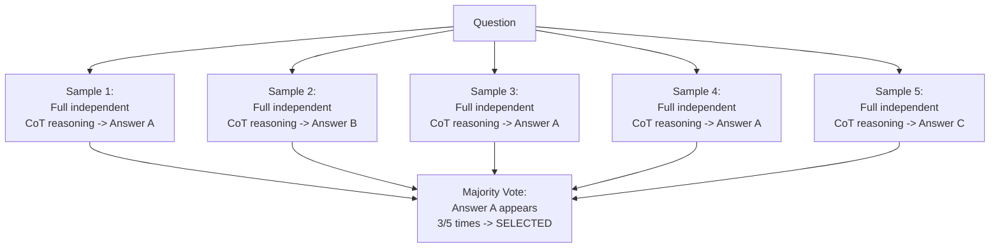
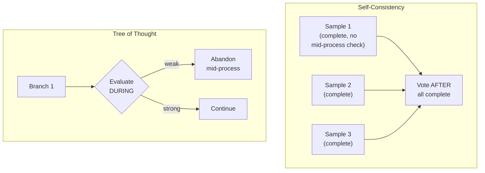
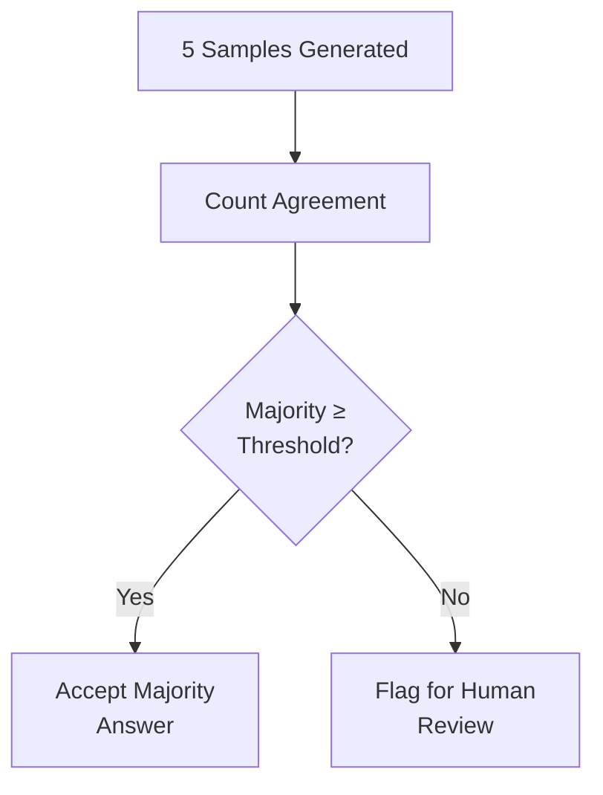

# 46 — Self-Consistency

> **Series:** Prompt Engineering Knowledge Library
> **File 46 of 60** | **Level:** Advanced
> **Prerequisites:** [`41_Chain_of_Thought.md`](./41_Chain_of_Thought.md), [`42_Tree_of_Thought.md`](./42_Tree_of_Thought.md)
> **Next:** [`47_Self_Reflection.md`](./47_Self_Reflection.md)

---

## Table of Contents

1. [Definition](#definition)
2. [Why It Matters](#why-it-matters)
3. [Core Concepts](#core-concepts)
4. [How It Works](#how-it-works)
5. [Internal Mechanism](#internal-mechanism)
6. [Types of Self-Consistency](#types-of-self-consistency)
7. [Syntax / Structure](#syntax--structure)
8. [Examples (Simple → Advanced)](#examples-simple--advanced)
9. [Best Practices](#best-practices)
10. [Common Mistakes](#common-mistakes)
11. [Real-World Applications](#real-world-applications)
12. [Comparison with Related Concepts](#comparison-with-related-concepts)
13. [Advantages & Limitations](#advantages--limitations)
14. [FAQs](#faqs)
15. [Summary](#summary)
16. [Cheat Sheet](#cheat-sheet)
17. [Glossary](#glossary)
18. [References](#references)
19. [Visual Diagram Gallery](#visual-diagram-gallery)

---

## Definition

**Self-Consistency** is the technique of generating multiple *complete, independent* reasoning paths for the same question (typically via [Chain of Thought](./41_Chain_of_Thought.md), run several times at non-zero sampling temperature) and then selecting the final answer that appears most frequently across all the independent attempts — using agreement across independently-derived answers as a signal of reliability. This is distinguished from [File 47 — Self-Reflection](./47_Self_Reflection.md), where a single reasoning attempt is critiqued and revised by the same process, and from [File 42 — Tree of Thought](./42_Tree_of_Thought.md), where branches are explored *and evaluated mid-process* with backtracking — self-consistency generates several *full, unexamined* attempts first, and only compares them at the very end, by simple majority agreement.

> The core statistical intuition: if a question has one genuinely correct answer, multiple independent, correctly-reasoning attempts should tend to converge on that same answer, while errors — being comparatively more idiosyncratic and path-dependent — are less likely to consistently repeat across independent attempts. Agreement, therefore, becomes a practical, if imperfect, confidence signal.

---

## Why It Matters

- **It directly addresses output variance from sampling** ([File 4 — How LLMs Interpret Prompts](./04_How_LLMs_Interpret_Prompts.md)) by turning that variance into useful signal rather than treating it as pure noise to be minimized.
- **It provides a genuinely different reliability mechanism than Tree of Thought's mid-process evaluation** — self-consistency's simplicity (generate many, vote) makes it easier to implement and reason about, at the cost of not being able to course-correct mid-reasoning the way ToT can.
- **It's particularly valuable for tasks with a single, checkable correct answer** (math, factual questions with a definite answer) where majority voting is a meaningful, interpretable aggregation method.
- **It illustrates a broader, important principle** — that reliability can sometimes be improved not by making any single reasoning attempt better, but by generating several and aggregating across them, a strategy with parallels well beyond prompt engineering.

---

## Core Concepts

| Concept | Definition |
|---|---|
| **Independent Sample** | One complete, separately-generated reasoning attempt and its resulting answer |
| **Majority Voting** | Selecting the final answer that appears most frequently across all independent samples |
| **Sample Count** | The number of independent reasoning attempts generated |
| **Answer Convergence** | The degree to which independent samples agree on the same final answer |
| **Confidence Signal** | Using the degree of agreement across samples as an indicator of answer reliability |
| **Sampling Temperature** | The parameter controlling randomness in generation, directly relevant to producing genuinely varied independent samples |

---

## How It Works



Each sample is generated completely independently — no sample sees or is influenced by any other sample's reasoning — which is precisely what makes majority agreement a meaningful signal: if the samples influenced each other, agreement would be partly an artifact of that influence rather than genuine independent convergence.

---

## Internal Mechanism

### Why sampling variance, normally a source of unreliability, becomes a useful signal here

As established in [File 4](./04_How_LLMs_Interpret_Prompts.md), non-zero sampling temperature introduces run-to-run variation in a model's output, generally treated as a reliability concern requiring careful management. Self-consistency inverts this: rather than trying to eliminate variance, it deliberately generates multiple samples specifically *because* of that variance, on the statistical premise that a correct, well-supported answer is more likely to be a stable "attractor" that independent reasoning attempts converge toward, while an incorrect answer is more likely to result from a specific, less-repeatable misstep in reasoning that different independent attempts are less likely to all make identically. This isn't a guarantee — a systematic bias or a genuinely difficult, misleading question could cause multiple independent samples to converge on the same *wrong* answer — but it is a genuine, statistically-motivated technique rather than an arbitrary one.

### Why self-consistency's simplicity is both its strength and its distinguishing limitation relative to Tree of Thought

Self-consistency generates each sample completely, independently, and without any mid-process evaluation or comparison — this is precisely what makes it simple to implement (no orchestrated branching/backtracking logic needed, per [File 42](./42_Tree_of_Thought.md)) but also means it cannot benefit from a sample's own partial progress informing another sample, or from abandoning an unpromising line of reasoning partway through the way ToT's backtracking can. Self-consistency essentially trades ToT's more sophisticated, computationally interactive search process for a much simpler "generate several complete attempts, then just count" approach — appropriate specifically when a clean, checkable final answer exists to count votes over, less suited to open-ended tasks without such a clear, comparable final answer.

---

## Types of Self-Consistency

| Type | Description | Best Suited For |
|---|---|---|
| **Simple Majority Voting** | The most frequent answer wins, no tie-breaking sophistication | Tasks with clear, discrete, checkable answers |
| **Weighted Voting** | Samples weighted by some confidence signal (e.g., a self-reported confidence score) before voting | Tasks where per-sample confidence estimation is meaningful and available |
| **Consistency Threshold Gating** | Only accepting the majority answer if it clears a minimum agreement threshold (e.g., 3+ of 5 samples), otherwise flagging for review | High-stakes applications needing an explicit "not confident enough" fallback |
| **Continuous-Answer Self-Consistency** | Adapted voting for numeric/continuous answers (e.g., median or clustering rather than exact-match voting) | Tasks where answers are numeric estimates rather than discrete categories |

---

## Syntax / Structure

```text
[The prompt itself is usually identical across all samples — 
self-consistency is primarily an APPLICATION-LEVEL orchestration 
technique, not a special prompt wording]

{{question}}

Think through this step by step before giving your final answer.
```

```yaml
# Orchestrating application logic (pseudocode)
samples = []
for i in range(5):  # sample count
    result = model_call(prompt, temperature=0.7)  # non-zero, 
                                                     # for genuine variation
    samples.append(extract_final_answer(result))

answer_counts = count_occurrences(samples)
majority_answer, count = most_common(answer_counts)

if count / len(samples) >= confidence_threshold:
    final_answer = majority_answer
else:
    final_answer = "FLAGGED: insufficient agreement, 
                     recommend human review"
```

---

## Examples (Simple → Advanced)

**Level 1 — Basic self-consistency on a math problem:**
```text
Question: "A bakery sold 47 loaves in the morning and 33 in 
the afternoon, but had to discard 8 due to a display issue. 
How many were successfully sold?"

[5 independent CoT samples generated]
Sample 1: 47 + 33 - 8 = 72
Sample 2: 47 + 33 - 8 = 72
Sample 3: 47 + 33 - 8 = 72
Sample 4: 47 + 33 = 80 (forgot to subtract) = 80
Sample 5: 47 + 33 - 8 = 72

Majority: 72 (4/5) -> SELECTED as final answer
```

**Level 2 — Consistency threshold gating:**
```text
[5 samples on a more ambiguous question]
Results: [A, B, A, C, A]
Majority: A (3/5 = 60% agreement)
Threshold set at 60% -> answer A accepted, but flagged as 
"moderate confidence" given the non-unanimous result
```

**Level 3 — Low agreement triggering human review:**
```text
[5 samples on a genuinely difficult, ambiguous question]
Results: [A, B, C, A, D]
Majority: A (2/5 = 40% agreement)
Threshold set at 60% -> NOT met
Result: Flagged for human review rather than auto-accepting a 
weak-majority answer
```

**Level 4 — Self-consistency combined with explicit reasoning trace review:**
```text
[5 samples generated, majority answer identified: $1,240]
For transparency/auditability, the reasoning traces of the 
samples that agreed with the majority are retained and can be 
reviewed, while the outlier sample's differing reasoning is 
also flagged for inspection — this can reveal WHY one sample 
diverged (e.g., misread a specific number), providing genuine 
diagnostic value beyond just the vote count.
```

**Level 5 — Full production self-consistency pipeline with cost/accuracy trade-off documented:**
```yaml
Task: Financial calculation validation (moderate stakes)

Configuration:
  sample_count: 5
  temperature: 0.7
  confidence_threshold: 0.6  # 3+ of 5 must agree

Measured impact (from File 11-style optimization comparison):
  Single-sample (no self-consistency) accuracy: 84%
  5-sample self-consistency accuracy: 93%
  Cost increase: 5x token/compute cost per request
  Latency increase: dependent on parallel vs. sequential 
                     sample generation

Decision: For this application's stakes (financial 
calculations feeding a report), the 9-point accuracy gain 
justified the 5x cost increase; a lower-stakes application 
might reasonably choose fewer samples or skip self-consistency 
entirely.
```

---

## Best Practices

1. **Use non-zero sampling temperature** to ensure samples are genuinely, independently varied — samples generated at zero temperature would be identical, defeating the entire purpose.
2. **Reserve self-consistency for tasks with a clear, checkable, comparable final answer** — its voting mechanism requires answers that can be meaningfully compared for agreement, poorly suited to open-ended creative tasks.
3. **Set an explicit confidence threshold with a defined fallback** (Level 3) rather than always blindly accepting whatever the majority happens to be, especially for higher-stakes applications.
4. **Weigh the genuine cost increase against the accuracy benefit** (Level 5) — self-consistency multiplies compute cost by the sample count, a real trade-off requiring the same cost-benefit reasoning as [File 11 — Prompt Optimization](./11_Prompt_Optimization.md).
5. **Consider retaining reasoning traces for diagnostic value**, not just the final vote count, since examining why outlier samples diverged can itself be informative.

---

## Common Mistakes

| Mistake | Consequence | Fix |
|---|---|---|
| Using zero temperature for self-consistency sampling | Identical samples, no genuine independent variation, defeating the technique's purpose | Use meaningfully non-zero temperature |
| Applying self-consistency to open-ended tasks with no clear comparable answer | Voting mechanism doesn't meaningfully apply | Reserve for tasks with clear, checkable, comparable final answers |
| Always blindly accepting whatever the majority is, with no threshold | Weak-majority answers (e.g., 2/5 agreement) treated with the same confidence as strong ones | Set an explicit confidence threshold with a defined low-confidence fallback |
| Ignoring the genuine cost multiplication | Unexpectedly high compute/token cost at production scale | Explicitly weigh the cost increase against the measured accuracy benefit |
| Discarding individual sample reasoning traces immediately after voting | Losing valuable diagnostic information about why samples diverged | Consider retaining traces, especially for outlier analysis |

---

## Real-World Applications

- **High-stakes mathematical or financial calculations** — where the accuracy improvement justifies the added computational cost.
- **Critical factual question answering** — applications where getting a definite-answer question right matters enough to warrant multiple independent verification attempts.
- **Automated grading or scoring systems** — using agreement across multiple independent reasoning attempts as a confidence signal for automated decisions.
- **Research and benchmark evaluation** — self-consistency is a well-established technique in academic evaluation of model reasoning capability, providing a stronger comparison point than single-sample performance.

---

## Comparison with Related Concepts

| Concept | Difference from "Self-Consistency" |
|---|---|
| **Self-Reflection (File 47)** | Self-reflection has a single reasoning process critique and revise itself; self-consistency generates several complete, independent, unexamined attempts and only compares them at the end via voting — fundamentally different mechanisms |
| **Tree of Thought (File 42)** | ToT evaluates and can backtrack from branches *during* the reasoning process; self-consistency generates full samples with no mid-process evaluation, comparing only completed results — ToT is more sophisticated and interactive, self-consistency simpler and purely statistical |
| **Prompt Optimization (File 11)** | Optimization is the general practice of measuring and comparing prompt variants; self-consistency is a specific *runtime* technique multiplying inference calls for a single request, a genuinely different kind of activity than comparing prompt versions |

---

## Advantages & Limitations

### ✅ Advantages of Self-Consistency

- **Measurably improves accuracy on tasks with a clear correct answer**, a well-documented, widely-replicated finding.
- **Simple to implement** — no sophisticated orchestration logic needed, unlike Tree of Thought.
- **Provides a genuine, interpretable confidence signal** through the degree of sample agreement.

### ⚠️ Limitations

- **Multiplies compute/token cost directly by the sample count**, a substantial, unavoidable cost trade-off.
- **Not applicable to open-ended tasks without a clear, comparable final answer** — its voting mechanism has a real structural prerequisite.
- **Cannot correct a systematic bias or misleading question** that causes multiple independent samples to converge on the same wrong answer — majority agreement is a signal, not a guarantee.

---

## FAQs

**Q: How many samples should self-consistency generate?**
A: There's no universal fixed number — more samples generally improve reliability but at directly proportional cost; a common practical range is 3–10 samples, with the specific choice justified by measuring the actual accuracy/cost trade-off for the task, per Level 5's approach.

**Q: Does self-consistency work for creative writing or open-ended tasks?**
A: Generally not well — its core mechanism (voting on the most frequent answer) requires answers that can be meaningfully compared for exact or near agreement, which doesn't apply naturally to genuinely open-ended, non-convergent creative output.

**Q: What should happen if there's no clear majority (e.g., 5 samples, 5 different answers)?**
A: This is exactly the low-confidence scenario a threshold-gating approach (Level 3) is designed to catch — rather than arbitrarily picking one, flag for human review or additional sampling.

**Q: Is self-consistency the same as just running a prompt multiple times and picking one?**
A: No — the key distinction is the *systematic voting/agreement* mechanism across genuinely independent full reasoning attempts, not an arbitrary or convenience-based selection among repeated runs.

---

## Summary

Self-Consistency generates multiple complete, independent Chain of Thought reasoning attempts for the same question and selects the final answer appearing most frequently, turning normally-unwanted sampling variance into a genuine, statistically-motivated reliability signal — correct answers tend to be stable attractors that independent attempts converge toward, while errors tend to be more idiosyncratic and less likely to repeat identically across independent samples. This simplicity — generate several complete attempts, then simply count agreement — trades away Tree of Thought's more sophisticated mid-process evaluation and backtracking for ease of implementation, and requires a clear, checkable, comparable final answer to meaningfully vote over, at the direct, unavoidable cost of multiplying compute by the sample count. Having covered this multiple-independent-attempt approach to reliability, the library turns to a different mechanism entirely — a single reasoning process examining and revising itself: [File 47 — Self-Reflection](./47_Self_Reflection.md).

---

## Cheat Sheet

```text
SELF-CONSISTENCY — QUICK REFERENCE

THE MECHANISM: Generate N independent full CoT samples 
(non-zero temperature) -> majority vote on final answer

USE WHEN: Task has a clear, checkable, comparable final answer 
(math, definite facts) — NOT for open-ended creative tasks.

CONFIGURATION
[ ] Non-zero temperature (essential — zero temp = identical 
    samples, defeats the purpose)
[ ] Explicit confidence threshold + low-confidence fallback
[ ] Sample count justified by measured cost/accuracy trade-off

COST: Directly multiplies compute/token cost by sample count 
— a real, unavoidable trade-off requiring justification.
```

---

## Glossary

| Term | Definition |
|---|---|
| **Independent Sample** | One complete, separately-generated reasoning attempt |
| **Majority Voting** | Selecting the most frequently occurring answer across samples |
| **Sample Count** | The number of independent reasoning attempts generated |
| **Answer Convergence** | The degree to which independent samples agree |
| **Confidence Signal** | Using sample agreement as a reliability indicator |
| **Sampling Temperature** | The parameter controlling randomness in generation |

---

## References

- Wang, X. et al. (2022) — *Self-Consistency Improves Chain of Thought Reasoning in Language Models*, arXiv:2203.11171
- Wei, J. et al. (2022) — *Chain-of-Thought Prompting Elicits Reasoning in Large Language Models*, arXiv:2201.11903
- Holtzman, A. et al. (2019) — *The Curious Case of Neural Text Degeneration*, arXiv:1904.09751 (sampling/temperature background)
- Chen, X. et al. (2023) — *Universal Self-Consistency for Large Language Model Generation*, arXiv:2311.17311

---

## Visual Diagram Gallery

**Diagram 1 — The Self-Consistency Voting Process**
```text
Question -> [5 INDEPENDENT full CoT samples, non-zero temp]
              Sample 1: Answer A
              Sample 2: Answer A
              Sample 3: Answer B
              Sample 4: Answer A
              Sample 5: Answer A
              -----------------------
              VOTE: A wins (4/5 = 80% agreement)
```

**Diagram 2 — Self-Consistency vs. Tree of Thought (mechanism contrast)**


**Diagram 3 — Confidence Threshold Gating Decision**


---

**⬅️ Previous:** [`45_Meta_Prompting.md`](./45_Meta_Prompting.md)
**➡️ Next:** [`47_Self_Reflection.md`](./47_Self_Reflection.md) — A single reasoning process examining and revising itself.
