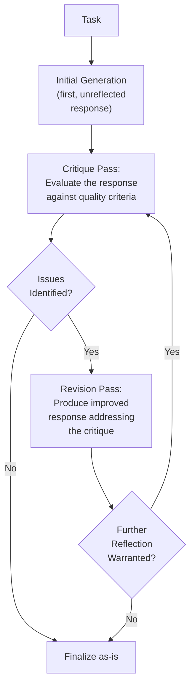
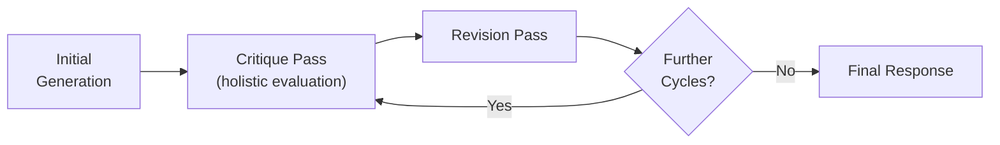
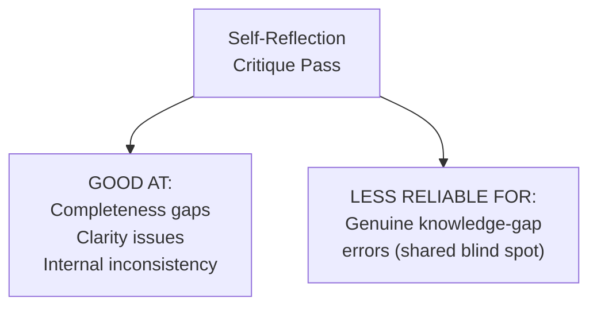

# 47 — Self-Reflection

> **Series:** Prompt Engineering Knowledge Library
> **File 47 of 60** | **Level:** Advanced
> **Prerequisites:** [`46_Self_Consistency.md`](./46_Self_Consistency.md), [`12_Prompt_Refinement.md`](./12_Prompt_Refinement.md)
> **Next:** [`48_ReAct_Prompting.md`](./48_ReAct_Prompting.md)

---

## Table of Contents

1. [Definition](#definition)
2. [Why It Matters](#why-it-matters)
3. [Core Concepts](#core-concepts)
4. [How It Works](#how-it-works)
5. [Internal Mechanism](#internal-mechanism)
6. [Types of Self-Reflection](#types-of-self-reflection)
7. [Syntax / Structure](#syntax--structure)
8. [Examples (Simple → Advanced)](#examples-simple--advanced)
9. [Best Practices](#best-practices)
10. [Common Mistakes](#common-mistakes)
11. [Real-World Applications](#real-world-applications)
12. [Comparison with Related Concepts](#comparison-with-related-concepts)
13. [Advantages & Limitations](#advantages--limitations)
14. [FAQs](#faqs)
15. [Summary](#summary)
16. [Cheat Sheet](#cheat-sheet)
17. [Glossary](#glossary)
18. [References](#references)
19. [Visual Diagram Gallery](#visual-diagram-gallery)

---

## Definition

**Self-Reflection** is the technique of having a model generate an initial response, then explicitly critique that same response against defined or implicit quality criteria, and finally produce a revised response informed by that critique — a single line of work examining and improving itself, as opposed to [File 46 — Self-Consistency](./46_Self_Consistency.md)'s approach of generating several independent, unexamined attempts and simply voting on the most common result. Where self-consistency answers "which of several separate attempts is most likely correct?", self-reflection asks a different question: "how can *this specific attempt* be improved by deliberately stepping back and evaluating it?"

> The core mechanism: **generate → critique → revise**, all applied to a single evolving response, rather than generating multiple parallel, non-interacting attempts.

---

## Why It Matters

- **It directly applies to open-ended tasks self-consistency's voting mechanism cannot handle** — creative writing, nuanced explanations, and other tasks without a single, comparable "correct" answer can still benefit from a deliberate critique-and-revise pass.
- **It formalizes a practice already familiar from human writing and editing** — drafting, then reviewing one's own work critically, then revising — directly connecting to [File 12 — Prompt Refinement](./12_Prompt_Refinement.md)'s human-side refinement practices, but performed by the model on its own output.
- **It can catch a specific class of error that a single, uninterrupted generation might miss** — an initial response generated in one continuous pass doesn't have the benefit of "re-reading" itself before finalizing, which self-reflection explicitly provides.
- **It's a distinct, complementary technique within the broader reliability-improvement toolkit** alongside self-consistency and Tree of Thought, each addressing reliability through a genuinely different mechanism.

---

## Core Concepts

| Concept | Definition |
|---|---|
| **Initial Generation** | The first, unreflected response to a task |
| **Critique Pass** | The step of evaluating the initial generation against quality criteria |
| **Revision Pass** | Producing an improved response informed by the critique |
| **Critique Criteria** | The specific dimensions or standards a critique pass evaluates against |
| **Reflection Depth** | How many critique-revise cycles are performed before finalizing |
| **Self-Critique Blind Spot** | The specific risk that a model's critique of its own work shares the same blind spots that produced the original weakness |

---

## How It Works



Unlike self-consistency's parallel, non-interacting samples, self-reflection is explicitly sequential and cumulative — each stage builds directly on and responds to the previous one, with the critique pass specifically designed to surface improvable aspects of the *particular* response just generated, not to compare against separately-generated alternatives.

---

## Internal Mechanism

### Why a separate, explicit critique pass can surface issues an uninterrupted generation misses

As established in [File 4 — How LLMs Interpret Prompts](./04_How_LLMs_Interpret_Prompts.md), a model generates tokens autoregressively, committing to each token before generating the next, with no ability to "look ahead" and revise earlier tokens once already produced within a single continuous generation. An explicit, separate critique pass changes this dynamic: the full initial response is now available as *input* to a fresh evaluation step, which can attend to the response holistically — noticing an inconsistency between an early and late section, an unaddressed edge case, or a claim that doesn't hold up on reflection — in a way that wasn't available to the model while it was still in the middle of producing that same response token by token. This is the precise mechanical reason self-reflection can catch certain issues an uninterrupted single generation cannot: it provides a genuinely different vantage point (evaluating a complete artifact) than the original generation had (producing that artifact incrementally, without the benefit of seeing the whole thing at once).

### Why self-critique blind spots are a genuine limitation, distinct from but related to meta-prompting's self-referential risk

This connects directly to [File 45 — Meta-Prompting](./45_Meta_Prompting.md)'s self-referential risk discussion, but applies it specifically to the case where the *same* underlying model both generates and critiques its own single response, often within the same overall interaction. If the initial generation's weakness stemmed from a genuine gap in the model's knowledge or a systematic pattern in how it approaches a certain task type, the critique pass — performed by that same underlying capability — has a real chance of not recognizing that specific weakness as a weakness at all, since the same underlying limitation that produced the flawed content may also shape how the critique itself is generated. This is why self-reflection, like meta-prompting, is best treated as a genuine, often effective improvement technique rather than a guaranteed error-correction mechanism — it catches many issues (particularly issues of completeness, clarity, and internal consistency, which benefit strongly from the "holistic view" advantage above) while remaining less reliable for catching issues rooted in a genuine knowledge gap or systematic blind spot.

---

## Types of Self-Reflection

| Type | Description | Best Suited For |
|---|---|---|
| **Criteria-Based Reflection** | Critique against explicitly stated quality criteria | Tasks with clear, definable quality dimensions |
| **Open-Ended Reflection** | A general "review your own response for any issues" prompt, no explicit criteria | Exploratory or creative tasks without easily enumerable criteria |
| **Single-Pass Reflection** | One critique-revise cycle | Most everyday applications, balancing benefit against added cost |
| **Iterative Reflection** | Multiple critique-revise cycles until a stopping condition is met | High-stakes content warranting deeper, repeated refinement |
| **Structured Reflection** | Critique organized by explicit categories (accuracy, completeness, clarity, tone) | Production applications needing systematic, auditable review |

---

## Syntax / Structure

```text
[Basic generate-critique-revise structure]
{{task}}

[After the initial response is generated:]

Now critique your own response above. Specifically identify: 
any factual concerns, missing important information, unclear 
explanations, or ways it could better address the original 
request.

[After critique:]

Based on that critique, provide a revised, improved response.
```

```text
[Structured reflection with explicit criteria]
{{task}}

After generating your response, evaluate it against these 
criteria: (1) accuracy — is anything stated that you're not 
confident is correct? (2) completeness — does it fully address 
the request? (3) clarity — would a reader unfamiliar with the 
topic understand it? 

Then provide a final, revised version addressing any gaps found.
```

---

## Examples (Simple → Advanced)

**Level 1 — Basic single-pass self-reflection:**
```text
Explain how vaccines work.

[Response generated]

Review your explanation above — is it accurate and clear for 
someone with no medical background? Revise if needed.
```

**Level 2 — Criteria-based reflection:**
```text
Write a product description for a wireless keyboard.

[Response generated]

Critique this description specifically for: does it mention 
key features (battery life, connectivity, compatibility)? Is 
the tone appropriately engaging without being overblown? 
Revise based on your critique.
```

**Level 3 — Iterative reflection (two cycles):**
```text
[Cycle 1]
{{complex_task}}
[Initial response] -> [Critique] -> [Revision 1]

[Cycle 2]
Critique Revision 1 again — are there any remaining gaps or 
issues? [Second critique] -> [Revision 2, final]
```

**Level 4 — Structured reflection with explicit category-by-category review:**
```text
{{report_writing_task}}

After drafting, review systematically:
CATEGORY: Accuracy — any unverified or uncertain claims?
CATEGORY: Completeness — does it address every part of the 
original request?
CATEGORY: Clarity — any jargon or unclear passages?
CATEGORY: Tone — appropriate for the stated audience?

For each category, note any issues found, then provide a 
final revised version addressing all identified issues.
```

**Level 5 — Self-reflection with explicit acknowledgment of blind-spot limitation, combined with external validation:**
```text
{{high_stakes_task}}

[Generate initial response]
[Critique against stated criteria]
[Revise based on critique]

Note: This self-reflection process is a valuable improvement 
step, but per its known limitation, it may not catch issues 
rooted in a genuine knowledge gap the same process shares. For 
this high-stakes task, the self-reflected output will ALSO be 
routed through independent validation (File 30) — schema 
checking and, where feasible, human review — rather than 
trusted as fully self-sufficient.
```

---

## Best Practices

1. **Provide explicit critique criteria when the task has definable quality dimensions** — criteria-based reflection tends to produce more consistent, actionable critique than open-ended "find any issues" requests.
2. **Recognize self-reflection's genuine strength**: catching completeness, clarity, and internal-consistency issues that benefit from a holistic view unavailable during initial generation, per the Internal Mechanism section.
3. **Don't treat self-reflection as a guaranteed catch-all for knowledge-gap or accuracy errors** — per the self-critique blind spot discussion, combine with independent validation ([File 30](./30_Response_Validation.md)) for genuinely high-stakes content.
4. **Balance reflection depth against cost** — each additional critique-revise cycle adds real token/latency cost, and returns diminish, similar in spirit to [File 16 — Prompt Iteration](./16_Prompt_Iteration.md)'s convergence discussion.
5. **Consider structured, category-based reflection for production applications** needing auditable, systematic review rather than an unstructured "check for issues" pass.

---

## Common Mistakes

| Mistake | Consequence | Fix |
|---|---|---|
| Using only open-ended, uncriteria'd reflection for tasks with clear quality dimensions | Less consistent, less actionable critique than criteria-based reflection would provide | Provide explicit critique criteria when definable |
| Trusting self-reflection as a complete solution for high-stakes accuracy concerns | Missing the self-critique blind spot risk — the critique may share the original weakness's blind spot | Combine with independent validation for high-stakes content |
| Unlimited, unjustified iterative reflection cycles | Diminishing returns at real, accumulating cost | Balance reflection depth against measured benefit, similar to iteration's convergence principle |
| Confusing self-reflection with self-consistency | Applying the wrong mechanism for the actual need — reflection improves one response, consistency selects among several independent ones | Keep the single-response-improvement versus multiple-independent-attempts distinction clear |
| No explicit revision step, only critique | Critique identifies issues without resolving them | Always include an explicit, final revision pass |

---

## Real-World Applications

- **Content generation requiring polish** — marketing copy, reports, and other content benefiting from a deliberate review-and-revise pass before finalizing.
- **Code generation and review** — a model generating code, then critiquing it for bugs, edge cases, or style issues, then revising, is a common and valuable pattern (connecting to [File 58 — Code Generation Prompts](./58_Code_Generation_Prompts.md) and [File 59 — Debugging Prompts](./59_Debugging_Prompts.md)).
- **Educational content creation** — reflecting specifically on clarity and completeness for an intended audience level.
- **Agentic systems performing multi-step tasks** — self-reflection at intermediate checkpoints can help an agent catch and correct its own course before proceeding further, connecting to [File 53 — Agentic Prompting](./53_Agentic_Prompting.md).

---

## Comparison with Related Concepts

| Concept | Difference from "Self-Reflection" |
|---|---|
| **Self-Consistency (File 46)** | Self-consistency generates several complete, independent, unexamined attempts and votes; self-reflection has a single evolving response examine and improve itself through critique and revision — fundamentally different mechanisms serving different task types |
| **Meta-Prompting (File 45)** | Meta-prompting broadly covers using a model to help with prompting/prompts themselves; self-reflection specifically applies critique-and-revise to a model's own *task response* within one interaction, a narrower, more specific application sharing the same self-referential risk consideration |
| **Prompt Refinement (File 12)** | Refinement is the general, often human-driven discipline of qualitative prompt polishing; self-reflection is a specific technique where the model itself performs an analogous critique-and-revise process on its own generated *response*, not the prompt |

---

## Advantages & Limitations

### ✅ Advantages of Self-Reflection

- **Applies to open-ended tasks** self-consistency's voting mechanism cannot handle.
- **Provides a genuine holistic-view advantage** over uninterrupted single generation, catching completeness and consistency issues effectively.
- **Formalizes a familiar, well-understood human practice** (draft, review, revise), making it intuitive to apply and reason about.

### ⚠️ Limitations

- **Carries genuine self-critique blind spot risk** — the same underlying limitation producing an original weakness may also shape the critique, missing that same weakness.
- **Adds real cost** proportional to reflection depth, with diminishing returns beyond a certain point.
- **Less reliable for catching genuine knowledge-gap or factual accuracy errors** than for catching completeness, clarity, and consistency issues — a real, mechanism-grounded distinction in what it's actually good at catching.

---

## FAQs

**Q: Does self-reflection guarantee an improved response?**
A: Not with absolute certainty — it's a strong, generally effective technique, particularly for completeness and clarity issues, but per the self-critique blind spot limitation, it's not guaranteed to catch every kind of error, especially ones rooted in genuine knowledge gaps.

**Q: How is self-reflection different from just asking for a longer, more careful initial response?**
A: The critical difference is the separate, holistic evaluation step — per the Internal Mechanism section, a critique pass has access to the complete initial response as input, providing a vantage point genuinely unavailable to the model while still producing that response incrementally, token by token.

**Q: Should I always include multiple reflection cycles?**
A: Not necessarily — a single critique-revise cycle is often sufficient and most cost-effective; additional cycles should be justified by genuinely observed continued improvement, not applied by default.

**Q: Can self-reflection be combined with self-consistency?**
A: Yes — these address different aspects of reliability and aren't mutually exclusive; a system could, for instance, apply self-reflection to each independent sample before self-consistency's voting step, though this compounds the cost of both techniques.

---

## Summary

Self-Reflection has a single response undergo an explicit critique pass — evaluating it holistically against quality criteria — followed by a revision pass producing an improved version, exploiting a genuine vantage point advantage: a complete response is available as input to critique in a way it wasn't available to itself during incremental, token-by-token generation. This makes self-reflection particularly effective for completeness, clarity, and internal-consistency issues, while carrying a genuine self-critique blind spot risk for issues rooted in a knowledge gap the critique process may share with the original generation — a limitation best addressed by combining self-reflection with independent validation for genuinely high-stakes content, rather than treating it as a complete, self-sufficient solution. Having covered this critique-and-revise mechanism, the library turns to a technique combining reasoning with external action-taking: [File 48 — ReAct Prompting](./48_ReAct_Prompting.md).

---

## Cheat Sheet

```text
SELF-REFLECTION — QUICK REFERENCE

THE MECHANISM: Generate -> Critique (against criteria) -> Revise
(a SINGLE evolving response, not multiple independent attempts)

GOOD AT catching: completeness gaps, clarity issues, internal 
inconsistency (genuine holistic-view advantage)
LESS RELIABLE for: knowledge-gap or accuracy errors (self-
critique blind spot risk — shares the same underlying limitation)

BEST PRACTICE: Provide EXPLICIT critique criteria when 
possible; for high-stakes content, combine with independent 
validation (File 30), don't rely on self-reflection alone.
```

---

## Glossary

| Term | Definition |
|---|---|
| **Initial Generation** | The first, unreflected response to a task |
| **Critique Pass** | Evaluating the initial generation against quality criteria |
| **Revision Pass** | Producing an improved response informed by critique |
| **Critique Criteria** | The specific dimensions a critique pass evaluates against |
| **Reflection Depth** | The number of critique-revise cycles performed |
| **Self-Critique Blind Spot** | The risk that self-critique shares the original weakness's blind spot |

---

## References

- Shinn, N. et al. (2023) — *Reflexion: Language Agents with Verbal Reinforcement Learning*, arXiv:2303.11366
- Madaan, A. et al. (2023) — *Self-Refine: Iterative Refinement with Self-Feedback*, arXiv:2303.17651
- Anthropic — [Prompt Engineering Overview](https://docs.claude.com/en/docs/build-with-claude/prompt-engineering/overview)
- Pan, L. et al. (2023) — *Automatically Correcting Large Language Models: Surveying the Landscape of Self-Correction Strategies*, arXiv:2308.03188

---

## Visual Diagram Gallery

**Diagram 1 — The Generate-Critique-Revise Cycle**


**Diagram 2 — Self-Reflection vs. Self-Consistency (mechanism contrast)**
```text
SELF-REFLECTION:                SELF-CONSISTENCY:
ONE response -> critique          MULTIPLE independent responses
-> revise -> improved             -> vote -> most common wins
(sequential, cumulative)          (parallel, non-interacting)
```

**Diagram 3 — What Self-Reflection Catches Well vs. Poorly**


---

**⬅️ Previous:** [`46_Self_Consistency.md`](./46_Self_Consistency.md)
**➡️ Next:** [`48_ReAct_Prompting.md`](./48_ReAct_Prompting.md) — Combining reasoning with external action-taking.
