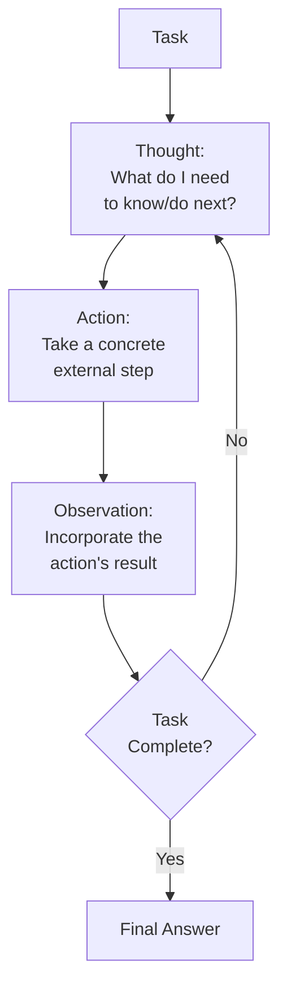
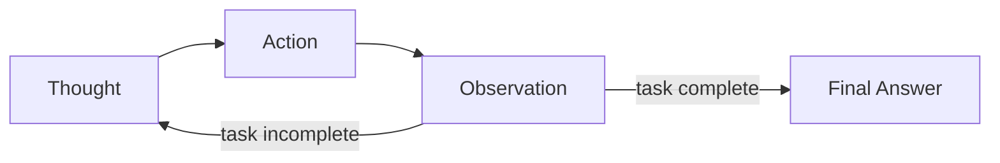
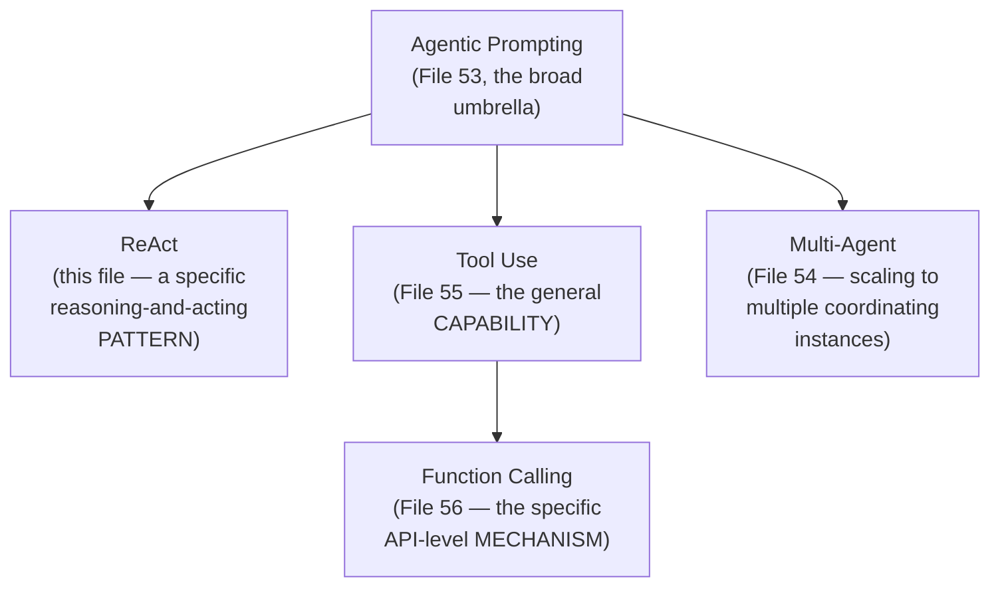

# 48 — ReAct Prompting

> **Series:** Prompt Engineering Knowledge Library
> **File 48 of 60** | **Level:** Advanced
> **Prerequisites:** [`41_Chain_of_Thought.md`](./41_Chain_of_Thought.md), [`19_Prompt_Patterns.md`](./19_Prompt_Patterns.md)
> **Next:** [`49_Least_to_Most_Prompting.md`](./49_Least_to_Most_Prompting.md)

---

## Table of Contents

1. [Definition](#definition)
2. [Why It Matters](#why-it-matters)
3. [Core Concepts](#core-concepts)
4. [How It Works](#how-it-works)
5. [Internal Mechanism](#internal-mechanism)
6. [Types of ReAct Implementations](#types-of-react-implementations)
7. [Syntax / Structure](#syntax--structure)
8. [Examples (Simple → Advanced)](#examples-simple--advanced)
9. [Best Practices](#best-practices)
10. [Common Mistakes](#common-mistakes)
11. [Real-World Applications](#real-world-applications)
12. [Comparison with Related Concepts](#comparison-with-related-concepts)
13. [Advantages & Limitations](#advantages--limitations)
14. [FAQs](#faqs)
15. [Summary](#summary)
16. [Cheat Sheet](#cheat-sheet)
17. [Glossary](#glossary)
18. [References](#references)
19. [Visual Diagram Gallery](#visual-diagram-gallery)

---

## Definition

**ReAct (Reason + Act)** is a prompting pattern that interleaves explicit reasoning steps with concrete external actions — tool calls, searches, API requests — and their resulting observations, in a repeating Thought → Action → Observation cycle, rather than reasoning purely internally ([Chain of Thought](./41_Chain_of_Thought.md)) or acting without explicit intermediate reasoning. [File 19 — Prompt Patterns](./19_Prompt_Patterns.md) introduced ReAct briefly within its general catalog; this file provides the dedicated deep-dive. ReAct is best understood as a specific, well-defined reasoning *pattern* that commonly operates *within* the broader agentic systems this library covers later ([Files 53–56](./53_Agentic_Prompting.md)) — the pattern is the reasoning-and-acting rhythm; agentic prompting is the larger umbrella of goal-directed, autonomous, multi-step operation this rhythm often serves.

> The defining cycle: **Thought** (reason about what's needed next) → **Action** (take a concrete external action based on that reasoning) → **Observation** (receive and incorporate the action's result) → repeat, until the task is complete.

---

## Why It Matters

- **It directly addresses a genuine limitation of pure internal reasoning**: a model reasoning entirely within its own generated text, with no ability to check external, current, or verifiable information, can only work with what it already has — ReAct's action step provides a mechanism to actually go get what's missing.
- **It grounds reasoning in real, verifiable observations** rather than the model's own potentially incomplete or outdated internal knowledge, connecting directly to [File 26 — Context Injection](./26_Context_Injection.md)'s discussion of grounding responses in retrieved, current data.
- **It's foundational to modern tool-using and agentic AI systems** — understanding this specific reasoning-and-acting rhythm well is prerequisite to understanding how those larger systems ([Files 53–56](./53_Agentic_Prompting.md)) actually operate turn by turn.
- **The explicit Thought step provides genuine transparency and debuggability** into why a particular action was taken, valuable both for building trust and for diagnosing failures ([File 13 — Prompt Debugging](./13_Prompt_Debugging.md)) in agentic systems.

---

## Core Concepts

| Concept | Definition |
|---|---|
| **Thought** | An explicit reasoning step, stating what's needed and why, before taking an action |
| **Action** | A concrete external operation taken based on the preceding thought (a tool call, search, API request) |
| **Observation** | The result returned by an action, incorporated into subsequent reasoning |
| **Cycle** | One complete Thought → Action → Observation sequence |
| **Termination Condition** | The criteria determining when the cycle stops and a final answer is given |
| **Action Space** | The specific set of tools or actions available to be taken |

---

## How It Works



Each cycle's Thought is conditioned on all prior Observations, directly exploiting the same autoregressive conditioning mechanism CoT relies on ([File 41](./41_Chain_of_Thought.md)) — but here, the "context" being conditioned on includes genuinely external, freshly-retrieved information from Observations, not merely the model's own prior internally-generated reasoning tokens.

---

## Internal Mechanism

### Why interleaving reasoning with action outperforms either pure reasoning or pure action alone

A model reasoning purely internally (CoT alone) is limited to whatever information is already in its training or the original prompt — it cannot obtain new, current, or verifiable information mid-task. A model taking actions without explicit interleaved reasoning risks taking poorly-motivated or poorly-sequenced actions, since there's no explicit record of *why* a given action was chosen, making it harder to course-correct if an action's result turns out to be unhelpful or unexpected. ReAct's interleaving directly addresses both limitations simultaneously: the Thought step ensures each action is deliberately, legibly motivated (supporting better action selection and easier debugging), while the Action/Observation steps ensure reasoning isn't confined to only what the model already "knew" at the start — each cycle's reasoning can incorporate genuinely new, externally-verified information the previous cycle's action retrieved.

### Why the Observation step's fidelity directly bounds the whole cycle's reliability

Because each subsequent Thought is conditioned on prior Observations ([File 4 — How LLMs Interpret Prompts](./04_How_LLMs_Interpret_Prompts.md)), an Observation that's incomplete, malformed, or misleading propagates that problem forward into every subsequent reasoning step, in a way structurally similar to Chain of Thought's error-propagation risk ([File 41](./41_Chain_of_Thought.md)) — except here, the "error" originates from an external system (a tool's output, a search result) rather than the model's own reasoning. This is precisely why the reliability of a ReAct-based system depends not just on prompt design but on the reliability of its underlying tools and the fidelity with which their results are captured as Observations — a genuine, practical engineering concern beyond prompt wording alone, connecting to [File 55 — Tool Use Prompting](./55_Tool_Use_Prompting.md) and [File 56 — Function Calling](./56_Function_Calling.md)'s more detailed treatment of tool reliability.

---

## Types of ReAct Implementations

| Type | Description | Best Suited For |
|---|---|---|
| **Search-Augmented ReAct** | Actions are primarily information retrieval (web search, knowledge base lookup) | Question-answering requiring current or specific factual grounding |
| **Multi-Tool ReAct** | Actions draw from a diverse toolset (calculator, search, code execution, API calls) | Complex tasks requiring several distinct capability types |
| **Single-Domain ReAct** | Actions are all within one narrow domain (e.g., only database queries) | Focused applications with a well-defined, limited action space |
| **Human-Confirmed ReAct** | Certain actions (especially consequential ones) require explicit human confirmation before execution | High-stakes agentic systems, connecting to [File 26](./26_Context_Injection.md)'s defense-in-depth confirmation practices |

---

## Syntax / Structure

```text
[The classic ReAct prompt structure]
You have access to the following tools: {{tool_descriptions}}

Solve the task by alternating between Thought, Action, and 
Observation steps. Use this exact format:

Thought: [your reasoning about what to do next]
Action: [tool_name(arguments)]
Observation: [result will be provided here]
... (repeat as needed)
Thought: [final reasoning]
Final Answer: [your conclusion]

Task: {{task}}
```

```text
[Example of one complete cycle in context]
Task: What's the current weather in Tokyo, and should I bring 
an umbrella?

Thought: I need current weather data for Tokyo, which I don't 
have from memory — I should use the weather tool.
Action: weather_lookup("Tokyo")
Observation: 18°C, 70% chance of rain this afternoon.

Thought: With a 70% chance of rain, an umbrella is a sensible 
precaution.
Final Answer: It's 18°C in Tokyo with a 70% chance of rain 
this afternoon — I'd recommend bringing an umbrella.
```

---

## Examples (Simple → Advanced)

**Level 1 — Simple single-cycle ReAct:**
```text
Task: What's 15% of the current price of item #4471?

Thought: I need the current price, which I don't have — 
let me look it up.
Action: product_lookup(4471)
Observation: Price: $80.00

Thought: 15% of $80.00 = $12.00
Final Answer: 15% of the current price is $12.00.
```

**Level 2 — Multi-cycle ReAct:**
```text
Task: Is it warmer in Miami or Phoenix right now?

Thought: I need current temperatures for both cities.
Action: weather_lookup("Miami")
Observation: 28°C

Thought: Now I need Phoenix's temperature to compare.
Action: weather_lookup("Phoenix")
Observation: 31°C

Thought: 31°C > 28°C, so Phoenix is currently warmer.
Final Answer: Phoenix is currently warmer (31°C) than Miami (28°C).
```

**Level 3 — ReAct with a search-augmented information gap:**
```text
Task: Summarize the key point of the company's latest press release.

Thought: I don't have this press release in my training data 
since it's recent — I need to search for it.
Action: web_search("company X latest press release")
Observation: [search results returned, including a link and snippet]

Thought: The snippet mentions a product launch — let me get 
the full content for an accurate summary.
Action: web_fetch("[URL from search results]")
Observation: [full press release text]

Thought: I now have enough information to summarize accurately.
Final Answer: [accurate summary based on the fetched content]
```

**Level 4 — Human-confirmed ReAct for a consequential action:**
```text
Task: Cancel my subscription and process a refund.

Thought: This is a consequential action (financial impact) — 
per this system's confirmation policy, I should verify with 
the user before executing, not just reason my way to doing it.
Action: request_human_confirmation("Confirm: cancel 
subscription and process refund of $49.99?")
Observation: User confirmed: "Yes, proceed."

Thought: Confirmation received — now safe to proceed with the action.
Action: cancel_subscription_and_refund(user_id, amount=49.99)
Observation: Success — subscription canceled, refund processed.

Final Answer: Your subscription has been canceled and a 
$49.99 refund has been processed.
```

**Level 5 — Multi-tool ReAct with error handling and course correction:**
```text
Task: Book a flight from NYC to Tokyo for next Friday, 
economy class, and confirm the booking.

Thought: I need current flight availability — let me search.
Action: flight_search(origin="NYC", dest="Tokyo", 
date="next Friday", class="economy")
Observation: ERROR — "next Friday" is ambiguous; specific 
date required.

Thought: The action failed due to date ambiguity — I need to 
resolve this before retrying, not just repeat the same failing 
action. Today's date context suggests "next Friday" is 
{{resolved_specific_date}}.
Action: flight_search(origin="NYC", dest="Tokyo", 
date="{{resolved_specific_date}}", class="economy")
Observation: 3 flights found: [flight details]

Thought: I have valid options now. Per policy, booking is a 
consequential action requiring confirmation before proceeding.
Action: request_human_confirmation("Book flight [details], 
$XXX total?")
Observation: User confirmed.

Thought: Confirmed — proceeding with booking.
Action: book_flight(flight_id, passenger_details)
Observation: Booking confirmed, confirmation #ABC123.

Final Answer: Your flight is booked — confirmation #ABC123.
```

---

## Best Practices

1. **Require an explicit Thought before every Action**, not just at the start — this maintains the legibility and deliberate-motivation benefit throughout the entire cycle, not just the first step.
2. **Define a clear, bounded action space** ([File 55 — Tool Use Prompting](./55_Tool_Use_Prompting.md)) so the model knows exactly what actions are genuinely available, rather than attempting undefined or unsupported actions.
3. **Require human confirmation for consequential actions** (Level 4), directly connecting to [File 26 — Context Injection](./26_Context_Injection.md)'s defense-in-depth principle — reasoning alone shouldn't authorize high-stakes real-world actions.
4. **Design for graceful error handling within the cycle** (Level 5) — an action failure should prompt a Thought about how to recover, not a repeated identical retry or a silent failure.
5. **Invest in Observation fidelity** — per the Internal Mechanism section, the whole cycle's reliability is bounded by how completely and accurately action results are captured as Observations.

---

## Common Mistakes

| Mistake | Consequence | Fix |
|---|---|---|
| Skipping the Thought step for some actions | Loses legibility and deliberate motivation for those specific actions | Require an explicit Thought before every single Action |
| Undefined or overly broad action space | Model attempts unsupported or poorly-specified actions | Define a clear, bounded set of available actions/tools |
| No human confirmation requirement for consequential actions | Real-world harm risk from an autonomous action taken without adequate oversight | Require explicit confirmation for consequential actions |
| No graceful error handling for failed actions | Repeated identical failing retries, or silent, unnoticed failure | Design explicit recovery reasoning for action failures |
| Incomplete or lossy Observation capture | Subsequent reasoning is built on an inaccurate picture of what actually happened | Invest in complete, accurate Observation capture |

---

## Real-World Applications

- **AI research and browsing agents** — the canonical ReAct use case, interleaving search actions with reasoning about what to search for next and how to synthesize findings.
- **Customer service agents with backend system access** — looking up order status, checking policies, and taking authorized actions, all with explicit, auditable reasoning at each step.
- **Coding assistants that can execute and test code** — reasoning about what to try, running it, observing the result (including errors), and reasoning about the next step.
- **Multi-step business process automation** — any agentic workflow requiring both reasoning and real, verifiable external actions benefits directly from this pattern's structure.

---

## Comparison with Related Concepts

| Concept | Difference from "ReAct Prompting" |
|---|---|
| **Chain of Thought (File 41)** | CoT reasons purely internally, with no external action-taking; ReAct interleaves reasoning with genuine external actions and their observed results — CoT is, in effect, the "Reason" half of ReAct without the "Act" half |
| **Agentic Prompting (File 53)** | Agentic prompting is the broader umbrella of goal-directed, autonomous, multi-step system design; ReAct is one specific, well-defined reasoning-and-acting *pattern* commonly used within that broader umbrella, not synonymous with it |
| **Tool Use Prompting (File 55)** | Tool use is the general *capability* of a system to invoke external tools; ReAct is a specific *pattern for structuring the reasoning* around when and how to invoke those tools, one particular way of organizing tool use, not the only possible one |

---

## Advantages & Limitations

### ✅ Advantages of ReAct Prompting

- **Directly addresses pure internal reasoning's inability to access new, current, or verifiable information** mid-task.
- **Provides genuine transparency and debuggability** through explicit, legible Thought steps motivating each action.
- **Foundational, well-documented pattern** underlying much of modern tool-using and agentic AI system design.

### ⚠️ Limitations

- **Reliability is bounded by the underlying tools' reliability and Observation fidelity** — a genuine engineering concern beyond prompt design alone.
- **Adds meaningful complexity and token cost** compared to a simple, single-response answer, justified specifically when genuine external information or action is actually needed.
- **Requires careful action-space definition and confirmation policies** for consequential actions — the pattern alone doesn't provide safety guarantees without deliberate, additional design (connecting to [File 26](./26_Context_Injection.md)'s defense-in-depth principle).

---

## FAQs

**Q: Is ReAct the same thing as "agentic AI"?**
A: No — ReAct is a specific, well-defined reasoning-and-acting *pattern* that's commonly used *within* agentic systems, but agentic prompting ([File 53](./53_Agentic_Prompting.md)) is the broader umbrella concept, which could in principle be implemented with different underlying reasoning patterns.

**Q: Does every action in a ReAct cycle need explicit human confirmation?**
A: No — only consequential actions genuinely warranting it (financial transactions, irreversible operations, sensitive data changes); low-stakes, easily-reversible actions like information lookups typically don't need this overhead, per the general stakes-calibration principle running throughout this library.

**Q: What happens if an action fails or returns an unexpected result?**
A: A well-designed ReAct system's next Thought step should explicitly reason about the failure and determine an appropriate recovery approach (Level 5), rather than repeating the same action identically or proceeding as if it had succeeded.

**Q: How is the "Action Space" defined in practice?**
A: Typically through explicit tool/function definitions provided in the system prompt or developer-tier content ([File 23](./23_Developer_Prompts.md)), directly connecting to the more detailed mechanics covered in [File 55 — Tool Use Prompting](./55_Tool_Use_Prompting.md) and [File 56 — Function Calling](./56_Function_Calling.md).

---

## Summary

ReAct (Reason + Act) interleaves explicit Thought steps with concrete external Actions and their resulting Observations in a repeating cycle, directly addressing pure internal reasoning's inability to access new, current, or verifiable information mid-task while providing genuine transparency into why each action was taken. The pattern's overall reliability is bounded not just by prompt design but by the fidelity of Observation capture and the reliability of underlying tools, and consequential actions specifically warrant human confirmation requirements rather than full autonomous authorization from reasoning alone. Understanding ReAct as a specific, well-defined pattern — rather than synonymous with "agentic AI" broadly — sets up the library's next several files, moving from this specific reasoning-and-acting rhythm toward the broader landscape of decomposition strategies, automated prompt improvement, and finally the full agentic and tool-use systems this pattern commonly serves. Continuing the reasoning-technique thread, the library turns next to a decomposition strategy for complex problems: [File 49 — Least-to-Most Prompting](./49_Least_to_Most_Prompting.md).

---

## Cheat Sheet

```text
REACT PROMPTING — QUICK REFERENCE

THE CYCLE: Thought -> Action -> Observation -> (repeat) -> 
           Final Answer

WHY IT WORKS: Combines reasoning's deliberate motivation with 
action's access to NEW, VERIFIABLE, EXTERNAL information — 
neither alone can do both.

ESSENTIAL PRACTICES
[ ] Explicit Thought before EVERY Action, not just the first
[ ] Clearly defined, bounded action space
[ ] Human confirmation for CONSEQUENTIAL actions
[ ] Graceful error-handling reasoning for failed actions

REMEMBER: ReAct is a SPECIFIC PATTERN, not synonymous with 
"agentic AI" broadly (File 53) — it's one common ingredient 
within that larger umbrella.
```

---

## Glossary

| Term | Definition |
|---|---|
| **Thought** | An explicit reasoning step before taking an action |
| **Action** | A concrete external operation based on the preceding thought |
| **Observation** | The result returned by an action |
| **Cycle** | One complete Thought → Action → Observation sequence |
| **Termination Condition** | The criteria for stopping the cycle and giving a final answer |
| **Action Space** | The specific set of tools/actions available |

---

## References

- Yao, S. et al. (2022) — *ReAct: Synergizing Reasoning and Acting in Language Models*, arXiv:2210.03629
- Wei, J. et al. (2022) — *Chain-of-Thought Prompting Elicits Reasoning in Large Language Models*, arXiv:2201.11903
- Schick, T. et al. (2023) — *Toolformer: Language Models Can Teach Themselves to Use Tools*, arXiv:2302.04761
- Anthropic — [Tool Use with Claude](https://docs.claude.com/en/docs/build-with-claude/tool-use)

---

## Visual Diagram Gallery

**Diagram 1 — The Core ReAct Cycle**


**Diagram 2 — ReAct vs. Pure CoT (the added Action/Observation loop)**
```text
PURE CoT:
Question -> Step 1 -> Step 2 -> Step 3 -> Answer
(all internal, no new external information)

REACT:
Question -> Thought -> Action -> Observation (NEW external info!)
                -> Thought -> Action -> Observation -> ... -> Answer
```

**Diagram 3 — ReAct's Position Within the Agentic Taxonomy**


---

**⬅️ Previous:** [`47_Self_Reflection.md`](./47_Self_Reflection.md)
**➡️ Next:** [`49_Least_to_Most_Prompting.md`](./49_Least_to_Most_Prompting.md) — Decomposing a complex problem into progressively solved sub-problems.
