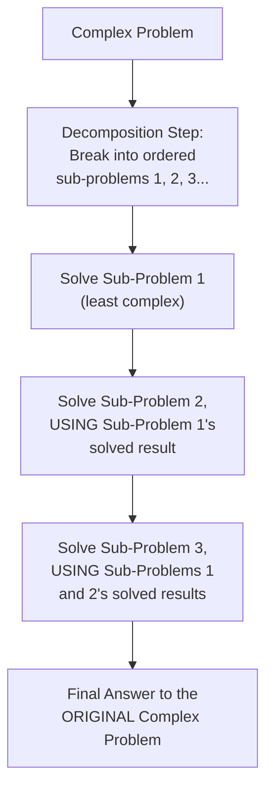
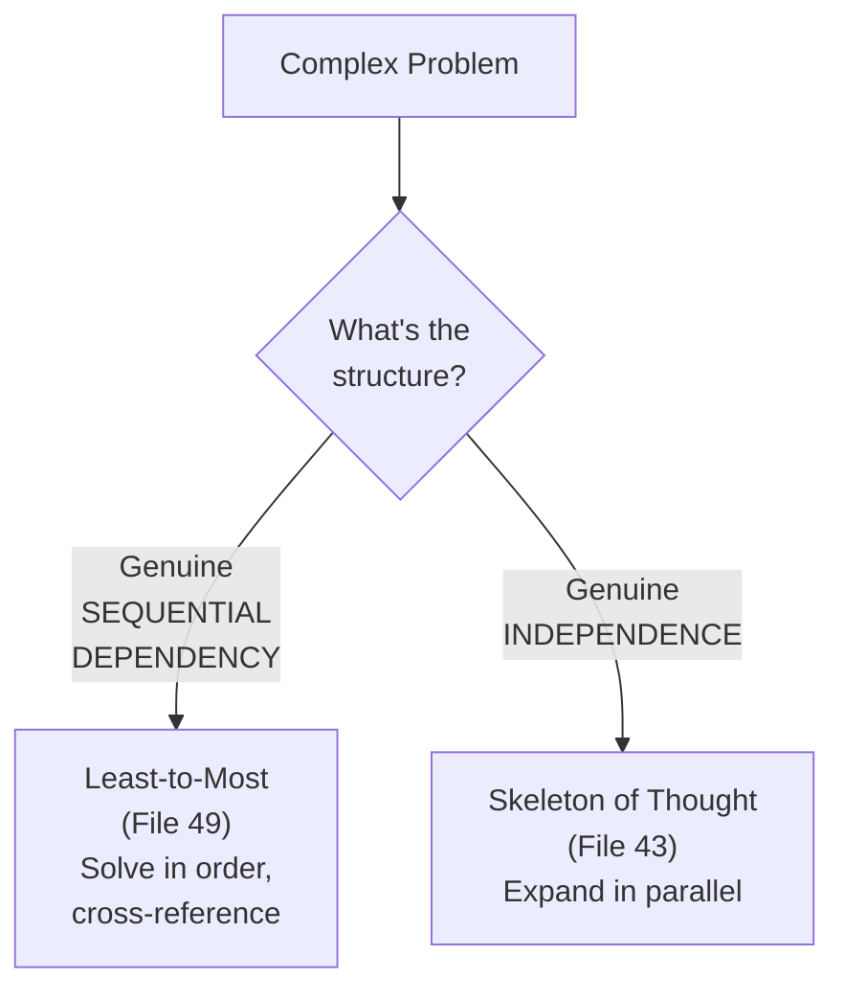

# 49 — Least-to-Most Prompting

> **Series:** Prompt Engineering Knowledge Library
> **File 49 of 60** | **Level:** Advanced
> **Prerequisites:** [`41_Chain_of_Thought.md`](./41_Chain_of_Thought.md), [`44_Step_Back_Prompting.md`](./44_Step_Back_Prompting.md)
> **Next:** [`50_Automatic_Prompt_Engineering.md`](./50_Automatic_Prompt_Engineering.md)

---

## Table of Contents

1. [Definition](#definition)
2. [Why It Matters](#why-it-matters)
3. [Core Concepts](#core-concepts)
4. [How It Works](#how-it-works)
5. [Internal Mechanism](#internal-mechanism)
6. [Types of Decomposition](#types-of-decomposition)
7. [Syntax / Structure](#syntax--structure)
8. [Examples (Simple → Advanced)](#examples-simple--advanced)
9. [Best Practices](#best-practices)
10. [Common Mistakes](#common-mistakes)
11. [Real-World Applications](#real-world-applications)
12. [Comparison with Related Concepts](#comparison-with-related-concepts)
13. [Advantages & Limitations](#advantages--limitations)
14. [FAQs](#faqs)
15. [Summary](#summary)
16. [Cheat Sheet](#cheat-sheet)
17. [Glossary](#glossary)
18. [References](#references)
19. [Visual Diagram Gallery](#visual-diagram-gallery)

---

## Definition

**Least-to-Most Prompting** decomposes a complex problem into a sequence of progressively harder sub-problems, solving each one in order, with each solution explicitly feeding into and informing the solving of the next — moving from the *least* complex sub-problem to the *most* complex, until the original, full problem is resolved. This differs from [File 41 — Chain of Thought](./41_Chain_of_Thought.md)'s within-a-single-answer step-by-step reasoning by operating at a coarser, explicit decomposition level: least-to-most first identifies the *distinct sub-problems themselves* as a deliberate planning step, before solving them in a carefully ordered sequence, whereas CoT reasons through steps toward one answer without necessarily first explicitly identifying and ordering them as separate sub-problems.

> The core structural idea: **first decompose, then solve the decomposition in order of increasing difficulty, each solved sub-problem's result becoming available context for solving the next.**

---

## Why It Matters

- **It directly addresses problems that are too complex for even Chain of Thought's linear steps to handle reliably in one pass** — genuinely compositional problems, where later parts depend on earlier parts in a structured way, benefit from explicit decomposition before attempting a solution.
- **It provides a natural way to build up context progressively** — each sub-problem's solved result becomes available, verified context for the next, rather than the model needing to hold an entire complex problem's full solution path in mind at once.
- **It's particularly valuable for problems that scale in a structured way** (e.g., problems with a clear recursive or incremental structure), where the decomposition itself mirrors the problem's natural structure.
- **Understanding when a problem's structure genuinely supports least-to-most decomposition, versus when it doesn't, is itself a practical skill** — much like [File 43 — Skeleton of Thought](./43_Skeleton_of_Thought.md)'s point-independence prerequisite, least-to-most has its own structural prerequisite worth understanding clearly.

---

## Core Concepts

| Concept | Definition |
|---|---|
| **Decomposition Step** | The initial step of breaking a complex problem into an ordered sequence of sub-problems |
| **Sub-Problem** | One distinct, individually solvable piece of the larger decomposed problem |
| **Sequential Dependency** | The property that later sub-problems build on and require earlier sub-problems' solved results |
| **Progressive Context Building** | Each solved sub-problem's result becoming available context for solving subsequent ones |
| **Difficulty Ordering** | Arranging sub-problems from least to most complex |
| **Compositional Generalization** | The ability to correctly solve a complex problem by correctly composing solutions to its simpler parts |

---

## How It Works



The defining structural feature, distinguishing this from simply "solving step by step" (CoT), is the *explicit, upfront decomposition* into named sub-problems, followed by *deliberately sequential* solving where each later sub-problem's solving process explicitly references and builds on earlier ones' already-solved, verified results — not merely on the model's own prior reasoning tokens in an undifferentiated stream.

---

## Internal Mechanism

### Why explicit decomposition helps with genuinely compositional problems specifically

Certain problems have a genuinely compositional structure — the full problem's correct answer is systematically built from correctly answering a sequence of simpler, related sub-problems, where each sub-problem's correct solution is a necessary, well-defined input to the next. As established in [File 4 — How LLMs Interpret Prompts](./04_How_LLMs_Interpret_Prompts.md), a model's reasoning is shaped by learned patterns, and for problems with this genuinely compositional structure, models sometimes show a documented capability gap: correctly solving each individual sub-problem *when asked in isolation*, while still struggling with the full, complex composed problem when attempted all at once. Least-to-most directly targets this specific gap: by explicitly surfacing the decomposition and solving sub-problems in verified sequence, it structures the interaction in a way that more closely matches the model's demonstrated per-sub-problem competence, rather than requiring the model to implicitly perform both the decomposition *and* the full composed solution simultaneously within one less-structured attempt.

### Why sequential dependency is least-to-most's genuine, defining prerequisite — and why it's the mirror image of Skeleton of Thought's prerequisite

Recall [File 43 — Skeleton of Thought](./43_Skeleton_of_Thought.md)'s hard prerequisite: genuine *point independence*, where parts can be generated without needing each other's specific content. Least-to-most's prerequisite is the precise opposite: genuine *sequential dependency*, where later sub-problems specifically *require* earlier ones' solved results to be correctly attempted at all. This isn't a coincidence — it reflects two genuinely different problem structures each technique is specifically built for. Applying least-to-most to a problem with actually-independent parts adds unnecessary sequential structure where parallel structure (SoT) would be both faster and equally effective; applying SoT to a problem with genuine sequential dependency (least-to-most's proper domain) risks the inconsistency discussed in [File 43](./43_Skeleton_of_Thought.md)'s Best Practices. Correctly diagnosing which structure a given complex problem actually has is the practical skill connecting these two techniques as structural mirror images of each other.

---

## Types of Decomposition

| Type | Description | Best Suited For |
|---|---|---|
| **Linear Sequential Decomposition** | Sub-problems form a single, ordered chain, each depending only on the immediately preceding one | Problems with a clear, single-threaded build-up structure |
| **Cumulative Decomposition** | Each sub-problem depends on ALL prior solved sub-problems, not just the immediately preceding one | Problems where context genuinely accumulates across the whole sequence |
| **Recursive Decomposition** | The decomposition itself has a self-similar, recursive structure (solving a smaller version of the same problem type) | Problems with genuine recursive structure (e.g., certain combinatorial or nested problems) |
| **Guided Decomposition** | The decomposition structure is provided explicitly by the prompt author, rather than left for the model to derive | High-stakes applications where a specific, verified decomposition is already known |

---

## Syntax / Structure

```text
[Basic least-to-most structure]
{{complex_problem}}

First, decompose this into a sequence of simpler sub-problems, 
ordered from easiest to hardest, where each later sub-problem 
may depend on solving the earlier ones.

Then, solve each sub-problem IN ORDER, explicitly using the 
solved result of each prior sub-problem as needed for the next.

Finally, use the sequence of solved sub-problems to answer the 
original complex problem.
```

```text
[Guided decomposition — prompt author provides the structure]
{{complex_problem}}

Solve this in the following order, using each step's result 
in the next:
Step 1: {{sub_problem_1}}
Step 2 (using Step 1's result): {{sub_problem_2}}
Step 3 (using Steps 1-2's results): {{sub_problem_3}}
Final: Combine all solved steps to answer the original problem.
```

---

## Examples (Simple → Advanced)

**Level 1 — Simple two-level decomposition:**
```text
Problem: "If a car travels 60 miles in the first hour and its 
speed increases by 10 mph each subsequent hour, how far has 
it traveled after 3 hours?"

Decomposition:
Sub-problem 1: What's the speed in hour 2? (60 + 10 = 70 mph)
Sub-problem 2: What's the speed in hour 3? (70 + 10 = 80 mph)
Sub-problem 3 (using 1 & 2): Total distance = 60 + 70 + 80 = 210 miles
```

**Level 2 — Cumulative decomposition:**
```text
Problem: A compound interest calculation over 3 years.

Sub-problem 1: Balance after year 1 (using initial principal)
Sub-problem 2: Balance after year 2 (using Sub-problem 1's 
result as the new principal)
Sub-problem 3: Balance after year 3 (using Sub-problem 2's 
result as the new principal)
Final: Sub-problem 3's result IS the final answer.
```

**Level 3 — Guided decomposition for a multi-part word problem:**
```text
Problem: "A recipe serves 4 and needs 2 cups of flour. If I'm 
cooking for 10 people and want to double the recipe's spice 
level, how much flour do I need?"

Guided decomposition:
Step 1: What's the scaling factor for 10 people vs. 4? (10/4 = 2.5)
Step 2 (using Step 1): How much flour for 10 people, 
unadjusted for spice? (2 cups × 2.5 = 5 cups)
Note: The "doubled spice level" detail is a distractor 
relevant to spice quantity, NOT flour — Step 2's flour 
answer is unaffected by it.
Final Answer: 5 cups of flour.
```

**Level 4 — Recursive decomposition for a structured combinatorial problem:**
```text
Problem: How many ways can you arrange 4 distinct books on a 
shelf?

Recursive decomposition:
Sub-problem (1 book): 1 way
Sub-problem (2 books, using 1-book result): 2 × 1 = 2 ways
Sub-problem (3 books, using 2-book result): 3 × 2 = 6 ways
Sub-problem (4 books, using 3-book result): 4 × 6 = 24 ways
Final Answer: 24 ways (this recursive structure directly 
mirrors the factorial calculation's natural build-up).
```

**Level 5 — Full least-to-most for a genuinely complex, multi-stage business problem:**
```text
Problem: "Our team's velocity has been declining for 3 
sprints. Given our sprint data, project when we'll miss our 
Q3 deadline if the trend continues, and recommend an 
intervention."

Decomposition (cumulative):
Sub-problem 1: What's the actual velocity trend across the 3 
sprints? (calculate from data)

Sub-problem 2 (using Sub-problem 1): If this trend continues 
linearly, what's the projected velocity in each remaining 
sprint before Q3?

Sub-problem 3 (using Sub-problem 2): Given those projected 
velocities, will the remaining Q3 scope be completed on time, 
or by how much will it miss?

Sub-problem 4 (using Sub-problems 1-3): Given the SPECIFIC 
nature of the decline (is it consistent, accelerating, or 
volatile — visible from Sub-problem 1's analysis) and the 
SPECIFIC projected miss (Sub-problem 3), what intervention 
would most directly address the root cause, not just the symptom?

Final Answer: [synthesized from all four sequentially-solved, 
interdependent sub-problems]
```

---

## Best Practices

1. **Verify genuine sequential dependency before applying least-to-most** — per the Internal Mechanism section, this is the technique's hard, defining prerequisite; for genuinely independent sub-parts, [Skeleton of Thought](./43_Skeleton_of_Thought.md) is the more appropriate, faster technique.
2. **Make the decomposition explicit and visible**, not implicit — this is precisely what distinguishes least-to-most from simply asking for step-by-step reasoning ([Chain of Thought](./41_Chain_of_Thought.md)).
3. **Explicitly reference each prior sub-problem's solved result when solving the next** — this is what actually provides the progressive-context-building benefit, not merely solving sub-problems in sequence without cross-referencing them.
4. **Consider guided decomposition for high-stakes or well-understood problem structures** where the correct decomposition is already known, rather than always leaving decomposition to the model.
5. **Watch for distractor details that belong to one sub-problem but not another** (Level 3) — explicit decomposition can help isolate and correctly scope which details are actually relevant to which sub-problem.

---

## Common Mistakes

| Mistake | Consequence | Fix |
|---|---|---|
| Applying least-to-most to genuinely independent sub-parts | Unnecessary sequential structure where parallel structure (SoT) would be faster and equally effective | Verify genuine sequential dependency first; use SoT (File 43) for independent parts instead |
| Solving sub-problems in sequence without explicitly cross-referencing prior results | Loses the progressive-context-building benefit, becoming closer to unstructured step-by-step reasoning | Explicitly reference each prior sub-problem's solved result |
| Leaving decomposition entirely implicit | Harder to verify correctness of the decomposition itself, and loses the explicit-decomposition benefit distinguishing this from CoT | Make the decomposition step explicit and visible |
| Incorrect or poorly-ordered decomposition | Later sub-problems built on a flawed foundation, propagating the error forward | Consider guided decomposition for well-understood problem structures; verify the decomposition's correctness before proceeding |
| Not recognizing when a problem's true structure is recursive or cumulative rather than simple linear | Missing the specific benefit that structure provides (Level 4's factorial example) | Recognize and explicitly leverage the problem's actual underlying structure |

---

## Real-World Applications

- **Multi-stage quantitative or financial analysis** — problems where each stage's result genuinely feeds into and is required by the next (compound calculations, cascading projections).
- **Structured business and strategic analysis** — problems combining several genuinely interdependent factors (Level 5's example) where a clear decomposition improves both correctness and auditability.
- **Curriculum-style educational content generation** — teaching a complex topic by explicitly building from simpler, prerequisite sub-concepts to more complex ones, mirroring the technique's structure directly.
- **Complex, multi-constraint planning problems** — where later planning decisions genuinely depend on the resolved outcomes of earlier decisions.

---

## Comparison with Related Concepts

| Concept | Difference from "Least-to-Most Prompting" |
|---|---|
| **Chain of Thought (File 41)** | CoT reasons through steps toward one answer without necessarily first explicitly naming and ordering distinct sub-problems as a deliberate planning step; least-to-most makes this decomposition explicit and upfront, then solves it in verified sequence |
| **Skeleton of Thought (File 43)** | The structural mirror image — SoT requires genuine point INdependence for parallel expansion; least-to-most requires genuine sequential DEpendency, where later parts specifically need earlier parts' solved results |
| **Step-Back Prompting (File 44)** | Step-back derives one general principle before applying it to the specific case (a two-stage abstract-then-specific structure); least-to-most decomposes into multiple ordered, specific sub-problems solved in sequence — a different structural approach to complexity |

---

## Advantages & Limitations

### ✅ Advantages of Least-to-Most Prompting

- **Directly addresses a documented capability gap** for genuinely compositional problems — correct on sub-problems in isolation, less reliable on the same sub-problems composed together without explicit structuring.
- **Provides genuine progressive context building**, with each sub-problem's verified result available for the next.
- **Improves auditability** through explicit, visible decomposition, valuable for reviewing or debugging complex multi-stage reasoning.

### ⚠️ Limitations

- **Genuinely inapplicable to problems without real sequential dependency** — this is a hard, defining prerequisite, not a soft preference, mirroring Skeleton of Thought's opposite prerequisite.
- **An incorrect or poorly-ordered decomposition propagates its flaw forward** through every subsequent sub-problem, similar to Chain of Thought's error-propagation risk but at the decomposition-structure level.
- **Adds real complexity and token cost** compared to a direct attempt, justified specifically for problems genuinely complex enough to benefit from explicit decomposition.

---

## FAQs

**Q: How is least-to-most different from just asking a model to "break this down into steps"?**
A: The key differences are explicitness and cross-referencing — least-to-most makes the decomposition into distinct, named sub-problems an explicit, visible step, and requires each subsequent sub-problem's solving to explicitly reference and use prior sub-problems' solved results, not merely proceed in an undifferentiated sequential stream the way basic CoT often does.

**Q: Can least-to-most and Chain of Thought be combined?**
A: Yes — each individual sub-problem within a least-to-most decomposition can itself be solved using chain-of-thought reasoning if that sub-problem is itself non-trivial, similar to how [Step-Back Prompting](./44_Step_Back_Prompting.md)'s application stage can incorporate CoT.

**Q: What if I'm not sure whether my problem has genuine sequential dependency?**
A: A practical test: could sub-problem 3 be correctly solved without knowing sub-problem 1 and 2's specific results? If yes, the dependency isn't genuine, and [Skeleton of Thought](./43_Skeleton_of_Thought.md) may be more appropriate; if no — sub-problem 3 genuinely needs those specific results — least-to-most's structure fits.

**Q: Is least-to-most only useful for math and quantitative problems?**
A: No — while quantitative examples illustrate the mechanism cleanly, the technique applies to any genuinely compositional problem, including structured business analysis, curriculum design, and multi-constraint planning, as shown in this file's later examples.

---

## Summary

Least-to-Most Prompting explicitly decomposes a complex problem into an ordered sequence of sub-problems, from least to most complex, solving each in turn while explicitly building on prior sub-problems' verified, solved results — directly addressing a documented gap where models correctly solve individual sub-problems in isolation but struggle with the same sub-problems composed together without explicit structuring. Its hard, defining prerequisite — genuine sequential dependency, where later sub-problems specifically require earlier ones' results — makes it the precise structural mirror image of [Skeleton of Thought](./43_Skeleton_of_Thought.md)'s opposite prerequisite of genuine independence, and correctly diagnosing which structure a given complex problem actually has is the practical skill connecting these two techniques. Having now covered this decomposition strategy, completing the library's core reasoning-technique catalog, the discussion turns to the automated, algorithmic version of the meta-prompting concept introduced earlier: [File 50 — Automatic Prompt Engineering](./50_Automatic_Prompt_Engineering.md).

---

## Cheat Sheet

```text
LEAST-TO-MOST PROMPTING — QUICK REFERENCE

THE STRUCTURE
1. DECOMPOSE explicitly into ordered sub-problems (easiest -> hardest)
2. SOLVE each sub-problem IN ORDER
3. Each later sub-problem EXPLICITLY USES prior solved results
4. COMBINE the sequence to answer the original problem

HARD PREREQUISITE: Genuine SEQUENTIAL DEPENDENCY — later 
sub-problems must actually NEED earlier ones' results.
(This is the MIRROR IMAGE of Skeleton of Thought's File 43 
prerequisite of genuine INdependence.)

QUICK TEST: Could sub-problem 3 be solved WITHOUT knowing 
sub-problems 1 & 2's results? 
No -> Least-to-Most fits.  Yes -> Consider SoT (File 43) instead.
```

---

## Glossary

| Term | Definition |
|---|---|
| **Decomposition Step** | Breaking a complex problem into ordered sub-problems |
| **Sub-Problem** | One distinct, individually solvable piece of the decomposed problem |
| **Sequential Dependency** | Later sub-problems requiring earlier ones' solved results |
| **Progressive Context Building** | Each solved sub-problem becoming context for the next |
| **Difficulty Ordering** | Arranging sub-problems from least to most complex |
| **Compositional Generalization** | Correctly solving a complex problem via its correctly-solved parts |

---

## References

- Zhou, D. et al. (2022) — *Least-to-Most Prompting Enables Complex Reasoning in Large Language Models*, arXiv:2205.10625
- Wei, J. et al. (2022) — *Chain-of-Thought Prompting Elicits Reasoning in Large Language Models*, arXiv:2201.11903
- Khot, T. et al. (2022) — *Decomposed Prompting: A Modular Approach for Solving Complex Tasks*, arXiv:2210.02406
- Press, O. et al. (2022) — *Measuring and Narrowing the Compositionality Gap in Language Models*, arXiv:2210.03350

---

## Visual Diagram Gallery

**Diagram 1 — The Least-to-Most Sequential Build-Up**
```text
Sub-Problem 1 (easiest) --solved--> Result 1
                                       |
                                       v
Sub-Problem 2 (uses Result 1) --solved--> Result 2
                                              |
                                              v
Sub-Problem 3 (uses Results 1&2) --solved--> FINAL ANSWER
```

**Diagram 2 — Least-to-Most vs. Skeleton of Thought (mirror-image prerequisites)**


**Diagram 3 — Recursive Decomposition Example (factorial structure)**
```text
1 book:  1 way
              |
              v (× 2)
2 books: 2 ways
              |
              v (× 3)
3 books: 6 ways
              |
              v (× 4)
4 books: 24 ways  <- FINAL ANSWER, built from the recursive chain
```

---

**⬅️ Previous:** [`48_ReAct_Prompting.md`](./48_ReAct_Prompting.md)
**➡️ Next:** [`50_Automatic_Prompt_Engineering.md`](./50_Automatic_Prompt_Engineering.md) — The automated, algorithmic version of meta-prompting.
