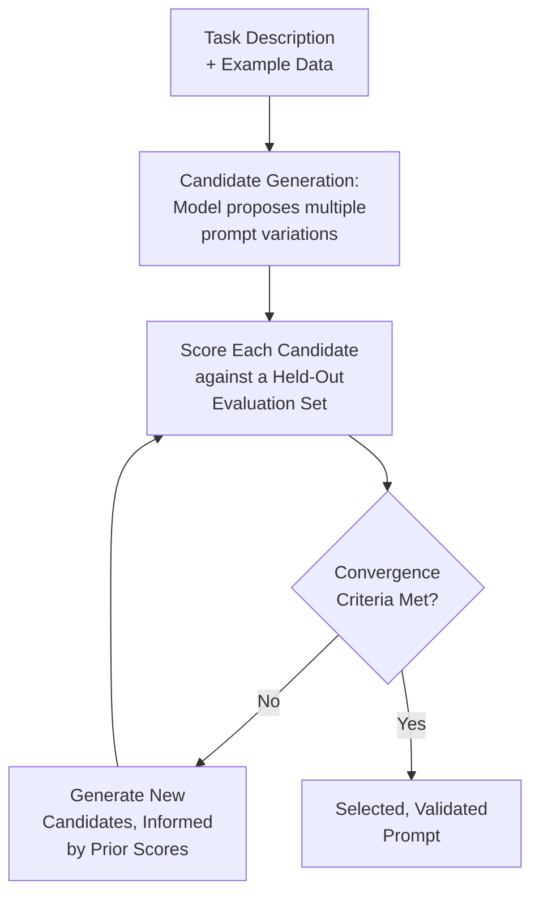
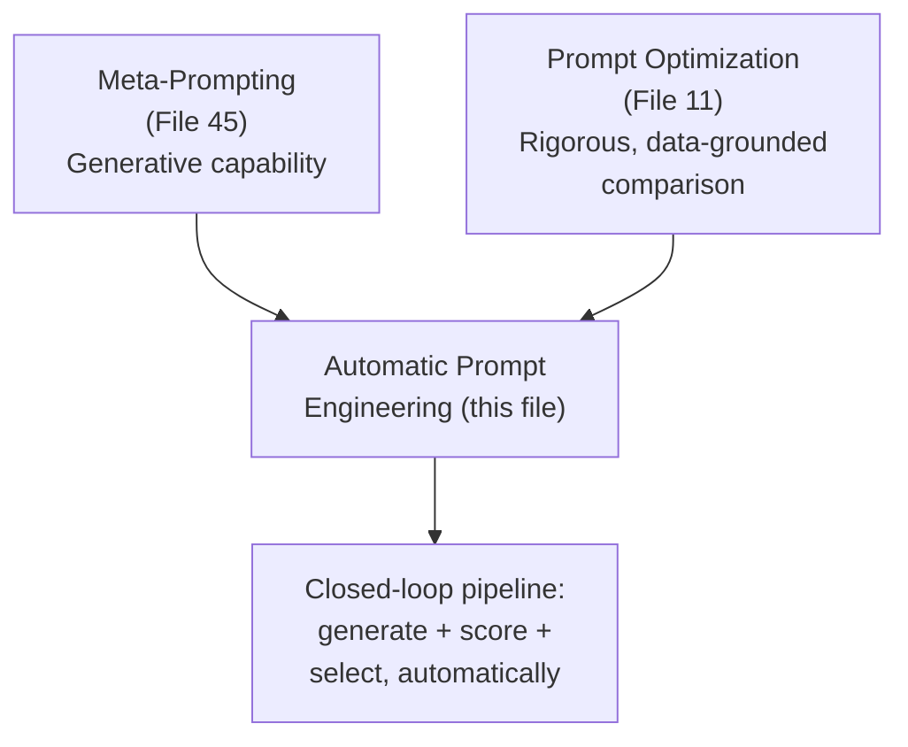
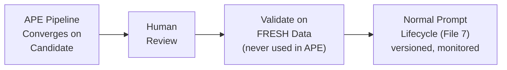

# 50 — Automatic Prompt Engineering

> **Series:** Prompt Engineering Knowledge Library
> **File 50 of 60** | **Level:** Advanced
> **Prerequisites:** [`45_Meta_Prompting.md`](./45_Meta_Prompting.md), [`11_Prompt_Optimization.md`](./11_Prompt_Optimization.md)
> **Next:** [`51_Prompt_Chaining.md`](./51_Prompt_Chaining.md)

---

## Table of Contents

1. [Definition](#definition)
2. [Why It Matters](#why-it-matters)
3. [Core Concepts](#core-concepts)
4. [How It Works](#how-it-works)
5. [Internal Mechanism](#internal-mechanism)
6. [Types of Automatic Prompt Engineering](#types-of-automatic-prompt-engineering)
7. [Syntax / Structure](#syntax--structure)
8. [Examples (Simple → Advanced)](#examples-simple--advanced)
9. [Best Practices](#best-practices)
10. [Common Mistakes](#common-mistakes)
11. [Real-World Applications](#real-world-applications)
12. [Comparison with Related Concepts](#comparison-with-related-concepts)
13. [Advantages & Limitations](#advantages--limitations)
14. [FAQs](#faqs)
15. [Summary](#summary)
16. [Cheat Sheet](#cheat-sheet)
17. [Glossary](#glossary)
18. [References](#references)
19. [Visual Diagram Gallery](#visual-diagram-gallery)

---

## Definition

**Automatic Prompt Engineering (APE)** is a systematic, algorithmic pipeline that generates, tests, scores, and selects prompt candidates — typically using a model itself to propose candidates and a defined metric to evaluate them, iterating through this cycle automatically, largely without manual human intervention once configured. This is the specific, formalized, closed-loop counterpart to [File 45 — Meta-Prompting](./45_Meta_Prompting.md)'s general, flexible, human-in-the-loop concept: where meta-prompting is a human asking a model "help me improve this prompt" and then deciding what to do with the suggestion, APE is a defined pipeline that generates many candidates, scores them against real data automatically, and converges on a winner with minimal manual back-and-forth.

> The core distinguishing property: APE runs as a **closed loop** — generate candidates, score them, select and iterate — largely autonomously, whereas meta-prompting is inherently **open-loop and human-mediated**, with a person reviewing and deciding at each step.

---

## Why It Matters

- **It directly combines [File 45](./45_Meta_Prompting.md)'s generative capability with [File 11 — Prompt Optimization](./11_Prompt_Optimization.md)'s rigorous, metric-driven comparison methodology**, automating what would otherwise be a manual, iterative human process.
- **It can explore a much larger space of candidate prompt variations** than a human manually iterating would typically have time for, potentially surfacing effective phrasings a human wouldn't have thought to try.
- **It directly addresses meta-prompting's self-referential risk** ([File 45](./45_Meta_Prompting.md)) in a specific, important way: APE's scoring step evaluates candidates against real, independent test data ([File 14 — Prompt Testing](./14_Prompt_Testing.md)), not merely another model's self-assessment — providing genuine, external validation the manual process's critique step alone doesn't.
- **Understanding APE's actual mechanism and genuine limitations** — rather than treating it as an unqualified, magical solution — is essential for using it appropriately within a broader, disciplined prompt engineering practice.

---

## Core Concepts

| Concept | Definition |
|---|---|
| **Candidate Generation** | The automated production of multiple prompt variations to test |
| **Scoring Function** | The metric or evaluation method used to assess each candidate's performance |
| **Search Strategy** | The algorithmic approach for exploring the space of possible prompt candidates |
| **Convergence** | The point at which the automated process settles on a final, selected prompt |
| **Closed-Loop Iteration** | The automated generate-score-select cycle running with minimal manual intervention |
| **Held-Out Evaluation Set** | The independent test data used to score candidates, kept separate from any data used in generation |

---

## How It Works



This loop directly combines meta-prompting's generative capability (Step B) with optimization's rigorous, held-constant comparative methodology ([File 11](./11_Prompt_Optimization.md), Step C) into a single, largely automated cycle — the human's role shifts from iterating manually to configuring the pipeline (defining the task, the scoring metric, the evaluation data) and reviewing the final, converged result.

---

## Internal Mechanism

### Why APE's scoring step provides genuinely independent validation that manual meta-prompting critique lacks

Recall from [File 45 — Meta-Prompting](./45_Meta_Prompting.md)'s Internal Mechanism section that a model critiquing a prompt carries genuine self-referential risk — the critique is generated by a system potentially sharing the same blind spots that produced the original weakness. APE's scoring step is mechanistically different and more robust in this specific respect: rather than asking a model whether a candidate prompt "seems good," it actually *runs* each candidate against real, held-out test data and measures actual performance — a genuinely external check, grounded in observed outputs rather than another model's self-assessment. This is precisely why APE, done correctly, doesn't fully inherit meta-prompting's self-referential risk in the same way: the final selection is validated by real behavior on real data, not merely by another round of the same kind of self-assessment.

### Why the held-out evaluation set's independence is a genuine, critical requirement, not a formality

For APE's scoring to provide the genuine, independent validation described above, the evaluation data used for scoring must be kept separate from any data the candidate-generation step might have effectively "seen" or been shaped around — otherwise, the scoring risks measuring how well a candidate fits data it was implicitly tuned toward, rather than how well it will generalize to genuinely new, unseen inputs. This directly mirrors a well-established principle from general machine learning practice (train/test separation) and connects to [File 11 — Prompt Optimization](./11_Prompt_Optimization.md)'s emphasis on holding the test set constant and representative — APE doesn't get a pass on this requirement merely because the optimization process itself is automated; if anything, the requirement matters more, since an automated process exploring many candidates has a correspondingly higher risk of finding a candidate that happens to overfit to quirks of a poorly-isolated evaluation set.

---

## Types of Automatic Prompt Engineering

| Type | Description | Best Suited For |
|---|---|---|
| **Instruction Generation APE** | Automatically generating and scoring candidate task instructions | Tasks with a well-defined scoring metric and available example data |
| **Few-Shot Example Selection APE** | Automatically selecting which examples, from a larger pool, to include in a few-shot prompt | Optimizing example choice for [File 38 — Few-Shot Prompting](./38_Few_Shot_Prompting.md) |
| **Iterative Refinement APE** | Starting from an initial candidate and automatically generating refined variations across multiple rounds | Improving an already-reasonable starting prompt further |
| **Multi-Objective APE** | Scoring candidates against several metrics simultaneously (accuracy, length, safety) rather than one | Applications needing to balance multiple genuine, sometimes competing concerns |

---

## Syntax / Structure

APE is implemented as an application-level pipeline, not expressed as a single prompt itself:

```yaml
# Example: an APE pipeline configuration
task_description: "Classify customer messages by urgency 
                    (low/medium/high)"
candidate_generation:
  method: "model-generated instruction variations"
  count_per_round: 10
scoring:
  method: "accuracy against held-out labeled examples"
  held_out_set_size: 100
  held_out_set_source: "manually labeled, kept SEPARATE from 
                         any data used in candidate generation"
convergence_criteria:
  max_rounds: 5
  stop_if_no_improvement_for: 2  # rounds
selected_output: "highest-scoring candidate meeting a minimum 
                   accuracy threshold"
```

```text
# Example candidate-generation prompt (one component of the pipeline)
Generate 10 different phrasings of an instruction that asks a 
model to classify a customer message's urgency as low, 
medium, or high. Vary the phrasing, level of detail, and 
inclusion of examples across the 10 variations.
```

---

## Examples (Simple → Advanced)

**Level 1 — Simple single-round APE (conceptual):**
```text
1. Generate 5 candidate instructions for "summarize this email 
   in one sentence."
2. Score each against 20 held-out example emails with 
   reference summaries.
3. Select the highest-scoring candidate.
```

**Level 2 — Multi-round iterative refinement:**
```text
Round 1: Generate 5 candidates, best scores 78%.
Round 2: Generate 5 NEW candidates, informed by what made 
Round 1's best candidate work (e.g., it included an explicit 
length constraint) — best scores 85%.
Round 3: Further refined candidates — best scores 87%, 
improvement plateauing.
Convergence: Stop after Round 3 (diminishing returns, similar 
to File 16's iteration convergence pattern).
```

**Level 3 — Few-shot example selection APE:**
```text
Given a pool of 50 potential few-shot examples for a 
classification task, automatically test different subsets 
(e.g., 3-example combinations) against a held-out evaluation 
set, selecting the specific combination of examples that 
produces the highest classification accuracy — rather than a 
human manually guessing which examples to include.
```

**Level 4 — Multi-objective APE balancing competing concerns:**
```yaml
Scoring across multiple objectives simultaneously:
  accuracy: weight 0.6
  response_length (shorter preferred, up to a point): weight 0.2
  safety_compliance (must pass, gating): weight required

Candidate A: 92% accuracy, avg 180 tokens, passes safety -> 
  weighted score: high
Candidate B: 95% accuracy, avg 450 tokens, passes safety -> 
  weighted score: lower than A despite higher raw accuracy, 
  due to the length penalty
Candidate C: 90% accuracy, avg 90 tokens, FAILS safety check -> 
  DISQUALIFIED regardless of other scores (safety is gating, 
  not merely weighted)

Selected: Candidate A — best balance across genuine, weighted 
priorities, with safety as a hard gate.
```

**Level 5 — Full production APE pipeline with human oversight checkpoint:**
```yaml
Pipeline: automated candidate generation + scoring, 5 rounds, 
converges on a top candidate.

CRITICAL CHECKPOINT (per File 45's meta-prompting caution, 
applied here): The converged candidate does NOT go directly 
to production. It is:
  1. Reviewed by a human for any qualitative concerns 
     automated scoring might miss (tone appropriateness, 
     edge-case handling not represented in the held-out set)
  2. Tested against a SECOND, genuinely fresh evaluation set 
     never used anywhere in the APE process, to check the 
     converged score actually generalizes (guards against the 
     held-out-set-independence risk discussed in the Internal 
     Mechanism section)
  3. Only THEN deployed, following the normal prompt lifecycle 
     (File 7) — versioned, monitored, subject to ongoing 
     iteration like any other production prompt

-> APE accelerates and systematizes the SEARCH for a good 
   candidate; it doesn't replace the broader engineering 
   discipline this library establishes for actually trusting 
   and deploying that candidate responsibly.
```

---

## Best Practices

1. **Keep the held-out evaluation set genuinely independent** from any data used in candidate generation — per the Internal Mechanism section, this is a critical, non-negotiable requirement for scoring to provide real validation.
2. **Define convergence criteria explicitly** (max rounds, minimum improvement threshold) rather than letting the process run indefinitely or stop arbitrarily.
3. **Consider multi-objective scoring with gating constraints** (Level 4) for applications with genuine competing concerns, rather than optimizing a single metric that might neglect other important dimensions like safety.
4. **Maintain a human review checkpoint before production deployment**, even for an APE-converged candidate — automated scoring, however rigorous, can miss qualitative concerns a human reviewer would catch.
5. **Validate the converged candidate against a genuinely fresh evaluation set**, separate from the one used during the APE process itself, to confirm the measured improvement actually generalizes rather than reflecting overfitting to the specific held-out set used during search.

---

## Common Mistakes

| Mistake | Consequence | Fix |
|---|---|---|
| Using evaluation data that overlaps with or resembles candidate-generation data | Scores don't reflect genuine generalization, risking a candidate that overfits to evaluation quirks | Keep the held-out set genuinely independent |
| No explicit convergence criteria | Process runs indefinitely or stops arbitrarily without a principled stopping point | Define explicit max rounds and improvement thresholds |
| Single-metric optimization for applications with genuine competing concerns | Neglects important dimensions (safety, length) not captured by the single optimized metric | Use multi-objective scoring with gating constraints where appropriate |
| Deploying an APE-converged candidate directly to production with no human review | Missing qualitative concerns automated scoring doesn't capture | Maintain a human review checkpoint before deployment |
| Not validating against a genuinely fresh evaluation set post-convergence | Undetected overfitting to the specific held-out set used during the search process | Validate against fresh data before trusting the converged result |

---

## Real-World Applications

- **Large-scale, high-volume production prompt optimization** — where the compounding value of even small improvements ([File 3 — Why Prompts Matter](./03_Why_Prompts_Matter.md)) justifies the engineering investment in an automated pipeline.
- **Few-shot example curation at scale** — automatically identifying the most effective examples from a large candidate pool, a task well suited to systematic search.
- **Research and benchmarking** — APE is an active area of academic research into systematically improving prompting techniques, with published methodologies directly informing production practice.
- **Multi-objective production systems** — applications needing to balance accuracy, cost, latency, and safety simultaneously benefit from APE's ability to search a large candidate space against multiple weighted criteria at once.

---

## Comparison with Related Concepts

| Concept | Difference from "Automatic Prompt Engineering" |
|---|---|
| **Meta-Prompting (File 45)** | Meta-prompting is the general, flexible, human-in-the-loop concept of using a model to help with prompts; APE is the specific, automated, closed-loop, algorithmically-scored version of that same underlying idea |
| **Prompt Optimization (File 11)** | Optimization is the general, rigorous, metric-driven comparison methodology; APE specifically automates BOTH the candidate-generation and the comparison steps into one closed-loop pipeline, whereas manual optimization typically has a human generating candidates for the optimization process to compare |
| **Prompt Testing (File 14)** | Testing provides the held-out evaluation infrastructure APE's scoring step depends on; APE is the search-and-selection process built on top of that testing infrastructure |

---

## Advantages & Limitations

### ✅ Advantages of Automatic Prompt Engineering

- **Combines generative capability with genuinely independent, data-grounded validation**, directly addressing meta-prompting's self-referential risk in a specific, important way.
- **Explores a larger candidate space** than manual iteration typically allows, within a given time budget.
- **Systematizes and accelerates** what would otherwise be manual, time-consuming prompt refinement work.

### ⚠️ Limitations

- **Requires a genuinely independent, representative held-out evaluation set** — a real infrastructure investment, and a critical requirement whose violation undermines the entire pipeline's validity.
- **Doesn't replace human review for qualitative concerns** automated scoring may not fully capture, particularly tone, brand voice, or edge cases underrepresented in the evaluation set.
- **Adds genuine engineering complexity and compute cost** — building and running an APE pipeline is a meaningfully larger investment than manual prompt iteration, justified specifically at scale or for high-value optimization targets.

---

## FAQs

**Q: Does APE eliminate the need for human prompt engineering judgment?**
A: No — per Best Practices and Level 5's example, human review remains an essential checkpoint before production deployment, and configuring the pipeline itself (defining the task, scoring metric, and evaluation data) requires genuine human judgment.

**Q: How is APE's scoring different from meta-prompting's critique step?**
A: APE's scoring runs candidates against real, held-out test data and measures actual performance — a genuinely external, data-grounded check; meta-prompting's critique is another round of model-generated assessment, carrying the self-referential risk APE's scoring specifically avoids.

**Q: Is APE only worthwhile for large-scale, high-volume applications?**
A: Generally yes, given its genuine engineering investment — for a one-off or low-stakes prompt, manual meta-prompting ([File 45](./45_Meta_Prompting.md)) or basic refinement ([File 12](./12_Prompt_Refinement.md)) typically provides sufficient value at much lower cost.

**Q: What happens if the held-out evaluation set isn't representative of real-world usage?**
A: The converged "winning" candidate may perform well on the evaluation set while still underperforming on genuinely different real-world inputs — this is precisely why evaluation set quality and representativeness ([File 14 — Prompt Testing](./14_Prompt_Testing.md)) is as critical to APE's validity as it is to manual testing.

---

## Summary

Automatic Prompt Engineering is the systematic, closed-loop algorithmic pipeline that generates candidate prompts, scores them against genuinely independent held-out data, and converges on a selected winner — combining meta-prompting's generative capability with optimization's rigorous, data-grounded comparative methodology, and specifically addressing meta-prompting's self-referential risk through scoring grounded in actual observed behavior rather than another round of model self-assessment. The technique's validity depends critically on genuine held-out evaluation set independence, and even a well-converged result should pass through human review and fresh-data validation before production deployment — APE accelerates and systematizes the search for a good candidate, but doesn't replace the broader engineering discipline this library establishes for responsibly trusting and deploying that candidate. Having now completed this extensive catalog of individual prompting techniques (Files 31–50), the library turns to how prompts connect and compose into larger multi-step and multi-prompt systems, beginning with [File 51 — Prompt Chaining](./51_Prompt_Chaining.md).

---

## Cheat Sheet

```text
AUTOMATIC PROMPT ENGINEERING — QUICK REFERENCE

THE PIPELINE: Generate candidates -> Score against HELD-OUT 
data -> Converge on winner -> (repeat rounds as needed)

CRITICAL REQUIREMENT: Held-out evaluation set must be 
GENUINELY INDEPENDENT from candidate-generation data — 
non-negotiable, or scores don't reflect real generalization.

APE vs. MANUAL META-PROMPTING (File 45)
Meta-Prompting: open-loop, human-mediated, critique = another 
                model's opinion
APE:            closed-loop, algorithmic, scoring = REAL data-
                grounded performance

ALWAYS: Human review + fresh-data validation BEFORE production, 
even for a converged APE result.
```

---

## Glossary

| Term | Definition |
|---|---|
| **Candidate Generation** | Automated production of multiple prompt variations |
| **Scoring Function** | The metric used to assess each candidate's performance |
| **Search Strategy** | The algorithmic approach for exploring candidate prompts |
| **Convergence** | The point where the automated process settles on a final prompt |
| **Closed-Loop Iteration** | The automated generate-score-select cycle |
| **Held-Out Evaluation Set** | Independent test data kept separate from generation data |

---

## References

- Zhou, Y. et al. (2022) — *Large Language Models Are Human-Level Prompt Engineers*, arXiv:2211.01910
- Pryzant, R. et al. (2023) — *Automatic Prompt Optimization with "Gradient Descent" and Beam Search*, arXiv:2305.03495
- Yang, C. et al. (2023) — *Large Language Models as Optimizers*, arXiv:2309.03409
- Fernando, C. et al. (2023) — *Promptbreeder: Self-Referential Self-Improvement via Prompt Evolution*, arXiv:2309.16797

---

## Visual Diagram Gallery

**Diagram 1 — APE as the Fusion of Meta-Prompting and Optimization**


**Diagram 2 — Why Held-Out Independence Matters**
```text
BAD: Evaluation data OVERLAPS with generation data
     -> Scores reflect fitting to seen quirks, not genuine 
        generalization to new inputs

GOOD: Evaluation data is GENUINELY SEPARATE
     -> Scores reflect real performance on unseen inputs
        -> Trustworthy signal for candidate selection
```

**Diagram 3 — The Full Responsible APE Workflow**


---

**⬅️ Previous:** [`49_Least_to_Most_Prompting.md`](./49_Least_to_Most_Prompting.md)
**➡️ Next:** [`51_Prompt_Chaining.md`](./51_Prompt_Chaining.md) — How prompts connect and compose into larger multi-step systems.
