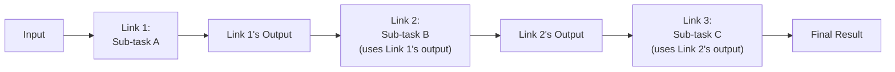
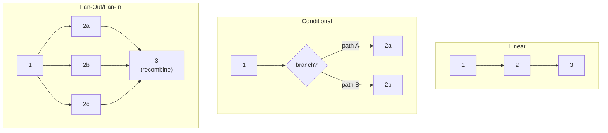
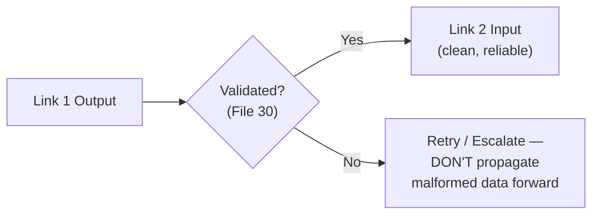

# 51 — Prompt Chaining

> **Series:** Prompt Engineering Knowledge Library
> **File 51 of 60** | **Level:** Intermediate → Advanced
> **Prerequisites:** [`18_Prompt_Templates.md`](./18_Prompt_Templates.md), [`07_Prompt_Lifecycle.md`](./07_Prompt_Lifecycle.md)
> **Next:** [`52_Loop_Prompting.md`](./52_Loop_Prompting.md)

---

## Table of Contents

1. [Definition](#definition)
2. [Why It Matters](#why-it-matters)
3. [Core Concepts](#core-concepts)
4. [How It Works](#how-it-works)
5. [Internal Mechanism](#internal-mechanism)
6. [Types of Prompt Chains](#types-of-prompt-chains)
7. [Syntax / Structure](#syntax--structure)
8. [Examples (Simple → Advanced)](#examples-simple--advanced)
9. [Best Practices](#best-practices)
10. [Common Mistakes](#common-mistakes)
11. [Real-World Applications](#real-world-applications)
12. [Comparison with Related Concepts](#comparison-with-related-concepts)
13. [Advantages & Limitations](#advantages--limitations)
14. [FAQs](#faqs)
15. [Summary](#summary)
16. [Cheat Sheet](#cheat-sheet)
17. [Glossary](#glossary)
18. [References](#references)
19. [Visual Diagram Gallery](#visual-diagram-gallery)

---

## Definition

**Prompt Chaining** is the general practice of connecting multiple distinct prompts in sequence, where one prompt's output becomes a subsequent prompt's input — decomposing a larger task into a series of separate, individually-scoped model calls rather than attempting the entire task within a single prompt. This is a genuinely general concept, encompassing any sequential arrangement of prompts, whether the chain is linear, branches conditionally, or has a fixed or variable length. [File 52 — Loop Prompting](./52_Loop_Prompting.md) that follows covers one specific, important *subtype* of chaining — cyclical repetition with a stopping condition — as distinct from chaining's general, not-inherently-cyclical case.

> The core structural shift: instead of one large, monolithic prompt attempting an entire complex task, prompt chaining breaks the task into a **sequence of separately-scoped, separately-callable prompts**, each with a narrower, more manageable responsibility, connected by explicit data flow between them.

---

## Why It Matters

- **It enables tasks too large or too varied in required capability for a single prompt to handle reliably** — different stages of a complex task may benefit from genuinely different prompt designs, models, or even different techniques from this library applied at each stage.
- **It improves debuggability significantly** — when a chained pipeline produces a wrong result, the failure can often be isolated to a specific link in the chain ([File 13 — Prompt Debugging](./13_Prompt_Debugging.md)'s isolation principle applied at the pipeline level), rather than needing to untangle a single, monolithic prompt's internal failure.
- **It supports genuine modularity and reuse** — an individual link in a chain, if well-designed as its own [template](./18_Prompt_Templates.md), can potentially be reused across multiple different chains for different overall tasks.
- **It's the foundational architectural concept underlying more specialized multi-prompt patterns** covered later in this library — loops ([File 52](./52_Loop_Prompting.md)), agentic systems ([File 53](./53_Agentic_Prompting.md)), and multi-agent coordination ([File 54](./54_Multi_Agent_Prompting.md)) are all, in different ways, elaborations on this basic chaining idea.

---

## Core Concepts

| Concept | Definition |
|---|---|
| **Link** | One individual prompt within a larger chain |
| **Chain Output Passing** | The mechanism by which one link's output becomes the next link's input |
| **Chain Length** | The number of links in a given chain |
| **Conditional Branching** | A chain structure where the next link depends on the result of a prior link |
| **Chain State** | The accumulated information carried forward through a chain, beyond just the immediately prior link's output |
| **Terminal Link** | The final link in a chain, producing the overall task's final result |

---

## How It Works



Each link is, in effect, its own separately-scoped prompt with its own specific responsibility — the chain's overall behavior emerges from how these individually-scoped links connect, not from any single prompt attempting to handle the entire task's full complexity at once.

---

## Internal Mechanism

### Why decomposing into separate links can outperform a single monolithic prompt for sufficiently complex tasks

A single prompt attempting a genuinely complex, multi-faceted task must simultaneously juggle every relevant instruction, constraint, and format requirement within one context window ([File 25 — Context Management](./25_Context_Management.md)), and per [File 6 — Prompt Anatomy](./06_Prompt_Anatomy.md)'s primacy/recency discussion, an overloaded prompt risks diluting attention across too many simultaneous concerns. Decomposing into a chain of separately-scoped links means each individual link's prompt can be tightly focused — clear, specific, following [File 9 — Prompt Design Principles](./09_Prompt_Design_Principles.md)'s principles more easily precisely because it has a narrower job — while the overall task's full complexity is handled by the composition of these focused links, not by any single one bearing the full burden. This is a direct, practical instance of a general engineering principle (breaking a complex system into well-scoped, individually simpler components) applied specifically to prompt design.

### Why chain output passing requires the same rigor as any other data-flow interface

Because one link's output becomes another link's input, the interface between them — what exactly gets passed forward, in what format — matters as much as either link's individual prompt quality. If Link 1's output is malformed, incomplete, or in a format Link 2's prompt doesn't correctly anticipate, the chain fails at that specific junction regardless of how well either link was individually designed. This is precisely why [File 29 — Output Formatting](./29_Output_Formatting.md)'s schema-specification practices and [File 30 — Response Validation](./30_Response_Validation.md)'s verification practices apply directly and importantly to chain junctions — each link's output should be validated before being passed forward as the next link's input, treating the connection between links with the same engineering rigor as any other data-flow interface in a larger system.

---

## Types of Prompt Chains

| Type | Description | Best Suited For |
|---|---|---|
| **Linear Chain** | A fixed sequence of links, each feeding directly into the next | Tasks with a clear, well-defined sequential structure |
| **Conditional Chain** | The next link depends on a prior link's specific result (branching) | Tasks where different paths are needed based on intermediate findings |
| **Fan-Out/Fan-In Chain** | One link's output is processed by several parallel subsequent links, then recombined | Tasks with genuinely independent sub-parts, connecting to [File 43 — Skeleton of Thought](./43_Skeleton_of_Thought.md)'s parallelization logic |
| **Validation-Gated Chain** | Each link's output is validated ([File 30](./30_Response_Validation.md)) before proceeding to the next link | High-stakes chains where an early error must be caught before it propagates |

---

## Syntax / Structure

```yaml
# Example: a linear chain configuration
chain: customer_feedback_processing
links:
  - link_id: extract_themes
    prompt: "Extract the 3 main themes from this feedback: 
              {{raw_feedback}}"
    output_format: {"themes": ["string", "string", "string"]}
  - link_id: sentiment_per_theme
    prompt: "For each theme below, classify sentiment: 
              {{themes_from_link_1}}"
    output_format: {"theme_sentiments": [{"theme": "string", 
                     "sentiment": "positive|negative|neutral"}]}
  - link_id: generate_summary
    prompt: "Write a 2-sentence executive summary based on: 
              {{theme_sentiments_from_link_2}}"
    output_format: {"summary": "string"}
```

```python
# Application-level chain execution (pseudocode)
themes = model_call(prompt_1.format(raw_feedback=input_text))
validate_schema(themes, schema_1)  # per File 30

sentiments = model_call(prompt_2.format(themes_from_link_1=themes))
validate_schema(sentiments, schema_2)

summary = model_call(prompt_3.format(theme_sentiments_from_link_2=sentiments))
validate_schema(summary, schema_3)

final_output = summary
```

---

## Examples (Simple → Advanced)

**Level 1 — Simple two-link chain:**
```text
Link 1: "Extract the key facts from this article: {{article}}"
Link 2: "Turn these facts into a 2-sentence summary: 
{{facts_from_link_1}}"
```

**Level 2 — Three-link linear chain with format specification:**
```text
Link 1: "Extract all dates mentioned in this document as a 
JSON array: {{document}}"
Link 2: "For each date, determine if it's a deadline or a 
historical reference: {{dates_from_link_1}}"
Link 3: "List only the deadlines, sorted chronologically: 
{{classified_dates_from_link_2}}"
```

**Level 3 — Conditional branching chain:**
```text
Link 1: "Classify this support ticket as billing, technical, 
or general: {{ticket}}"

[Branch based on Link 1's result:]
If "billing" -> Link 2a: "Extract the specific billing issue 
type and amount involved: {{ticket}}"
If "technical" -> Link 2b: "Extract the specific error message 
and affected feature: {{ticket}}"
If "general" -> Link 2c: "Extract the general topic and 
urgency level: {{ticket}}"
```

**Level 4 — Validation-gated chain:**
```text
Link 1: "Extract structured order data as JSON: {{order_email}}"

[Validation gate — per File 30]
Check: Is the output valid JSON? Does it contain all required 
fields (order_id, items, total)?
If validation FAILS: retry Link 1 with error feedback, or 
escalate to human review — do NOT proceed to Link 2 with 
malformed data.
If validation PASSES: proceed.

Link 2: "Using this validated order data, draft a confirmation 
email: {{validated_order_data}}"
```

**Level 5 — Full fan-out/fan-in chain for a multi-perspective analysis:**
```yaml
Link 1 (single): "Extract the core proposal from this business 
document: {{document}}"

[Fan-out — 3 parallel links, all using Link 1's output]
Link 2a (parallel): "Analyze this proposal from a financial 
risk perspective: {{proposal_from_link_1}}"
Link 2b (parallel): "Analyze this proposal from a market 
opportunity perspective: {{proposal_from_link_1}}"
Link 2c (parallel): "Analyze this proposal from an operational 
feasibility perspective: {{proposal_from_link_1}}"

[Fan-in — final link combining all three parallel analyses]
Link 3: "Synthesize these three independent analyses into a 
single, balanced recommendation: {{financial_analysis}}, 
{{market_analysis}}, {{operational_analysis}}"

(Note: Links 2a-2c are genuinely independent of each other — 
this fan-out structure directly applies File 43's Skeleton of 
Thought point-independence logic at the chain-architecture level.)
```

---

## Best Practices

1. **Scope each link narrowly and specifically**, per the Internal Mechanism section's focus-benefit discussion — a chain of tightly-focused links generally outperforms fewer, more overloaded links.
2. **Validate each link's output before passing it forward** ([File 30 — Response Validation](./30_Response_Validation.md)) — treat inter-link data flow with the same rigor as any other system interface.
3. **Specify explicit output formats for every link** ([File 29 — Output Formatting](./29_Output_Formatting.md)) — this is essential for reliable programmatic passing between links.
4. **Consider fan-out/fan-in structures specifically for genuinely independent sub-analyses** — applying [File 43](./43_Skeleton_of_Thought.md)'s independence logic can provide both latency and quality benefits at the chain-architecture level.
5. **Design explicit error/failure handling at each link**, not just the happy path — what should happen if a given link's output fails validation, and how should that be handled before it propagates further.

---

## Common Mistakes

| Mistake | Consequence | Fix |
|---|---|---|
| Overloading individual links with too much responsibility | Loses the focus benefit that motivates chaining in the first place | Scope each link narrowly and specifically |
| No validation at inter-link junctions | Malformed output from one link silently corrupts the next link's input | Validate each link's output before passing it forward |
| No explicit output format specification per link | Unreliable, inconsistent data passing between links | Specify explicit output formats for every link |
| Treating a genuinely independent set of sub-analyses as a forced linear sequence | Missing the latency/quality benefits of fan-out/fan-in structuring | Recognize and apply fan-out/fan-in where genuine independence exists |
| No explicit failure-handling design at any link | Chain breaks unpredictably when any single link produces unexpected output | Design explicit error handling at each link, not just the happy path |

---

## Real-World Applications

- **Multi-stage content processing pipelines** — extraction, classification, and synthesis stages chained together for complex document or data processing tasks.
- **Customer support triage systems** — conditional chains routing tickets through different specialized processing paths based on initial classification.
- **Research and analysis workflows** — fan-out/fan-in chains providing multiple independent analytical perspectives before synthesis.
- **Any complex task exceeding what a single, well-designed prompt can reliably handle** — chaining is the standard architectural response once a task's complexity crosses this threshold.

---

## Comparison with Related Concepts

| Concept | Difference from "Prompt Chaining" |
|---|---|
| **Loop Prompting (File 52)** | Loop prompting is a specific *subtype* of chaining — cyclical repetition with a stopping condition; general chaining, as covered in this file, isn't inherently cyclical and can be a simple, fixed-length linear or branching sequence |
| **Agentic Prompting (File 53)** | Agentic prompting is a broader, more autonomous concept where the system itself often determines the chain's structure and length dynamically based on the task, rather than following a pre-designed, fixed chain architecture |
| **ReAct Prompting (File 48)** | ReAct's Thought-Action-Observation cycle is, structurally, a specific kind of chain (or loop) where each "link" is one reasoning-action cycle; general chaining is the broader architectural concept ReAct is one specific instance of |

---

## Advantages & Limitations

### ✅ Advantages of Prompt Chaining

- **Enables handling tasks too complex for a single, well-focused prompt** to reliably manage alone.
- **Improves debuggability** by isolating failures to specific links rather than an undifferentiated monolithic prompt.
- **Supports genuine modularity and reuse** of well-designed individual links across different overall chains.

### ⚠️ Limitations

- **Adds real latency** — multiple sequential model calls take longer than one, a genuine trade-off requiring the same cost-benefit reasoning as other multi-call techniques in this library.
- **Requires careful, deliberate interface design at inter-link junctions** — this isn't free, and getting it wrong (per Common Mistakes) can introduce failures a single prompt wouldn't have.
- **Increases overall system complexity**, particularly for chains with conditional branching or fan-out/fan-in structures, requiring genuine application-level orchestration beyond simple sequential prompt design.

---

## FAQs

**Q: When should I chain prompts instead of using one larger prompt?**
A: When a task's complexity genuinely exceeds what a single, well-focused prompt can reliably handle — multiple distinct capability requirements, a need for intermediate validation, or genuinely independent sub-analyses are all signals favoring chaining.

**Q: How many links should a chain have?**
A: There's no fixed number — the practical guide is scoping each link to one clear, focused responsibility; a chain with too many overly-granular links adds unnecessary latency and complexity, while too few overloaded links loses the focus benefit chaining provides.

**Q: Should every link's output be validated?**
A: For any genuinely important chain, yes — per Best Practices, inter-link data flow deserves the same rigor as any system interface, though the depth of validation can scale with the chain's actual stakes.

**Q: Is prompt chaining the same as building an "agent"?**
A: Not necessarily — a fixed, pre-designed chain (this file's focus) differs from agentic systems ([File 53](./53_Agentic_Prompting.md)), where the system itself often dynamically determines chain structure and length based on the task, rather than following a predetermined architecture.

---

## Summary

Prompt Chaining connects multiple distinct, separately-scoped prompts in sequence, with one link's output becoming the next link's input, decomposing a complex task into a series of individually-focused model calls rather than one overloaded, monolithic attempt — directly improving debuggability, enabling genuine modularity, and allowing each link to follow sound design principles more easily precisely because its scope is narrower. This general architectural concept requires treating inter-link data flow — output formatting and validation at each junction — with the same rigor as any system interface, and encompasses several structural variants (linear, conditional, fan-out/fan-in) suited to different task structures. Having established this general, foundational multi-prompt composition concept, the library turns to its specific cyclical subtype: [File 52 — Loop Prompting](./52_Loop_Prompting.md).

---

## Cheat Sheet

```text
PROMPT CHAINING — QUICK REFERENCE

CORE IDEA: Break a complex task into a SEQUENCE of narrowly-
scoped links, each link's output feeding the next link's input.

CHAIN TYPES
Linear         -> fixed sequence
Conditional    -> branches based on a prior link's result
Fan-Out/Fan-In -> parallel independent links, then recombined 
                   (applies File 43's independence logic)
Validation-Gated -> each output validated before proceeding

ESSENTIAL PRACTICES
[ ] Scope each link narrowly, one clear responsibility
[ ] Specify explicit output format per link
[ ] Validate at every inter-link junction (File 30)
[ ] Design explicit failure handling, not just the happy path
```

---

## Glossary

| Term | Definition |
|---|---|
| **Link** | One individual prompt within a larger chain |
| **Chain Output Passing** | The mechanism by which one link's output becomes the next's input |
| **Chain Length** | The number of links in a chain |
| **Conditional Branching** | A chain structure where the next link depends on a prior result |
| **Chain State** | Accumulated information carried through a chain |
| **Terminal Link** | The final link producing the overall task's final result |

---

## References

- Wu, T. et al. (2022) — *AI Chains: Transparent and Controllable Human-AI Interaction by Chaining Large Language Model Prompts*, CHI 2022
- Anthropic — [Chaining Prompts](https://docs.claude.com/en/docs/build-with-claude/prompt-engineering/chain-prompts)
- Khot, T. et al. (2022) — *Decomposed Prompting: A Modular Approach for Solving Complex Tasks*, arXiv:2210.02406
- OpenAI — [Prompt Chaining for Complex Tasks](https://platform.openai.com/docs/guides/prompt-engineering)

---

## Visual Diagram Gallery

**Diagram 1 — The Basic Linear Chain**
```text
Input -> [Link 1] -> Output 1 -> [Link 2] -> Output 2 -> 
         [Link 3] -> Final Result
```

**Diagram 2 — Chain Structure Variants**


**Diagram 3 — Why Inter-Link Validation Matters**


---

**⬅️ Previous:** [`50_Automatic_Prompt_Engineering.md`](./50_Automatic_Prompt_Engineering.md)
**➡️ Next:** [`52_Loop_Prompting.md`](./52_Loop_Prompting.md) — The cyclical repetition subtype of chaining.
