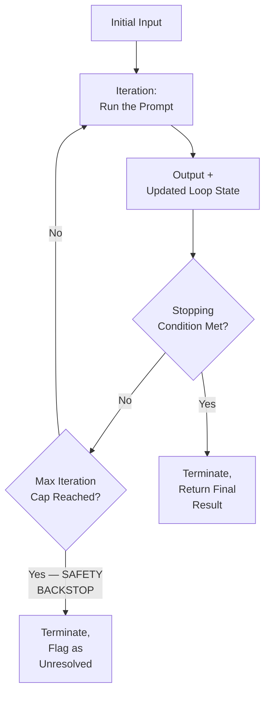
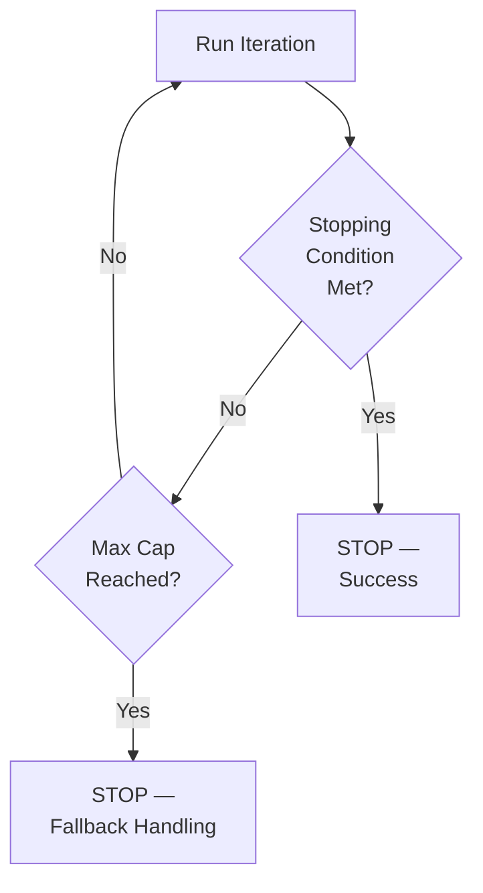

# 52 — Loop Prompting

> **Series:** Prompt Engineering Knowledge Library
> **File 52 of 60** | **Level:** Advanced
> **Prerequisites:** [`51_Prompt_Chaining.md`](./51_Prompt_Chaining.md), [`47_Self_Reflection.md`](./47_Self_Reflection.md)
> **Next:** [`53_Agentic_Prompting.md`](./53_Agentic_Prompting.md)

---

## Table of Contents

1. [Definition](#definition)
2. [Why It Matters](#why-it-matters)
3. [Core Concepts](#core-concepts)
4. [How It Works](#how-it-works)
5. [Internal Mechanism](#internal-mechanism)
6. [Types of Loop Prompting](#types-of-loop-prompting)
7. [Syntax / Structure](#syntax--structure)
8. [Examples (Simple → Advanced)](#examples-simple--advanced)
9. [Best Practices](#best-practices)
10. [Common Mistakes](#common-mistakes)
11. [Real-World Applications](#real-world-applications)
12. [Comparison with Related Concepts](#comparison-with-related-concepts)
13. [Advantages & Limitations](#advantages--limitations)
14. [FAQs](#faqs)
15. [Summary](#summary)
16. [Cheat Sheet](#cheat-sheet)
17. [Glossary](#glossary)
18. [References](#references)
19. [Visual Diagram Gallery](#visual-diagram-gallery)

---

## Definition

**Loop Prompting** is the specific chaining subtype ([File 51](./51_Prompt_Chaining.md)) where the same prompt, or a small cycle of prompts, is repeated iteratively — each repetition's output feeding back as the next repetition's input — until an explicit stopping condition is met, rather than proceeding through a fixed, pre-determined sequence of distinct links. Where [File 51](./51_Prompt_Chaining.md)'s general chaining covers any sequential arrangement, loop prompting specifically addresses the *cyclical* case: repetition of essentially the same operation, continuing until a defined termination criterion — not a fixed number of pre-planned steps — is satisfied.

> The defining structural feature distinguishing a loop from a general chain: **the number of repetitions isn't fixed in advance** — it's determined dynamically, during execution, by whether the stopping condition has been met yet.

---

## Why It Matters

- **It handles tasks where the required number of steps genuinely isn't known upfront** — refining a piece of content until it meets a quality bar, searching until a satisfactory result is found, or iterating until a numerical convergence criterion is satisfied all require this dynamic, condition-based structure that a fixed-length chain cannot provide.
- **It's the structural mechanism underlying iterative self-improvement techniques** — [File 47 — Self-Reflection](./47_Self_Reflection.md)'s iterative reflection cycles are, structurally, a loop; understanding loop prompting's general mechanics illuminates that and similar techniques more deeply.
- **It requires genuinely careful engineering to avoid a specific, serious failure mode**: an incorrectly specified or never-satisfied stopping condition can cause a loop to continue indefinitely, with real cost and reliability consequences distinct from anything a fixed-length chain risks.
- **It's foundational to how agentic systems** ([File 53 — Agentic Prompting](./53_Agentic_Prompting.md)) **often operate** — many agentic workflows are, at their core, a loop (reason, act, observe, check if done, repeat) with a dynamically-determined length rather than a fixed one.

---

## Core Concepts

| Concept | Definition |
|---|---|
| **Iteration** | One complete pass through the loop's repeated operation |
| **Stopping Condition** | The explicit, checkable criterion determining when the loop terminates |
| **Loop State** | The information carried forward from one iteration to inform the next |
| **Maximum Iteration Cap** | A hard upper bound on iterations, as a safety backstop against a stopping condition that's never satisfied |
| **Convergence** | The property of a loop's output stabilizing or improving toward the stopping condition over successive iterations |
| **Infinite Loop Risk** | The specific failure mode of a loop continuing indefinitely due to a never-satisfied stopping condition |

---

## How It Works



The critical structural addition beyond general chaining ([File 51](./51_Prompt_Chaining.md)) is the explicit decision point — check the stopping condition, and only continue if it's not yet met — plus a genuinely necessary safety backstop (the maximum iteration cap) that a fixed-length chain, by its very nature, never needs.

---

## Internal Mechanism

### Why a well-specified, checkable stopping condition is the technique's single most important design element

Because a loop's length isn't fixed in advance, the stopping condition is the sole mechanism determining when the process actually ends — an ambiguous, unverifiable, or overly lenient stopping condition creates real risk: the loop might terminate too early (before genuine convergence) or, more seriously, might never definitively satisfy an ambiguous condition at all. This connects directly to [File 9 — Prompt Design Principles](./09_Prompt_Design_Principles.md)'s specificity principle, applied at the loop-architecture level: "keep refining until it's good" is not a checkable stopping condition in the way "keep refining until the response scores 8+/10 on this specific rubric" is — the latter provides an actual, verifiable test the loop's execution logic can programmatically check after each iteration, while the former requires an ambiguous, potentially inconsistent judgment call.

### Why the maximum iteration cap is a non-negotiable safety requirement, not an optional add-on

Even a well-specified stopping condition can, for a genuinely difficult or edge-case input, fail to be satisfied within any reasonable number of iterations — a task might simply be harder than expected, or an edge case might interact with the stopping condition in an unanticipated way. Without an explicit maximum iteration cap acting as a hard backstop, this scenario produces a loop that continues consuming compute resources indefinitely, a genuinely different and more severe failure mode than anything a fixed-length chain risks, since a chain's total work is bounded by its design regardless of input difficulty. This is precisely why responsible loop prompting design treats the maximum iteration cap not as an edge-case afterthought but as a required, load-bearing part of the loop's core specification — every loop needs both a target stopping condition AND a hard ceiling, working together.

---

## Types of Loop Prompting

| Type | Description | Best Suited For |
|---|---|---|
| **Quality-Threshold Loop** | Repeats until output meets a defined quality score or rubric threshold | Iterative content refinement, connecting to [File 47 — Self-Reflection](./47_Self_Reflection.md) |
| **Search/Retry Loop** | Repeats an attempt (e.g., a search query, an action) until a satisfactory result is found | Search refinement, retry-on-failure patterns |
| **Numerical Convergence Loop** | Repeats until a numerical value stabilizes within a defined tolerance | Iterative calculations or estimations |
| **Fixed-Small-Cycle Loop** | A short, bounded cycle (e.g., generate-critique-revise, repeated a small number of times) with both a quality condition and a low iteration cap | Cost-conscious applications wanting bounded, predictable iteration |

---

## Syntax / Structure

```yaml
# Example: a loop prompting configuration
loop: iterative_content_refinement
initial_prompt: "Write a product description for: {{product}}"
iteration_prompt: "Here's the current draft: {{current_draft}}. 
                    Critique it against this rubric: {{rubric}}. 
                    If it scores 8+/10, respond ONLY with 
                    'APPROVED'. Otherwise, provide a revised draft."
stopping_condition: "Output contains 'APPROVED'"
max_iterations: 5  # hard safety backstop
on_max_iterations_reached: "Return the best-scoring draft 
                             produced across all iterations, 
                             flagged as 'did not reach approval 
                             threshold within iteration limit'"
```

```python
# Application-level loop execution (pseudocode)
current_output = model_call(initial_prompt)
for iteration in range(max_iterations):
    result = model_call(iteration_prompt.format(
        current_draft=current_output))
    if stopping_condition_met(result):
        return result  # success — condition satisfied
    current_output = result
# Reached here only if max_iterations exhausted without success
return handle_max_iterations_reached(current_output)
```

---

## Examples (Simple → Advanced)

**Level 1 — Simple quality-threshold loop:**
```text
Iteration prompt: "Rate this summary's clarity 1-10: {{summary}}. 
If 8+, respond 'APPROVED'. Otherwise, provide an improved 
version."
Stopping condition: response contains "APPROVED"
Max iterations: 3
```

**Level 2 — Search/retry loop:**
```text
Iteration prompt: "Search for information about {{topic}}. If 
you found genuinely relevant results, respond with them. If 
not, refine your search query and try a different angle."
Stopping condition: relevant results found (checked 
programmatically against a relevance heuristic)
Max iterations: 4
```

**Level 3 — Explicit, checkable stopping condition (per Internal Mechanism):**
```text
[AMBIGUOUS — avoid this]
Stopping condition: "the response is good enough"

[CONCRETE, CHECKABLE — use this instead]
Stopping condition: "the response's word count is between 
100-150 AND contains no unaddressed items from the provided 
checklist"
```

**Level 4 — Fixed-small-cycle loop with explicit cost awareness:**
```text
Loop: generate -> critique -> revise, repeated max 2 times 
(deliberately small, for cost control)
Stopping condition: critique finds zero remaining issues
Max iterations: 2 (hard cap — even if the critique still finds 
issues after 2 rounds, stop and return the best version, 
rather than looping indefinitely for marginal gains)

Rationale: per File 16's diminishing-returns principle, most 
of the improvement typically happens in the first 1-2 cycles; 
capping at 2 balances quality against cost.
```

**Level 5 — Full production loop with safety backstop and monitoring:**
```yaml
Loop: automated_data_validation_retry
Purpose: Retry a data extraction task until output passes 
schema validation (File 30) or the safety cap is reached.

iteration_prompt: "Extract structured data as JSON: 
{{source_document}}. Previous attempt failed validation with 
error: {{validation_error_from_prior_iteration}}. Correct 
this specific issue."
stopping_condition: "Output passes schema validation (File 30) 
— checked programmatically, not by asking the model"
max_iterations: 3

on_max_iterations_reached: 
  action: "Escalate to human review"
  logged_for_monitoring: true

Monitoring note: If this loop frequently reaches max_iterations 
without success for a particular document TYPE, that's a 
strong signal (per File 16 — Prompt Iteration) that the 
underlying extraction prompt itself needs improvement, not 
just more loop iterations.
```

---

## Best Practices

1. **Specify a concrete, programmatically-checkable stopping condition**, not a vague quality judgment — per the Internal Mechanism section, this is the technique's single most important design element.
2. **Always include a maximum iteration cap as a hard safety backstop**, treated as non-negotiable, not optional — every loop needs both a target condition and a hard ceiling.
3. **Check the stopping condition programmatically where possible**, rather than relying solely on the model's own self-assessment (Level 5's example) — this connects to [File 30 — Response Validation](./30_Response_Validation.md)'s independent-verification principle.
4. **Design explicit, meaningful handling for the max-iteration-reached case** — don't just silently fail; decide what should happen (return the best attempt, escalate to human review) and log it for monitoring.
5. **Monitor how often loops reach their maximum iteration cap without success** — a persistently high rate for a given task type is a strong signal the underlying prompt, not just the loop's iteration count, needs improvement.

---

## Common Mistakes

| Mistake | Consequence | Fix |
|---|---|---|
| Vague, ambiguous stopping conditions ("good enough") | Unreliable termination — may stop too early or never definitively satisfy the condition | Specify concrete, checkable stopping conditions |
| No maximum iteration cap | Genuine risk of indefinite, costly, unbounded execution for difficult inputs | Always include a hard iteration cap as a non-negotiable safety backstop |
| Relying solely on the model's self-assessment to check the stopping condition | Carries self-referential risk similar to self-reflection's blind spot (File 47) | Check programmatically where possible, independent of model self-report |
| No explicit handling for the max-iteration-reached case | Silent failure or undefined behavior when the cap is hit | Design explicit, meaningful handling and logging for this case |
| Never monitoring iteration-cap-reached frequency | Missing a valuable signal that the underlying prompt needs improvement | Track and monitor this rate as part of ongoing lifecycle review |

---

## Real-World Applications

- **Iterative content refinement systems** — quality-threshold loops repeatedly improving a piece of content until it meets a defined bar, directly building on [File 47 — Self-Reflection](./47_Self_Reflection.md)'s single-cycle mechanism.
- **Retry-on-failure patterns for structured data extraction** — looping with error feedback until a validation-passing result is achieved, connecting to [File 30 — Response Validation](./30_Response_Validation.md).
- **Search refinement in research or information-retrieval agents** — repeatedly refining a search query until genuinely relevant results are found.
- **Agentic system core loops** — many agentic workflows are, at their architectural core, exactly this kind of stopping-condition-based loop, previewing [File 53 — Agentic Prompting](./53_Agentic_Prompting.md).

---

## Comparison with Related Concepts

| Concept | Difference from "Loop Prompting" |
|---|---|
| **Prompt Chaining (File 51)** | General chaining covers any sequential arrangement, often with a fixed, pre-planned number of links; loop prompting is specifically the cyclical subtype, where the number of repetitions is dynamically determined by a stopping condition, not fixed in advance |
| **Self-Reflection (File 47)** | Self-reflection's iterative reflection type is, structurally, a specific application of loop prompting — critique-revise repeated until satisfactory; loop prompting is the more general architectural pattern, applicable beyond just self-critique cycles |
| **Agentic Prompting (File 53)** | Agentic systems often use loop prompting as their core execution mechanism, but "agentic" encompasses broader concerns (goal management, tool use, multi-step planning) beyond just the looping structure itself |

---

## Advantages & Limitations

### ✅ Advantages of Loop Prompting

- **Handles tasks where the required number of steps genuinely isn't known upfront**, which fixed-length chains structurally cannot accommodate.
- **Provides a natural mechanism for iterative quality improvement** until a defined bar is met, rather than a single, fixed-effort attempt.
- **Foundational to understanding and correctly implementing more complex agentic systems**, which frequently rely on this same underlying structure.

### ⚠️ Limitations

- **Carries a genuine, unique risk of indefinite or excessive execution** if the stopping condition is poorly specified, a risk fixed-length chains simply don't have by design.
- **Requires the maximum iteration cap as a mandatory, not optional, safety element**, adding a design requirement general chaining doesn't need.
- **Each additional iteration adds real, direct cost**, and unlike a fixed-length chain's predictable total cost, a loop's total cost is inherently less predictable in advance, bounded only by the maximum cap.

---

## FAQs

**Q: How is a loop different from just running the same chain multiple times manually?**
A: The key difference is the *dynamic, condition-based* termination built into the loop's own execution logic — a loop programmatically checks its stopping condition after each iteration and continues or stops based on that check, rather than a human or external process deciding when to stop.

**Q: What's a reasonable maximum iteration cap?**
A: There's no universal number — it should be set based on genuine expectations for how many iterations a well-functioning stopping condition should typically need, with enough margin for reasonable variation, but tight enough to actually bound cost meaningfully; this is a judgment call informed by testing and monitoring, not a fixed rule.

**Q: Should the stopping condition always be checked programmatically rather than by asking the model?**
A: Where feasible, yes, per Best Practices — programmatic checking avoids the self-referential risk of relying on the same model's self-assessment; for conditions that are genuinely difficult to check programmatically (nuanced qualitative judgments), model-based checking may be necessary, but this should be a deliberate choice, not a default.

**Q: What should happen when a loop hits its maximum iteration cap without satisfying the stopping condition?**
A: This requires explicit, deliberate design (Level 5's example) — common approaches include returning the best attempt produced so far, escalating to human review, or returning an explicit "unresolved" status — but this should never be left as undefined, silent behavior.

---

## Summary

Loop Prompting is the specific, cyclical subtype of prompt chaining where a prompt or small cycle repeats iteratively until an explicit, dynamically-checked stopping condition is met, rather than proceeding through a fixed, pre-planned sequence — enabling tasks where the required number of steps genuinely isn't known in advance, at the cost of introducing a genuine, unique risk of indefinite or excessive execution that fixed-length chains simply don't share. Responsible loop design requires two non-negotiable elements working together: a concrete, ideally programmatically-checkable stopping condition, and a hard maximum iteration cap serving as a safety backstop for cases where that condition proves difficult or impossible to satisfy within a reasonable number of attempts. Having now covered both general chaining and this specific cyclical subtype, the library turns to the broader, more autonomous systems these composition patterns commonly serve: [File 53 — Agentic Prompting](./53_Agentic_Prompting.md).

---

## Cheat Sheet

```text
LOOP PROMPTING — QUICK REFERENCE

TWO NON-NEGOTIABLE ELEMENTS (every loop needs BOTH)
1. Concrete, CHECKABLE stopping condition (not "good enough")
2. Hard MAXIMUM ITERATION CAP (safety backstop)

STOPPING CONDITION QUALITY TEST
Bad:  "keep refining until it's good"
Good: "keep refining until it scores 8+/10 on this specific 
       rubric" (or, better, a programmatically-checkable test)

ALWAYS DESIGN: Explicit handling for what happens when the 
iteration cap IS reached without success — never leave this 
undefined.

MONITOR: How often loops hit their cap without success — a 
persistent high rate signals the underlying PROMPT needs 
improvement, not just more iterations.
```

---

## Glossary

| Term | Definition |
|---|---|
| **Iteration** | One complete pass through the loop's repeated operation |
| **Stopping Condition** | The criterion determining when the loop terminates |
| **Loop State** | Information carried forward from one iteration to inform the next |
| **Maximum Iteration Cap** | A hard upper bound on iterations, as a safety backstop |
| **Convergence** | A loop's output stabilizing or improving toward the stopping condition |
| **Infinite Loop Risk** | The failure mode of indefinite continuation from a never-satisfied condition |

---

## References

- Madaan, A. et al. (2023) — *Self-Refine: Iterative Refinement with Self-Feedback*, arXiv:2303.17651
- Shinn, N. et al. (2023) — *Reflexion: Language Agents with Verbal Reinforcement Learning*, arXiv:2303.11366
- Anthropic — [Prompt Engineering Overview](https://docs.claude.com/en/docs/build-with-claude/prompt-engineering/overview)
- Yao, S. et al. (2022) — *ReAct: Synergizing Reasoning and Acting in Language Models*, arXiv:2210.03629 (cyclical structure background)

---

## Visual Diagram Gallery

**Diagram 1 — The Loop's Decision Point**


**Diagram 2 — Fixed Chain vs. Loop (structural contrast)**
```text
FIXED CHAIN (File 51):        LOOP (this file):
Link1 -> Link2 -> Link3        Iterate -> Check condition -> 
(length KNOWN in advance)       repeat or stop
                                (length DETERMINED at runtime)
```

**Diagram 3 — Why Both Safety Elements Are Required Together**
```text
STOPPING CONDITION ONLY (risky):
"repeat until good enough" -> if never satisfied -> RUNS FOREVER

MAX CAP ONLY (also risky):
"repeat exactly 5 times" -> may stop before genuine quality 
                             is reached, or waste cycles after 
                             it's already been reached

BOTH TOGETHER (correct):
Stopping condition (target) + Max cap (safety backstop) 
= reliable, bounded, quality-oriented iteration
```

---

**⬅️ Previous:** [`51_Prompt_Chaining.md`](./51_Prompt_Chaining.md)
**➡️ Next:** [`53_Agentic_Prompting.md`](./53_Agentic_Prompting.md) — Broader, goal-directed, autonomous multi-step systems.
