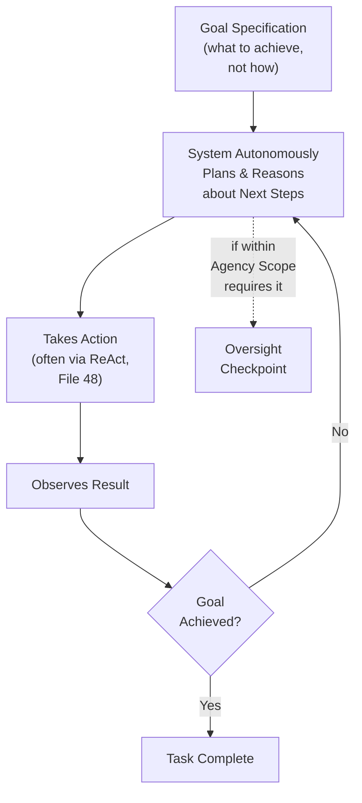
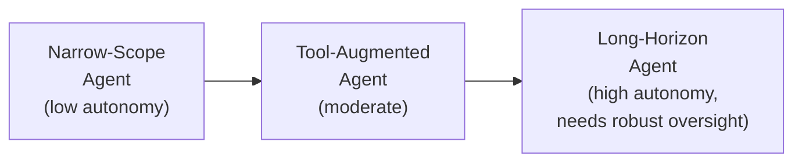
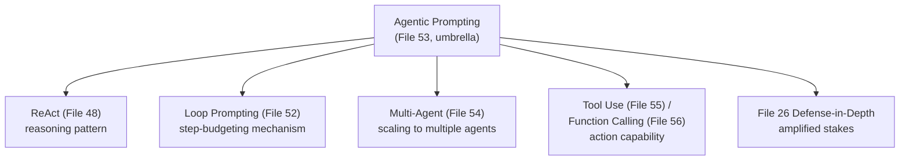

# 53 — Agentic Prompting

> **Series:** Prompt Engineering Knowledge Library
> **File 53 of 60** | **Level:** Advanced
> **Prerequisites:** [`52_Loop_Prompting.md`](./52_Loop_Prompting.md), [`48_ReAct_Prompting.md`](./48_ReAct_Prompting.md)
> **Next:** [`54_Multi_Agent_Prompting.md`](./54_Multi_Agent_Prompting.md)

---

## Table of Contents

1. [Definition](#definition)
2. [Why It Matters](#why-it-matters)
3. [Core Concepts](#core-concepts)
4. [How It Works](#how-it-works)
5. [Internal Mechanism](#internal-mechanism)
6. [Types of Agentic Systems](#types-of-agentic-systems)
7. [Syntax / Structure](#syntax--structure)
8. [Examples (Simple → Advanced)](#examples-simple--advanced)
9. [Best Practices](#best-practices)
10. [Common Mistakes](#common-mistakes)
11. [Real-World Applications](#real-world-applications)
12. [Comparison with Related Concepts](#comparison-with-related-concepts)
13. [Advantages & Limitations](#advantages--limitations)
14. [FAQs](#faqs)
15. [Summary](#summary)
16. [Cheat Sheet](#cheat-sheet)
17. [Glossary](#glossary)
18. [References](#references)
19. [Visual Diagram Gallery](#visual-diagram-gallery)

---

## Definition

**Agentic Prompting** is the broad, umbrella design approach for building systems where a model operates with meaningful autonomy toward a stated goal — dynamically determining its own sequence of reasoning and actions, rather than following a fixed, pre-designed chain ([File 51](./51_Prompt_Chaining.md)) or loop ([File 52](./52_Loop_Prompting.md)) whose structure was entirely specified in advance. This file positions agentic prompting as the umbrella concept that several more specific techniques already covered in this library — [ReAct](./48_ReAct_Prompting.md)'s reasoning-and-acting pattern, [Loop Prompting](./52_Loop_Prompting.md)'s dynamic termination — commonly operate *within*, while [File 54](./54_Multi_Agent_Prompting.md), [File 55](./55_Tool_Use_Prompting.md), and [File 56](./56_Function_Calling.md) that follow each cover a more specific component or scaling dimension of agentic system design.

> The defining property distinguishing "agentic" from the fixed chains and loops covered in the two preceding files: **the system itself determines much of its own execution path** — which actions to take, in what order, how many steps to use — based on the goal and what it learns along the way, rather than a human having pre-specified that path's structure in advance.

---

## Why It Matters

- **It represents a genuine shift in how complex tasks are approached** — from "the human designs the exact sequence of steps" (chains, loops) to "the human specifies the goal and available capabilities, and the system determines the steps" — a meaningfully different design philosophy with its own distinct considerations.
- **It's necessary for tasks whose required steps genuinely can't be fully anticipated in advance** — open-ended research, complex multi-step problem-solving where the right approach depends on what's discovered along the way, and similar tasks don't fit neatly into a fixed chain or loop's predetermined structure.
- **It concentrates and amplifies concerns already introduced throughout this library** — instruction hierarchy ([File 27](./27_Instruction_Following.md)), guardrails ([File 32](./32_Guardrails.md)), and defense-in-depth ([File 26](./26_Context_Injection.md)) all become more consequential, not less, as a system's autonomy increases.
- **Understanding agentic prompting as an umbrella, not a single technique, clarifies how the library's more specific agentic-adjacent files fit together** — this file establishes the overall frame; the following files fill in specific components.

---

## Core Concepts

| Concept | Definition |
|---|---|
| **Goal Specification** | Stating the desired outcome, rather than the specific steps to achieve it |
| **Autonomous Planning** | The system's own determination of what steps to take toward the goal |
| **Dynamic Execution Path** | The sequence of reasoning and actions actually taken, determined during execution rather than pre-specified |
| **Agency Scope** | The bounds within which a system is permitted to operate autonomously |
| **Oversight Checkpoint** | A point where human review or confirmation is required before the system proceeds |
| **Task Completion Criteria** | The definition of what counts as the goal having been achieved |

---

## How It Works



The critical structural difference from a fixed chain or loop is visible at the "Autonomously Plans" step — rather than following a pre-designed sequence, the system itself determines, at each point, what should happen next, informed by the goal and everything observed so far.

---

## Internal Mechanism

### Why goal specification, rather than step specification, is the defining input to an agentic system

Recall from [File 51 — Prompt Chaining](./51_Prompt_Chaining.md) and [File 52 — Loop Prompting](./52_Loop_Prompting.md) that both techniques require a human to design the actual structure in advance — which links exist, in what order, or what the loop's repeated operation and stopping condition are. Agentic prompting inverts this: the human specifies the *goal* (what success looks like) and the *available capabilities* (what actions/tools exist), and the model itself, drawing on its trained planning and reasoning capability, determines the actual sequence of steps at runtime. This shift is what makes agentic systems suitable for tasks whose correct execution path genuinely can't be fully anticipated in advance — but it also means the human has correspondingly less direct control over exactly what will happen, which is precisely why agency scope and oversight checkpoints (discussed next) become load-bearing design elements rather than optional additions.

### Why increasing agency scope directly amplifies the stakes of every prior file's safety-adjacent concepts

As a system's autonomy increases — more steps taken without human review, a wider range of available actions, less predictable execution paths — the potential consequences of any single failure in instruction hierarchy ([File 27](./27_Instruction_Following.md)), guardrail robustness ([File 32](./32_Guardrails.md)), or injection defense ([File 26](./26_Context_Injection.md)) compound correspondingly, since a flaw that might produce one bad response in a simple, single-turn system can, in a highly autonomous agentic system, potentially lead to a longer sequence of compounding actions before any human notices. This is a direct, mechanical consequence of increased autonomy, not merely a vague general caution — it's precisely why [File 26](./26_Context_Injection.md)'s defense-in-depth principle (particularly its emphasis on human confirmation for consequential actions and least-privilege scoping) applies with escalating, not diminishing, importance as agentic systems become more autonomous and capable.

---

## Types of Agentic Systems

| Type | Description | Agency Scope |
|---|---|---|
| **Narrow-Scope Agent** | Operates autonomously within a tightly bounded task and action set | Low autonomy — limited actions, frequent checkpoints |
| **Tool-Augmented Agent** | Combines autonomous reasoning with defined tool access ([File 55](./55_Tool_Use_Prompting.md)) | Moderate — bounded by the specific tools made available |
| **Long-Horizon Agent** | Operates autonomously across many steps or an extended session toward a complex goal | High — requires robust oversight design given extended autonomy |
| **Human-Supervised Agent** | Autonomous planning and reasoning, but with mandatory checkpoints before consequential actions | Variable — autonomy for reasoning/planning, gated for action |

---

## Syntax / Structure

```text
[Goal specification, rather than step specification]
Goal: Research and produce a summary of recent developments in 
{{topic}}, citing at least 3 credible sources.

Available tools: web_search, web_fetch, document_summarizer

You determine the specific research steps needed — how many 
searches, which sources to investigate further, and how to 
synthesize findings — to achieve this goal. Use ReAct-style 
reasoning (Thought/Action/Observation) throughout.

Agency scope: You may search and fetch content autonomously. 
Before finalizing any specific factual claim you're uncertain 
about, flag it explicitly rather than stating it confidently.
```

```yaml
# Example: an agentic system's configuration, defining scope
agent_config:
  goal_template: "{{user_specified_goal}}"
  available_tools: [web_search, web_fetch, calculator]
  agency_scope:
    autonomous_actions: [search, fetch, calculate]
    requires_human_confirmation: [any action modifying external 
                                    state, e.g., sending 
                                    communications, making 
                                    purchases]
  max_steps: 20  # per File 52's iteration cap principle, 
                  # applied at the agentic system level
  oversight_checkpoint: "before any requires_human_confirmation 
                          action"
```

---

## Examples (Simple → Advanced)

**Level 1 — Simple, narrow-scope agentic task:**
```text
Goal: Find the current population of {{city}} and calculate 
what it would be with 5% annual growth over 10 years.

You have access to: web_search, calculator. Determine the 
steps needed autonomously.
```

**Level 2 — Tool-augmented agent with a moderate action set:**
```text
Goal: Answer this customer's question by checking their order 
history and our current policy.

Available tools: order_lookup, policy_search
Determine autonomously which tools to use, in what order, 
based on what the specific question requires.
```

**Level 3 — Long-horizon agent with explicit step budgeting:**
```text
Goal: Conduct a competitive analysis of 3 named competitors, 
covering pricing, key features, and recent news.

Available tools: web_search, web_fetch
Max steps: 15 (per File 52's iteration cap principle)
You determine the research plan — which competitor to 
research in what order, how many searches per competitor, 
when you have sufficient information to synthesize a finding.
```

**Level 4 — Human-supervised agent with explicit checkpoint design:**
```text
Goal: Identify and resolve this customer's billing discrepancy.

Available tools: order_lookup, billing_system_query, 
refund_processor

Agency scope: 
- order_lookup and billing_system_query: fully autonomous, 
  no confirmation needed (read-only, low stakes)
- refund_processor: REQUIRES explicit human confirmation before 
  execution (consequential, financial impact — per File 26's 
  defense-in-depth principle)

You determine the investigation steps autonomously. When you 
reach a point where a refund seems warranted, STOP and present 
your finding + proposed refund amount for human confirmation 
before taking that specific action.
```

**Level 5 — Full production agentic system with layered scope and monitoring:**
```yaml
Goal: "Triage and initial-respond to incoming support tickets, 
escalating complex cases to human agents."

available_tools: [ticket_classifier, policy_search, 
                   order_lookup, draft_response_generator, 
                   escalate_to_human]

agency_scope:
  fully_autonomous: [ticket_classifier, policy_search, 
                      order_lookup]
  requires_confirmation: [draft_response_generator output 
                           MUST be human-reviewed before sending, 
                           for at least the first N weeks of 
                           this system's deployment — per File 7's 
                           lifecycle monitoring, this requirement 
                           may be relaxed later based on observed 
                           accuracy]
  mandatory_escalation_triggers: [ticket mentions legal action, 
                                    ticket sentiment extremely 
                                    negative, uncertainty above 
                                    a defined threshold]

max_steps_per_ticket: 8

monitoring: 
  - track_escalation_rate: "unexpectedly low escalation rate 
     could indicate the agent is overconfident, not that it's 
     performing better"
  - track_max_steps_reached_rate: "per File 52, high rate 
     signals ticket complexity exceeding the system's current 
     capability, worth investigating"

-> This demonstrates agentic prompting's umbrella nature: goal 
   specification (this file), ReAct-style reasoning (File 48), 
   loop-style step budgeting (File 52), defense-in-depth 
   confirmation gating (File 26), and lifecycle monitoring 
   (File 7) all working together.
```

---

## Best Practices

1. **Specify the goal and completion criteria clearly**, not just the general topic — an agentic system needs a genuinely well-defined target to autonomously plan toward, connecting to [File 9 — Prompt Design Principles](./09_Prompt_Design_Principles.md)'s specificity principle applied at the goal level.
2. **Explicitly define agency scope** — which actions are fully autonomous versus which require human confirmation — rather than leaving this ambiguous, per the escalating-stakes discussion in the Internal Mechanism section.
3. **Set an explicit maximum step budget** ([File 52 — Loop Prompting](./52_Loop_Prompting.md)'s iteration cap principle, applied at the agentic system level) as a safety backstop against runaway or unexpectedly long execution.
4. **Design mandatory oversight checkpoints for genuinely consequential actions**, directly extending [File 26 — Context Injection](./26_Context_Injection.md)'s defense-in-depth principle — this matters more, not less, as autonomy increases.
5. **Monitor agentic system behavior over time**, not just at initial deployment — escalation rates, step-budget-exhaustion rates, and similar operational metrics provide valuable signal about whether the system's actual behavior matches its intended agency scope.

---

## Common Mistakes

| Mistake | Consequence | Fix |
|---|---|---|
| Vague, underspecified goals | Poor autonomous planning, since the system lacks a clear target | Specify the goal and completion criteria clearly and specifically |
| No explicit agency scope definition | Ambiguity about which actions are genuinely autonomous versus requiring oversight | Explicitly define agency scope, especially for consequential actions |
| No maximum step budget | Risk of runaway or unexpectedly long, costly execution | Set an explicit step cap, per File 52's principle |
| Treating oversight checkpoints as optional or a launch-time-only consideration | Under-investment in safety proportional to the system's actual, escalating autonomy | Design and maintain oversight checkpoints as a core, ongoing element, not an afterthought |
| No ongoing monitoring of agentic system behavior | Missing signals (unusual escalation rates, frequent step-cap exhaustion) indicating misalignment between intended and actual scope | Monitor operational metrics continuously, per File 7's lifecycle principles |

---

## Real-World Applications

- **Autonomous research and analysis agents** — tasks where the specific research path genuinely can't be fully pre-planned, requiring dynamic, goal-directed autonomy.
- **Complex customer service triage and resolution systems** — combining autonomous investigation with carefully scoped confirmation requirements for consequential actions.
- **Software development assistance agents** — planning and executing multi-step coding tasks where the specific sequence of edits, tests, and fixes depends on what's discovered along the way.
- **Business process automation** — end-to-end workflow agents handling tasks with genuine branching complexity that a fixed chain or loop couldn't anticipate in advance.

---

## Comparison with Related Concepts

| Concept | Difference from "Agentic Prompting" |
|---|---|
| **Prompt Chaining (File 51) / Loop Prompting (File 52)** | Chains and loops have their structure (which links, what repeats, when to stop) largely pre-designed by a human; agentic prompting has the system itself determine much of this structure dynamically, based on the stated goal |
| **ReAct Prompting (File 48)** | ReAct is a specific reasoning-and-acting *pattern* commonly used *within* agentic systems for structuring individual reasoning cycles; agentic prompting is the broader umbrella concept of autonomous, goal-directed operation that ReAct frequently serves |
| **Multi-Agent Prompting (File 54)** | Multi-agent prompting specifically scales agentic prompting to multiple distinct, coordinating agent instances; this file covers the single-agent case as the foundational concept |

---

## Advantages & Limitations

### ✅ Advantages of Agentic Prompting

- **Handles tasks whose required execution path genuinely can't be fully anticipated in advance**, unlike fixed chains or loops.
- **Reduces the upfront design burden** of pre-specifying every step, shifting that work to the system's own trained planning capability.
- **Enables genuinely more sophisticated, adaptive task completion** for complex, open-ended goals.

### ⚠️ Limitations

- **Correspondingly reduces direct human control** over exactly what will happen during execution, a genuine trade-off against the predictability fixed chains and loops provide.
- **Amplifies the stakes of every safety-adjacent concept covered throughout this library** — instruction hierarchy, guardrails, and injection defense all matter more, not less, as autonomy increases.
- **Requires genuine, ongoing engineering investment in agency scope design and monitoring**, not just an interesting one-time prompt-writing exercise.

---

## FAQs

**Q: Is "agentic prompting" the same thing as "AI agents"?**
A: Closely related — "agentic prompting" specifically refers to the prompting and design approach that produces the autonomous, goal-directed behavior commonly associated with "AI agents" as a broader product/system category.

**Q: How much autonomy should an agentic system have?**
A: This is a genuine, task-specific design decision — the general principle, extending this library's recurring stakes-calibration theme, is that agency scope should be calibrated to the actual consequences of the system's available actions, with more consequential actions warranting tighter scope and more frequent oversight checkpoints.

**Q: Does an agentic system need ReAct specifically, or can it use a different reasoning pattern?**
A: ReAct ([File 48](./48_ReAct_Prompting.md)) is a common, well-documented choice, but agentic prompting as a broader concept doesn't strictly require it — the umbrella concept is autonomous, goal-directed operation, which could in principle be implemented with different underlying reasoning-and-acting structures.

**Q: What's the single most important safety consideration for agentic systems?**
A: There's no single answer, but explicit agency scope definition — clearly distinguishing fully autonomous actions from those requiring human confirmation — combined with a hard step budget, are foundational, load-bearing elements that the rest of this library's safety-adjacent principles (guardrails, defense-in-depth, monitoring) build directly upon.

---

## Summary

Agentic Prompting is the broad, umbrella design approach where a system operates with meaningful autonomy toward a stated goal, dynamically determining its own execution path — which reasoning and actions to take, in what order — rather than following a chain or loop whose structure was entirely pre-designed by a human. This shift from step-specification to goal-specification enables handling tasks whose correct execution path genuinely can't be fully anticipated in advance, but correspondingly amplifies the stakes of instruction hierarchy, guardrail robustness, and defense-in-depth practices covered throughout this library, making explicit agency scope definition, step budgeting, and ongoing monitoring load-bearing, non-optional design elements rather than afterthoughts. Having established this foundational umbrella concept, the library turns to scaling it: what happens when multiple distinct agent instances must coordinate toward a shared or related goal — [File 54 — Multi-Agent Prompting](./54_Multi_Agent_Prompting.md).

---

## Cheat Sheet

```text
AGENTIC PROMPTING — QUICK REFERENCE

THE SHIFT: Step-specification (chains/loops, pre-designed) -> 
           Goal-specification (system determines its own path)

REQUIRED DESIGN ELEMENTS (non-optional)
[ ] Clear, specific goal + completion criteria
[ ] Explicit agency scope (autonomous vs. requires-confirmation 
    actions)
[ ] Hard maximum step budget (File 52's principle, applied here)
[ ] Oversight checkpoints for CONSEQUENTIAL actions
[ ] Ongoing monitoring of operational metrics

KEY PRINCIPLE: Increased autonomy AMPLIFIES the stakes of every 
safety concept in this library (Files 26, 27, 32) — not a 
one-time launch consideration, an ongoing discipline.
```

---

## Glossary

| Term | Definition |
|---|---|
| **Goal Specification** | Stating the desired outcome rather than the specific steps |
| **Autonomous Planning** | The system's own determination of steps toward a goal |
| **Dynamic Execution Path** | The sequence of actions determined during execution |
| **Agency Scope** | The bounds within which a system operates autonomously |
| **Oversight Checkpoint** | A point requiring human review before proceeding |
| **Task Completion Criteria** | The definition of goal achievement |

---

## References

- Yao, S. et al. (2022) — *ReAct: Synergizing Reasoning and Acting in Language Models*, arXiv:2210.03629
- Wang, L. et al. (2023) — *A Survey on Large Language Model Based Autonomous Agents*, arXiv:2308.11432
- Anthropic — [Building Effective AI Agents](https://www.anthropic.com/research/building-effective-agents)
- Park, J. et al. (2023) — *Generative Agents: Interactive Simulacra of Human Behavior*, arXiv:2304.03442

---

## Visual Diagram Gallery

**Diagram 1 — Step-Specification vs. Goal-Specification**
```text
CHAINS/LOOPS (Files 51-52):     AGENTIC (this file):
Human specifies: EXACT STEPS     Human specifies: GOAL + 
                                  CAPABILITIES
System executes: as designed     System determines: the actual 
                                  steps, dynamically
```

**Diagram 2 — Agency Scope Spectrum**


**Diagram 3 — Agentic Prompting as the Umbrella Over This Library's Related Files**


---

**⬅️ Previous:** [`52_Loop_Prompting.md`](./52_Loop_Prompting.md)
**➡️ Next:** [`54_Multi_Agent_Prompting.md`](./54_Multi_Agent_Prompting.md) — Scaling agentic prompting to multiple coordinating agent instances.
