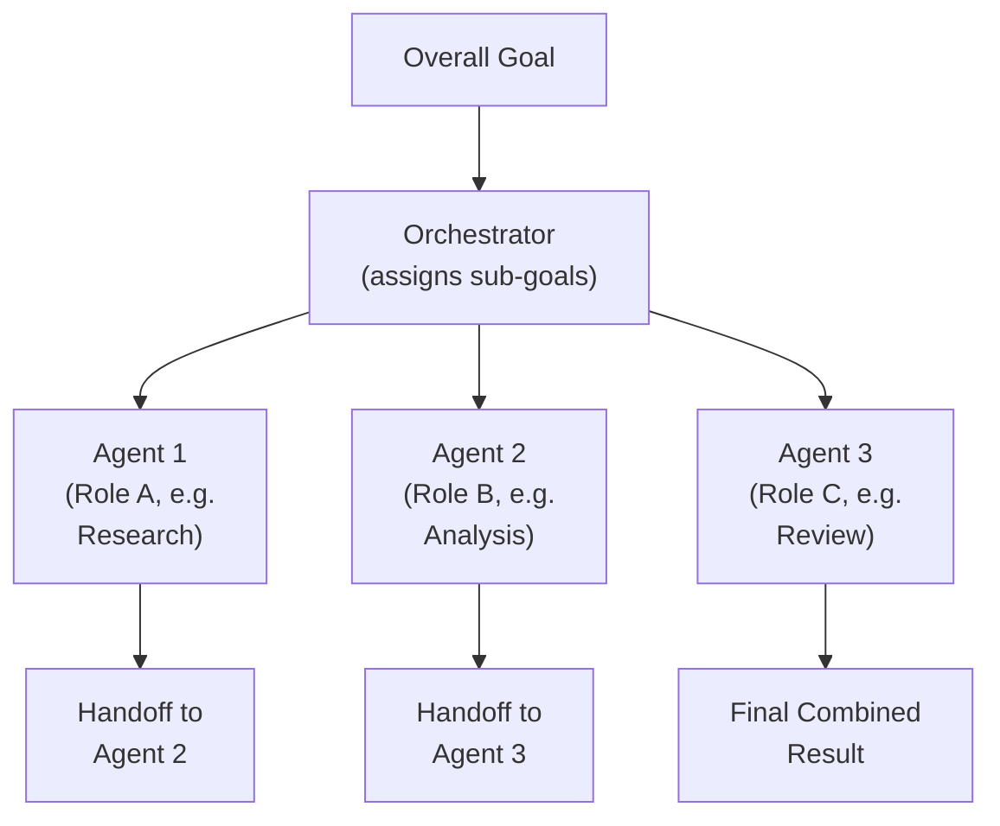
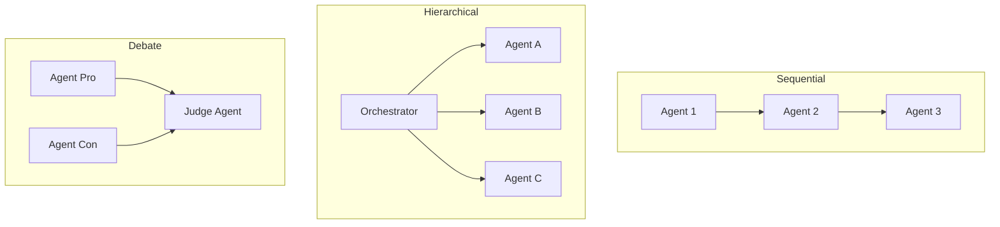
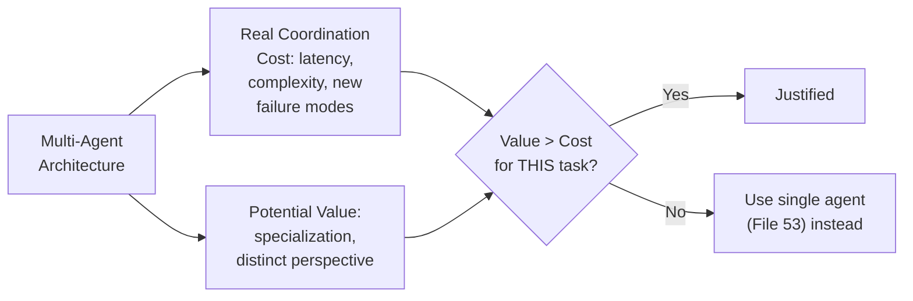

# 54 — Multi-Agent Prompting

> **Series:** Prompt Engineering Knowledge Library
> **File 54 of 60** | **Level:** Advanced
> **Prerequisites:** [`53_Agentic_Prompting.md`](./53_Agentic_Prompting.md), [`51_Prompt_Chaining.md`](./51_Prompt_Chaining.md)
> **Next:** [`55_Tool_Use_Prompting.md`](./55_Tool_Use_Prompting.md)

---

## Table of Contents

1. [Definition](#definition)
2. [Why It Matters](#why-it-matters)
3. [Core Concepts](#core-concepts)
4. [How It Works](#how-it-works)
5. [Internal Mechanism](#internal-mechanism)
6. [Types of Multi-Agent Architectures](#types-of-multi-agent-architectures)
7. [Syntax / Structure](#syntax--structure)
8. [Examples (Simple → Advanced)](#examples-simple--advanced)
9. [Best Practices](#best-practices)
10. [Common Mistakes](#common-mistakes)
11. [Real-World Applications](#real-world-applications)
12. [Comparison with Related Concepts](#comparison-with-related-concepts)
13. [Advantages & Limitations](#advantages--limitations)
14. [FAQs](#faqs)
15. [Summary](#summary)
16. [Cheat Sheet](#cheat-sheet)
17. [Glossary](#glossary)
18. [References](#references)
19. [Visual Diagram Gallery](#visual-diagram-gallery)

---

## Definition

**Multi-Agent Prompting** is the practice of coordinating multiple distinct agentic instances ([File 53](./53_Agentic_Prompting.md)) — each potentially with its own role, persona, tools, or sub-goal — toward a shared or related overall objective, with defined mechanisms for how they communicate, hand off work, or collaborate. This scales single-agent agentic prompting along a specific dimension: from one autonomous system operating alone to several, each contributing a distinct part, requiring genuine new design considerations around coordination, communication, and role division that a single agent's design doesn't need to address at all.

> The defining addition beyond single-agent systems: **multiple distinct agent instances, each with genuine autonomy within its own scope, must somehow communicate and coordinate** — a new category of design problem beyond anything a single agent, however sophisticated, ever needs to solve alone.

---

## Why It Matters

- **It enables genuine specialization** — different agents can be designed (via [Persona Design, File 37](./37_Persona_Design.md), distinct tool access, or distinct goal framing) for genuinely different sub-tasks, rather than forcing one single agent to be simultaneously excellent at every distinct capability a complex task might require.
- **It can improve reliability through a mechanism related to, but distinct from, [Self-Consistency](./46_Self_Consistency.md)** — having a genuinely distinct agent (e.g., a "reviewer" agent with a different framing) check another agent's work can catch issues a single agent's own self-reflection might miss, since it's a genuinely different perspective, not the same underlying process examining itself.
- **It introduces coordination overhead and failure modes that single-agent systems simply don't have** — communication breakdown between agents, conflicting sub-goals, and unclear handoff responsibility are new categories of risk requiring their own deliberate design attention.
- **Understanding when multi-agent architecture genuinely adds value versus when it adds unjustified complexity** is itself a practical skill this file develops, directly extending this library's recurring theme of matching technique complexity to genuine task need.

---

## Core Concepts

| Concept | Definition |
|---|---|
| **Agent Role** | The specific responsibility or specialization assigned to one agent within the system |
| **Inter-Agent Communication** | The mechanism by which agents exchange information or hand off work |
| **Coordination Protocol** | The defined structure governing how agents interact (sequential, hierarchical, peer-to-peer) |
| **Shared Context** | Information visible to multiple agents, as opposed to information private to one agent |
| **Handoff** | The transfer of a task or sub-task from one agent to another |
| **Orchestrator** | An agent or process specifically responsible for coordinating the others, in architectures that use one |

---

## How It Works



Each agent operates with its own genuine autonomy within its assigned role and scope ([File 53](./53_Agentic_Prompting.md)'s single-agent concept, applied to each individual agent), while the overall system's coordination — how work flows between them — is the new, distinct design layer this file specifically addresses.

---

## Internal Mechanism

### Why genuinely distinct agent framing can catch issues a single agent's self-reflection might miss

Recall [File 47 — Self-Reflection](./47_Self_Reflection.md)'s self-critique blind spot: a single agent critiquing its own work carries genuine risk of sharing the same underlying limitation that produced the original weakness. A genuinely distinct second agent — with different persona framing ([File 37](./37_Persona_Design.md)), a different specific instruction set, or even a deliberately adversarial or skeptical role assignment — approaches the same content from a meaningfully different starting point within the conditioning context ([File 4 — How LLMs Interpret Prompts](./04_How_LLMs_Interpret_Prompts.md)), which can activate different learned patterns and, in some cases, surface issues the original agent's own framing was less likely to notice. This isn't a guarantee — both agents may still be instances of the same underlying model with genuinely shared knowledge gaps — but the framing difference provides a meaningfully different vantage point than the same agent reflecting on itself, similar in spirit to how a human colleague's fresh-eyes review ([File 12 — Prompt Refinement](./12_Prompt_Refinement.md)) differs from an author's own re-reading.

### Why coordination overhead is a genuine cost requiring justification, not a free architectural upgrade

Every piece of information that needs to pass between agents requires an explicit communication mechanism — a defined format, a clear handoff point, and (per [File 51 — Prompt Chaining](./51_Prompt_Chaining.md)'s inter-link data-flow principle, applied here) validation that the handoff actually succeeded correctly. This coordination isn't free: it adds genuine latency (multiple agents' processing time, often partly sequential), genuine engineering complexity (defining and maintaining the coordination protocol), and a genuinely new failure surface (communication breakdown, ambiguous handoff responsibility, or conflicting sub-goals between agents) that a single, well-designed agent simply doesn't have to contend with at all. This is precisely why multi-agent architecture should be adopted specifically when the genuine specialization or distinct-perspective benefits (discussed above) outweigh this real, non-trivial coordination cost — not adopted by default because it sounds more sophisticated.

---

## Types of Multi-Agent Architectures

| Type | Description | Best Suited For |
|---|---|---|
| **Sequential Pipeline** | Agents operate in a fixed sequence, each handing off to the next | Tasks with clear, distinct sequential stages requiring different specializations |
| **Hierarchical/Orchestrator** | One orchestrating agent assigns and coordinates sub-tasks to specialized worker agents | Complex tasks needing dynamic sub-task assignment based on discovered needs |
| **Peer Review/Critique** | One agent produces work, a genuinely distinct second agent critiques it | High-stakes content benefiting from a distinct-perspective check, extending [File 47](./47_Self_Reflection.md) |
| **Debate/Adversarial** | Multiple agents argue different positions, with a final synthesis or judgment step | Complex decisions benefiting from explicitly considering multiple genuine perspectives |
| **Peer-to-Peer Collaborative** | Agents communicate more freely, without a strict hierarchical or sequential structure | Genuinely exploratory or creative tasks where a fixed structure would be limiting |

---

## Syntax / Structure

```yaml
# Example: a hierarchical multi-agent configuration
orchestrator:
  goal: "Produce a comprehensive market analysis report"
  sub_agents:
    - agent_id: researcher
      role: "Gather relevant market data and trends via search"
      tools: [web_search, web_fetch]
    - agent_id: analyst
      role: "Analyze researcher's findings for key insights"
      input_from: researcher
    - agent_id: reviewer
      role: "Critically review the analyst's conclusions for 
              unsupported claims or gaps"
      input_from: analyst
      framing: "Approach this with genuine skepticism — your 
                 job is to find weaknesses, not confirm the 
                 analysis"
  handoff_format: "structured JSON, per File 29, with explicit 
                    schema at each handoff point"
  final_synthesis: "Orchestrator combines researcher, analyst, 
                     and reviewer outputs into the final report"
```

---

## Examples (Simple → Advanced)

**Level 1 — Simple two-agent sequential pipeline:**
```text
Agent 1 (Writer): "Draft a blog post about {{topic}}."
Agent 2 (Editor): "Review this draft for clarity and grammar, 
provide a final polished version: {{draft_from_agent_1}}"
```

**Level 2 — Peer review architecture with distinct framing:**
```text
Agent 1 (Analyst): "Analyze this financial data and provide 
your conclusion: {{data}}"

Agent 2 (Skeptical Reviewer): "Here's an analyst's conclusion 
about this data: {{conclusion_from_agent_1}}. Approach this 
with genuine skepticism — identify any unsupported claims, 
alternative interpretations not considered, or gaps in the 
reasoning."
```

**Level 3 — Hierarchical orchestrator with three specialized agents:**
```text
Orchestrator: "Goal: comprehensive competitor analysis. 
Assigning: Agent A researches Competitor 1, Agent B researches 
Competitor 2, Agent C synthesizes both into a comparison."

[Agent A and Agent B operate independently, in parallel — 
connecting to File 43's Skeleton of Thought independence logic]
[Agent C waits for both, then synthesizes]
```

**Level 4 — Debate architecture for a genuinely contested decision:**
```text
Agent 1 (Pro-Expansion): "Argue for the business expanding 
into the new market, using the provided data."
Agent 2 (Pro-Caution): "Argue for NOT expanding, using the 
same data, focusing on risks Agent 1 may have understated."

Agent 3 (Judge): "Review both arguments: {{agent_1_argument}}, 
{{agent_2_argument}}. Provide a balanced synthesis, noting 
where each argument was strongest and where each may have 
been one-sided."
```

**Level 5 — Full production multi-agent system with explicit coordination protocol and failure handling:**
```yaml
Architecture: Hierarchical, 4 agents

orchestrator: 
  role: "Assigns sub-goals, monitors overall progress, handles 
         handoff failures"
  
agent_researcher:
  role: "Gather data via tools"
  output_schema: {"findings": ["string"], "sources": ["url"]}
  
agent_analyst:
  role: "Synthesize findings into insights"
  input_from: researcher
  output_schema: {"insights": ["string"], "confidence": 
                   "low|medium|high"}
  
agent_reviewer:
  role: "Skeptically review analyst's insights"
  input_from: analyst
  output_schema: {"approved_insights": ["string"], 
                   "flagged_concerns": ["string"]}

Handoff validation: Each handoff's output is validated (File 30) 
against its schema before being passed to the next agent — a 
FAILED handoff triggers orchestrator-level retry logic, NOT 
silent propagation of malformed data.

Failure handling: If agent_reviewer flags MORE than 2 concerns, 
orchestrator routes back to agent_analyst for revision rather 
than proceeding to final synthesis — an explicit feedback loop, 
not a one-way pipeline.

Cost/latency note: This 4-agent, multi-step architecture takes 
meaningfully longer and costs more than a single well-designed 
agent — justified here specifically because the genuine 
distinct-perspective review (agent_reviewer) provides real, 
measured value for this application's stakes, per the Internal 
Mechanism section's justification principle.
```

---

## Best Practices

1. **Justify multi-agent architecture against its genuine coordination cost** — per the Internal Mechanism section, adopt it specifically when specialization or distinct-perspective benefits outweigh the real overhead, not by default.
2. **Design genuinely distinct framing for agents meant to provide a different perspective** (Level 2, Level 4) — a "reviewer" agent with the same underlying framing as the original agent provides less genuine value than one deliberately framed differently.
3. **Specify explicit handoff formats and validate them** ([File 29](./29_Output_Formatting.md), [File 30](./30_Response_Validation.md)) — inter-agent communication deserves the same data-flow rigor as inter-link chaining.
4. **Design explicit failure/feedback handling**, not just a one-way pipeline — what should happen if one agent's output doesn't meet the next agent's needs (Level 5's revision loop).
5. **Consider parallel execution for genuinely independent agent sub-tasks** (Level 3), applying [File 43 — Skeleton of Thought](./43_Skeleton_of_Thought.md)'s independence logic at the multi-agent architecture level for latency benefits.

---

## Common Mistakes

| Mistake | Consequence | Fix |
|---|---|---|
| Adopting multi-agent architecture without genuine justification | Unnecessary coordination overhead and complexity for a task a single well-designed agent could handle | Justify against genuine specialization or distinct-perspective need |
| Reviewer/critique agents with the same underlying framing as the original agent | Reduced genuine distinct-perspective value, closer to redundant self-reflection | Design deliberately distinct framing for perspective-diverse agents |
| No explicit, validated handoff format between agents | Unreliable, potentially corrupted inter-agent communication | Specify and validate explicit handoff schemas |
| Purely one-way pipeline architecture with no feedback mechanism | Downstream agents stuck working with upstream output they can't request revision of | Design explicit feedback loops where genuinely warranted |
| Forcing genuinely sequential agents into a parallel structure, or vice versa | Either lost latency benefits or genuine correctness risk from inappropriate parallelization | Correctly diagnose genuine dependency vs. independence, per Files 43 and 49's principles |

---

## Real-World Applications

- **Research and content production pipelines** — specialized research, analysis, writing, and review agents each contributing their distinct capability to a larger output.
- **Code review and quality assurance systems** — a code-generating agent paired with a genuinely distinct reviewing agent, directly extending [File 47 — Self-Reflection](./47_Self_Reflection.md)'s single-agent mechanism to a multi-agent architecture.
- **Complex decision support systems** — debate architectures explicitly surfacing multiple genuine perspectives before a synthesized recommendation, valuable for high-stakes or contested decisions.
- **Large-scale business process automation** — hierarchical orchestrator architectures managing complex workflows too varied for any single agent's scope to reasonably cover.

---

## Comparison with Related Concepts

| Concept | Difference from "Multi-Agent Prompting" |
|---|---|
| **Agentic Prompting (File 53)** | Single-agent agentic prompting covers one autonomous system; multi-agent prompting specifically scales this to multiple, coordinating instances, introducing genuinely new communication and coordination design considerations |
| **Self-Reflection (File 47)** | Self-reflection has one agent critique its own work, carrying self-critique blind-spot risk; multi-agent peer review uses a genuinely distinct agent instance/framing for critique, providing a meaningfully different (though not perfect) vantage point |
| **Prompt Chaining (File 51)** | General chaining connects fixed, often single-purpose prompt links; multi-agent architectures connect genuinely autonomous agent instances, each potentially with their own internal agentic complexity (planning, tool use), a meaningfully higher-complexity composition |

---

## Advantages & Limitations

### ✅ Advantages of Multi-Agent Prompting

- **Enables genuine specialization**, avoiding the need for one single agent to excel simultaneously at every distinct capability a complex task requires.
- **Provides a genuinely distinct-perspective check** for critique/review use cases, meaningfully different from single-agent self-reflection.
- **Supports sophisticated architectures** (debate, hierarchical orchestration) well suited to genuinely complex, multi-faceted tasks.

### ⚠️ Limitations

- **Introduces real, non-trivial coordination overhead** — latency, engineering complexity, and new failure modes single-agent systems don't have.
- **Requires justification against this genuine cost** — not a default upgrade, appropriate specifically when specialization or distinct-perspective value outweighs the overhead.
- **Amplifies every agentic-system safety consideration from [File 53](./53_Agentic_Prompting.md)** across multiple agents simultaneously, requiring correspondingly more comprehensive agency-scope and oversight design.

---

## FAQs

**Q: When should I use multi-agent architecture instead of a single, well-designed agent?**
A: When the task genuinely benefits from specialization (different agents excelling at different sub-tasks) or a distinct perspective (a genuinely different-framed agent catching issues a single agent's self-reflection might miss) — not simply because multi-agent systems sound more sophisticated.

**Q: How is a "reviewer" agent different from just using self-reflection?**
A: A genuinely distinct agent, with different framing or persona, provides a meaningfully different vantage point than the same underlying process reflecting on itself — though this is a matter of degree, not an absolute guarantee, since both may still share underlying model limitations.

**Q: What's the biggest risk specific to multi-agent systems that single-agent systems don't have?**
A: Coordination failure — communication breakdown, ambiguous handoff responsibility, or conflicting sub-goals between agents — a genuinely new category of risk requiring its own explicit design attention, distinct from anything a single agent needs to address.

**Q: Can multi-agent architectures use parallel execution?**
A: Yes, for genuinely independent agent sub-tasks (Level 3's example) — this directly applies [File 43 — Skeleton of Thought](./43_Skeleton_of_Thought.md)'s independence logic at the multi-agent architecture level, providing real latency benefits when the dependency structure genuinely supports it.

---

## Summary

Multi-Agent Prompting coordinates multiple distinct agentic instances — each with its own role, framing, or specialization — toward a shared objective, scaling single-agent agentic prompting ([File 53](./53_Agentic_Prompting.md)) along a genuinely new dimension that introduces its own design considerations: explicit communication protocols, handoff validation, and coordination failure modes single-agent systems simply don't have. The technique's real value comes from genuine specialization and distinct-perspective benefits — a deliberately, meaningfully differently-framed reviewer agent provides a more genuinely different vantage point than the same agent's self-reflection — but this value must be weighed against real, non-trivial coordination overhead, making multi-agent architecture a deliberate choice justified by genuine task need, not a default upgrade. Having now covered both single- and multi-agent system design, the library turns to a specific capability both architectures depend on: how agents actually invoke external tools — [File 55 — Tool Use Prompting](./55_Tool_Use_Prompting.md).

---

## Cheat Sheet

```text
MULTI-AGENT PROMPTING — QUICK REFERENCE

WHEN TO USE: Genuine specialization need, OR genuine distinct-
perspective value (e.g., a meaningfully differently-framed 
reviewer) — NOT by default because it sounds sophisticated.

ARCHITECTURE TYPES
Sequential Pipeline  -> fixed order, distinct stages
Hierarchical         -> orchestrator assigns to worker agents
Peer Review/Critique -> distinct agent checks another's work
Debate/Adversarial   -> multiple genuine perspectives, synthesized

ESSENTIAL PRACTICES
[ ] Genuinely distinct framing for perspective-diverse agents
[ ] Explicit, VALIDATED handoff format between agents (File 30)
[ ] Explicit feedback/failure handling, not just one-way flow
[ ] Justify against the REAL coordination overhead cost
```

---

## Glossary

| Term | Definition |
|---|---|
| **Agent Role** | The specific responsibility assigned to one agent |
| **Inter-Agent Communication** | The mechanism for exchanging information between agents |
| **Coordination Protocol** | The defined structure governing agent interaction |
| **Shared Context** | Information visible to multiple agents |
| **Handoff** | Transfer of a task from one agent to another |
| **Orchestrator** | An agent or process specifically coordinating others |

---

## References

- Wu, Q. et al. (2023) — *AutoGen: Enabling Next-Gen LLM Applications via Multi-Agent Conversation*, arXiv:2308.08155
- Park, J. et al. (2023) — *Generative Agents: Interactive Simulacra of Human Behavior*, arXiv:2304.03442
- Du, Y. et al. (2023) — *Improving Factuality and Reasoning in Language Models through Multiagent Debate*, arXiv:2305.14325
- Anthropic — [Building Effective AI Agents](https://www.anthropic.com/research/building-effective-agents)

---

## Visual Diagram Gallery

**Diagram 1 — Multi-Agent Architecture Types**


**Diagram 2 — Why Distinct Framing Provides Genuine Perspective Value**
```text
SELF-REFLECTION (File 47):        MULTI-AGENT PEER REVIEW:
Same agent, same framing,         Genuinely DIFFERENT agent 
critiques itself                  framing/persona critiques
      |                                  |
      v                                  v
Shares the SAME underlying        Meaningfully DIFFERENT 
blind spots as the original       vantage point (though not 
                                   a perfect guarantee)
```

**Diagram 3 — Coordination Cost vs. Value Justification**


---

**⬅️ Previous:** [`53_Agentic_Prompting.md`](./53_Agentic_Prompting.md)
**➡️ Next:** [`55_Tool_Use_Prompting.md`](./55_Tool_Use_Prompting.md) — The general capability of invoking external tools, which agentic systems depend on.
