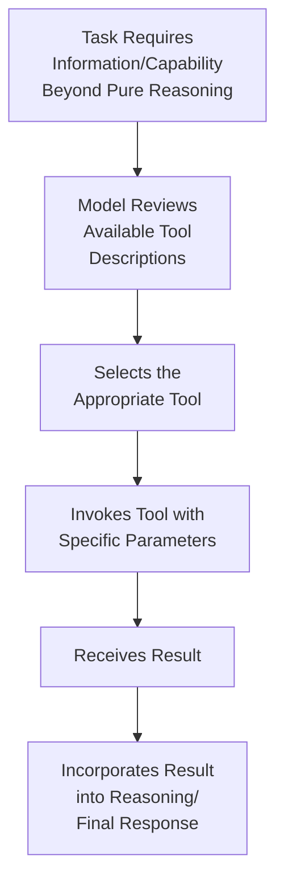
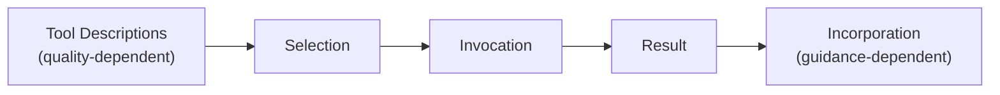
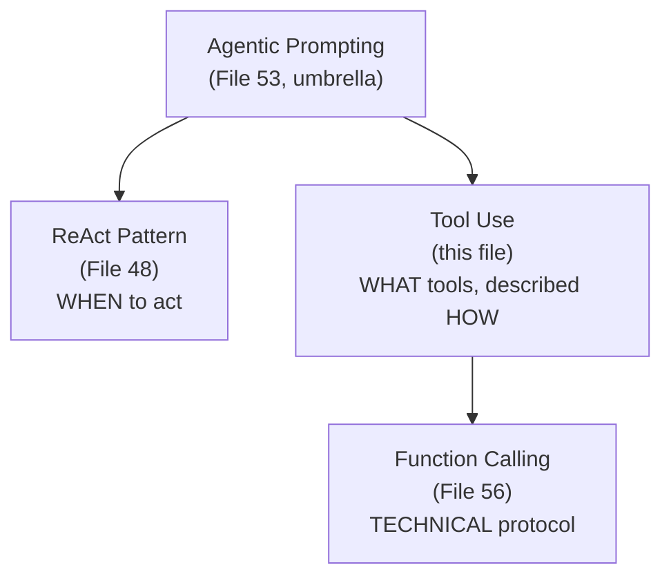

# 55 — Tool Use Prompting

> **Series:** Prompt Engineering Knowledge Library
> **File 55 of 60** | **Level:** Advanced
> **Prerequisites:** [`48_ReAct_Prompting.md`](./48_ReAct_Prompting.md), [`53_Agentic_Prompting.md`](./53_Agentic_Prompting.md)
> **Next:** [`56_Function_Calling.md`](./56_Function_Calling.md)

---

## Table of Contents

1. [Definition](#definition)
2. [Why It Matters](#why-it-matters)
3. [Core Concepts](#core-concepts)
4. [How It Works](#how-it-works)
5. [Internal Mechanism](#internal-mechanism)
6. [Types of Tool Use Design](#types-of-tool-use-design)
7. [Syntax / Structure](#syntax--structure)
8. [Examples (Simple → Advanced)](#examples-simple--advanced)
9. [Best Practices](#best-practices)
10. [Common Mistakes](#common-mistakes)
11. [Real-World Applications](#real-world-applications)
12. [Comparison with Related Concepts](#comparison-with-related-concepts)
13. [Advantages & Limitations](#advantages--limitations)
14. [FAQs](#faqs)
15. [Summary](#summary)
16. [Cheat Sheet](#cheat-sheet)
17. [Glossary](#glossary)
18. [References](#references)
19. [Visual Diagram Gallery](#visual-diagram-gallery)

---

## Definition

**Tool Use Prompting** is the general design discipline of enabling and guiding a model to invoke external tools — calculators, search engines, databases, APIs, code execution environments — as part of fulfilling a task, extending its effective capability beyond what pure text generation alone can accomplish. This file covers the *general capability and design considerations*: what makes a tool description effective, how to guide correct tool selection, and how to handle tool results well — as distinct from [File 56 — Function Calling](./56_Function_Calling.md), which covers the *specific, technical, API-level mechanism* (structured schemas, typed parameters, the request/response protocol) that implements this general capability in practice.

> A useful distinction: tool use is *the capability and the design discipline* — deciding what tools to offer, how to describe them, when a model should reach for one. Function calling ([File 56](./56_Function_Calling.md)) is *the specific technical protocol* — the structured schema format, parameter typing, and request/response mechanics — that most modern implementations use to actually realize this capability.

---

## Why It Matters

- **It directly addresses a fundamental limitation established in [File 4 — How LLMs Interpret Prompts](./04_How_LLMs_Interpret_Prompts.md)**: a model's knowledge is frozen at training time, and pure text generation alone cannot access current information, perform precise calculation reliably, or take real-world action — tools provide the bridge.
- **It's the concrete capability [ReAct](./48_ReAct_Prompting.md)'s Action step and [Agentic Prompting](./53_Agentic_Prompting.md)'s autonomous operation both depend on** — neither pattern is meaningfully useful without actual tools to reason about and invoke.
- **Tool description quality directly and measurably affects tool selection accuracy** — a model choosing between multiple available tools relies entirely on how well each tool's purpose and appropriate use case is conveyed, making this a genuine, high-leverage prompt engineering skill.
- **Poor tool use design produces specific, diagnosable failure patterns** — wrong tool selection, malformed invocation, or poor incorporation of results — each traceable to a specific design gap, similar in spirit to [File 5](./05_Prompt_Components.md)'s component-to-failure-pattern mapping.

---

## Core Concepts

| Concept | Definition |
|---|---|
| **Tool Description** | The text conveying what a tool does and when it should be used |
| **Tool Selection** | The model's decision about which available tool (if any) is appropriate for a given need |
| **Tool Invocation** | The act of actually calling a tool with specific parameters |
| **Result Incorporation** | How a tool's returned result is used within the ongoing reasoning/response |
| **Tool Availability Signaling** | How the model is made aware of which tools it currently has access to |
| **Tool Selection Ambiguity** | The risk of a model being uncertain which of several tools is most appropriate |

---

## How It Works



Every step in this diagram depends on prompt-level design quality — tool descriptions must be clear enough to support correct selection (Step B→C), invocation must follow a format the model can reliably produce (Step D), and the surrounding prompt must guide effective use of the returned result (Step E→F).

---

## Internal Mechanism

### Why tool description quality directly determines selection accuracy, mechanistically

As established in [File 4](./04_How_LLMs_Interpret_Prompts.md), a model's behavior is shaped by learned patterns activated by the specific text in its context — there's no separate, out-of-band mechanism by which a model "just knows" what a tool does beyond what's actually conveyed in its description. This means tool selection accuracy is directly, mechanistically bounded by description quality: a vague tool description ("searches for information") provides weak signal for distinguishing when this tool is appropriate versus a different available tool with a similarly vague description, while a specific, well-scoped description ("searches current news and events; NOT for looking up static reference facts") gives the model much clearer grounds for correct selection — this is precisely [File 9 — Prompt Design Principles](./09_Prompt_Design_Principles.md)'s specificity principle applied directly to tool design.

### Why result incorporation guidance matters as much as the tool description itself

A tool's returned result becomes new content in the model's context ([File 4](./04_How_LLMs_Interpret_Prompts.md)), and how that result should be used — trusted at face value, treated with some skepticism, combined with other information, or triggering a specific follow-up action — is not automatically obvious from the result alone. This connects directly to [File 26 — Context Injection](./26_Context_Injection.md)'s trust-tagging principles: a tool result is, mechanically, injected external content, and if the tool draws from an untrusted or variable-quality source (e.g., a general web search versus a verified internal database), the surrounding prompt should convey appropriate trust framing for that specific result, not treat every tool result identically regardless of its actual reliability.

---

## Types of Tool Use Design

| Type | Description | Best Suited For |
|---|---|---|
| **Single-Tool Design** | The model has access to exactly one tool | Narrow, well-defined capability extensions (e.g., only a calculator) |
| **Multi-Tool Design** | Several distinct tools available, requiring genuine selection | Broader agentic capability, requiring careful description differentiation |
| **Conditional Tool Availability** | Different tools available depending on context or task stage | Complex systems where not all tools are relevant at every point |
| **Tiered-Trust Tool Design** | Tools explicitly categorized by result reliability/trust level | Systems combining verified internal tools with less-verified external ones (e.g., open web search) |

---

## Syntax / Structure

```text
[Well-differentiated multi-tool description]
Available tools:

1. calculator(expression): Use for precise mathematical 
   calculations. NOT for estimation or rough figures you can 
   reason about directly.

2. web_search(query): Use for CURRENT events, recent news, or 
   information that may have changed since training. NOT for 
   stable, well-established facts you likely already know.

3. internal_kb_search(query): Use for company-specific policy 
   or product information. This is the AUTHORITATIVE source 
   for such questions — prefer it over general reasoning for 
   anything policy-related.
```

```text
[Result incorporation guidance with trust framing, per File 26]
When you receive a result from web_search, treat it as 
potentially variable-quality external information — note the 
source, and flag if multiple sources seem to disagree.

When you receive a result from internal_kb_search, treat it 
as authoritative for company policy questions — this source 
should be trusted over your own general reasoning if they 
conflict.
```

---

## Examples (Simple → Advanced)

**Level 1 — Simple single-tool use:**
```text
You have access to a calculator tool. Use it for any 
calculation rather than computing mentally, to ensure accuracy.

Task: What's 847 × 293?
```

**Level 2 — Multi-tool selection with clear differentiation:**
```text
Tools available: calculator (for math), unit_converter (for 
unit conversions). 

Task: Convert 15 miles to kilometers, then calculate the 
equivalent in a 3-day trip's daily average.
(Requires correctly selecting unit_converter first, THEN 
calculator — clear tool differentiation supports correct 
sequencing.)
```

**Level 3 — Tool selection ambiguity resolution:**
```text
[Without clear differentiation — ambiguous:]
Tools: search_tool_a, search_tool_b (both vaguely described 
as "search for information")

[With clear differentiation — resolves ambiguity:]
search_recent_news: for events/information from the last 6 months
search_reference_facts: for stable, established factual lookups 
(e.g., "what year did X happen historically")
```

**Level 4 — Tiered-trust tool design:**
```text
internal_policy_db: AUTHORITATIVE source for company policy — 
trust this over general web results if they conflict.
general_web_search: Useful for broader context, but treat 
results as one input to consider, not automatically authoritative 
— note the source and flag any inconsistency with the internal 
policy database.

Task: What's our return policy, and how does it compare to 
industry norms?
(Requires using BOTH tools appropriately, with correctly 
differentiated trust levels for each.)
```

**Level 5 — Full production tool use design with description testing:**
```yaml
Tool: order_lookup
description_v1: "Look up order information"
description_v2 (refined after observing selection errors): 
  "Look up a SPECIFIC order by order ID or customer email. Use 
  when the customer references a specific past purchase. Do 
  NOT use for general product availability questions — use 
  product_catalog_search for that instead."

Measured impact (per File 11's optimization methodology):
  v1 tool selection accuracy: 71% (confused with 
    product_catalog_search in ambiguous cases)
  v2 tool selection accuracy: 94% (clearer differentiation 
    resolved most confusion)

-> Directly demonstrates the Internal Mechanism section's 
   point: tool description quality is not a cosmetic detail, 
   it's a measurable, high-leverage driver of tool selection 
   accuracy.
```

---

## Best Practices

1. **Write specific, differentiated tool descriptions**, especially when multiple tools are available — per the Internal Mechanism section, description quality directly, mechanistically bounds selection accuracy.
2. **Explicitly state when a tool should NOT be used**, not just when it should — negative guidance (Level 4's "do NOT use for...") directly helps disambiguate between similar-seeming tools.
3. **Provide explicit trust/reliability framing for tool results**, especially when combining tools of genuinely different reliability ([File 26 — Context Injection](./26_Context_Injection.md)'s trust-tagging principle applied to tool outputs).
4. **Test and measure tool selection accuracy directly** (Level 5) — treat tool description quality as a genuine optimization target ([File 11](./11_Prompt_Optimization.md)), not a one-time, unexamined design choice.
5. **Design explicit guidance for how tool results should be incorporated**, not just described — trusted at face value, combined with other sources, or triggering specific follow-up reasoning.

---

## Common Mistakes

| Mistake | Consequence | Fix |
|---|---|---|
| Vague, underspecified tool descriptions | Poor tool selection accuracy, especially with multiple similar-seeming tools | Write specific, differentiated descriptions |
| Only describing what a tool does, never when NOT to use it | Ambiguity between genuinely similar tools | Include explicit negative guidance |
| Treating all tool results as equally trustworthy regardless of source | Inappropriate confidence in variable-quality external results | Provide explicit trust/reliability framing per tool |
| Never measuring actual tool selection accuracy | Undiagnosed, silent selection errors accumulating in production | Test and measure selection accuracy directly, treating it as an optimization target |
| No guidance for how to incorporate tool results | Inconsistent, poorly-reasoned use of otherwise-good tool data | Design explicit result-incorporation guidance |

---

## Real-World Applications

- **Any agentic system with real capability extensions** — search, calculation, database access, and API integration are near-universal tool use applications across modern LLM-powered products.
- **Customer service systems with backend access** — order lookup, policy search, and account management tools, each requiring clear differentiation for reliable selection.
- **Research and analysis agents** — combining search, retrieval, and computational tools, where correct sequencing and selection directly determines output quality.
- **Coding assistants with execution capability** — code execution and testing tools, where tool result incorporation (interpreting error messages, test outputs) is as important as the tool call itself.

---

## Comparison with Related Concepts

| Concept | Difference from "Tool Use Prompting" |
|---|---|
| **Function Calling (File 56)** | Tool use is the general capability and design discipline (what tools to offer, how to describe them); function calling is the specific, technical API-level protocol (structured schemas, typed parameters) most modern systems use to implement this capability |
| **ReAct Prompting (File 48)** | ReAct is a specific reasoning-and-acting pattern that structures WHEN and HOW reasoning interleaves with tool invocation; tool use prompting covers the broader design of the tools themselves, independent of which reasoning pattern invokes them |
| **Agentic Prompting (File 53)** | Agentic prompting is the umbrella concept of autonomous, goal-directed operation; tool use is one specific, foundational capability agentic systems typically depend on, not synonymous with agentic prompting itself |

---

## Advantages & Limitations

### ✅ Advantages of Well-Designed Tool Use

- **Directly extends model capability beyond pure text generation's inherent limitations** — current information, precise calculation, real-world action.
- **Tool description quality is a genuine, measurable, high-leverage optimization target**, not a fixed or immutable constraint.
- **Foundational to nearly all modern agentic and ReAct-based systems**, making this design discipline broadly applicable.

### ⚠️ Limitations

- **Selection accuracy, however well-designed, is not architecturally guaranteed** — like other prompt-level influences, it remains a strong but probabilistic tendency, warranting downstream validation for high-stakes tool invocations.
- **Result incorporation quality depends on both the underlying tool's reliability and the surrounding prompt's guidance** — neither alone is sufficient.
- **Adding more tools increases selection ambiguity risk** if descriptions aren't correspondingly carefully differentiated, a genuine design cost of expanding tool availability.

---

## FAQs

**Q: How many tools can a model reliably choose between?**
A: There's no fixed universal number — the practical constraint is description quality and differentiation, not raw count; a system with many well-differentiated, clearly-scoped tools can outperform a system with fewer, vaguely-described ones.

**Q: Should every tool result be trusted at face value?**
A: No — per Best Practices and [File 26](./26_Context_Injection.md)'s trust-tagging principle, different tools warrant different trust framing depending on their underlying source's actual reliability.

**Q: How do I know if my tool descriptions need improvement?**
A: Measure actual tool selection accuracy directly (Level 5's example), treating it as a genuine, testable metric rather than assuming description quality based on how clear it seems to a human reader.

**Q: Is tool use only relevant for agentic systems?**
A: It's most commonly discussed in that context, but the underlying design principles (clear, differentiated descriptions, explicit trust framing) apply to any system where a model invokes external capabilities, even outside a fully autonomous agentic architecture.

---

## Summary

Tool Use Prompting is the general design discipline of enabling and guiding a model to invoke external tools — extending capability beyond pure text generation — covering what makes tool descriptions effective, how to support correct tool selection, and how to guide appropriate incorporation of returned results, as distinct from [File 56 — Function Calling](./56_Function_Calling.md)'s specific technical implementation protocol. Tool description quality directly, mechanistically bounds selection accuracy, since a model has no out-of-band way to know a tool's purpose beyond what's actually conveyed in its description — making specific, differentiated descriptions (including explicit guidance on when NOT to use a tool) a genuine, measurable, high-leverage design target, alongside explicit trust framing for how differently-reliable tool results should actually be incorporated. Having covered this general capability and design discipline, the library turns to the specific technical mechanism most modern systems use to implement it: [File 56 — Function Calling](./56_Function_Calling.md).

---

## Cheat Sheet

```text
TOOL USE PROMPTING — QUICK REFERENCE

TOOL DESCRIPTION QUALITY CHECKLIST
[ ] Specific, not vague ("search current news" not "search 
    for information")
[ ] Includes NEGATIVE guidance (when NOT to use it)
[ ] Differentiated from other similar available tools
[ ] Trust/reliability framing for the RESULT it returns

MEASURE, DON'T ASSUME: Tool selection accuracy is directly, 
mechanistically bounded by description quality — TEST it 
(File 11's optimization methodology), don't assume clarity 
based on how it reads to a human.

KEY DISTINCTION
Tool Use (this file)      = the CAPABILITY + design discipline
Function Calling (File 56) = the specific TECHNICAL PROTOCOL
```

---

## Glossary

| Term | Definition |
|---|---|
| **Tool Description** | Text conveying what a tool does and when to use it |
| **Tool Selection** | The model's decision about which tool is appropriate |
| **Tool Invocation** | The act of calling a tool with specific parameters |
| **Result Incorporation** | How a tool's returned result is used in reasoning |
| **Tool Availability Signaling** | How the model learns which tools it currently has access to |
| **Tool Selection Ambiguity** | Uncertainty about which of several tools is most appropriate |

---

## References

- Schick, T. et al. (2023) — *Toolformer: Language Models Can Teach Themselves to Use Tools*, arXiv:2302.04761
- Yao, S. et al. (2022) — *ReAct: Synergizing Reasoning and Acting in Language Models*, arXiv:2210.03629
- Anthropic — [Tool Use with Claude](https://docs.claude.com/en/docs/build-with-claude/tool-use)
- Qin, Y. et al. (2023) — *Tool Learning with Foundation Models*, arXiv:2304.08354

---

## Visual Diagram Gallery

**Diagram 1 — The Tool Use Pipeline**


**Diagram 2 — Vague vs. Differentiated Tool Descriptions**
```text
VAGUE (poor selection accuracy):
Tool A: "searches for information"
Tool B: "searches for information"
-> Model has weak grounds to distinguish them

DIFFERENTIATED (strong selection accuracy):
Tool A: "CURRENT events, last 6 months"
Tool B: "STABLE reference facts, historical"
-> Model has clear grounds for correct selection
```

**Diagram 3 — Tool Use's Position in the Agentic Stack**


---

**⬅️ Previous:** [`54_Multi_Agent_Prompting.md`](./54_Multi_Agent_Prompting.md)
**➡️ Next:** [`56_Function_Calling.md`](./56_Function_Calling.md) — The specific technical API-level mechanism implementing tool use.
