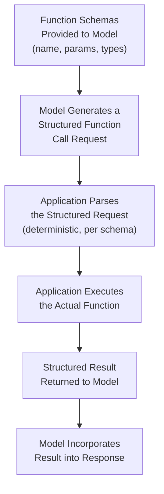
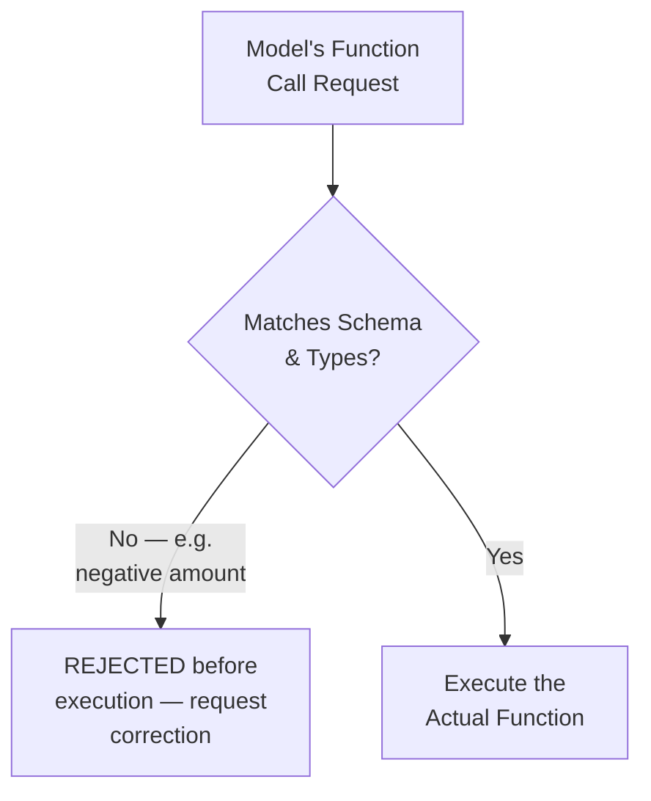
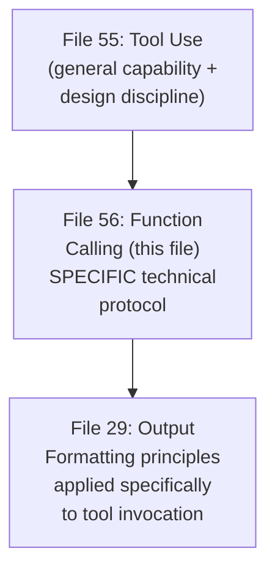

# 56 — Function Calling

> **Series:** Prompt Engineering Knowledge Library
> **File 56 of 60** | **Level:** Advanced
> **Prerequisites:** [`55_Tool_Use_Prompting.md`](./55_Tool_Use_Prompting.md), [`29_Output_Formatting.md`](./29_Output_Formatting.md)
> **Next:** [`57_RAG_Prompting.md`](./57_RAG_Prompting.md)

---

## Table of Contents

1. [Definition](#definition)
2. [Why It Matters](#why-it-matters)
3. [Core Concepts](#core-concepts)
4. [How It Works](#how-it-works)
5. [Internal Mechanism](#internal-mechanism)
6. [Types of Function Calling Patterns](#types-of-function-calling-patterns)
7. [Syntax / Structure](#syntax--structure)
8. [Examples (Simple → Advanced)](#examples-simple--advanced)
9. [Best Practices](#best-practices)
10. [Common Mistakes](#common-mistakes)
11. [Real-World Applications](#real-world-applications)
12. [Comparison with Related Concepts](#comparison-with-related-concepts)
13. [Advantages & Limitations](#advantages--limitations)
14. [FAQs](#faqs)
15. [Summary](#summary)
16. [Cheat Sheet](#cheat-sheet)
17. [Glossary](#glossary)
18. [References](#references)
19. [Visual Diagram Gallery](#visual-diagram-gallery)

---

## Definition

**Function Calling** is the specific, technical API-level mechanism by which a model requests a tool invocation using a structured, machine-parseable schema — typed parameters, a defined function signature, and a standardized request/response format — rather than the model attempting to invoke a tool through free-form natural language description alone. This is the concrete implementation layer beneath [File 55 — Tool Use Prompting](./55_Tool_Use_Prompting.md)'s general design discipline: where File 55 covers *what tools to offer and how to describe them* for effective selection, this file covers the *specific structured protocol* — how a tool's interface is formally defined, how the model's request is structured and parsed, and how results flow back — that most modern production systems actually use to implement tool use reliably.

> The core technical shift: instead of a model producing free-form text like "I'll search for the weather in Tokyo" that an application must then parse and interpret, function calling has the model produce a structured, typed request — `weather_lookup(location="Tokyo")` — directly matching a predefined schema the application can parse deterministically, without needing to interpret ambiguous natural language.

---

## Why It Matters

- **It directly addresses a genuine reliability gap free-form tool invocation has**: parsing a model's natural-language description of an intended tool call into an application's actual function signature is inherently more error-prone than parsing an already-structured, schema-conformant request.
- **It's the mechanism underlying virtually all modern, production-grade tool-use and agentic systems** — understanding this specific technical layer is prerequisite to building genuinely reliable tool-using applications, beyond the general design principles [File 55](./55_Tool_Use_Prompting.md) covers.
- **Structured schemas directly extend [File 29 — Output Formatting](./29_Output_Formatting.md)'s finding that schema-plus-example outperforms verbal description alone** — function calling is, in effect, that same principle applied specifically to the tool-invocation use case.
- **It provides a genuinely stronger foundation for validation** ([File 30 — Response Validation](./30_Response_Validation.md)) — a structured function call can be checked against its schema programmatically and deterministically, in a way free-form natural language intent cannot.

---

## Core Concepts

| Concept | Definition |
|---|---|
| **Function Schema** | The formal, structured definition of a tool's name, parameters, and their types |
| **Parameter Typing** | Specifying the expected data type (string, number, enum, etc.) for each function parameter |
| **Function Call Request** | The model's structured output requesting a specific function be invoked with specific arguments |
| **Function Result** | The structured data returned after the actual function/tool executes |
| **Required vs. Optional Parameters** | Distinguishing which parameters a function call must include versus may omit |
| **Multi-Function Selection** | The model choosing among several available function schemas for a given need |

---

## How It Works



The critical structural improvement over free-form tool description ([File 55](./55_Tool_Use_Prompting.md) alone) is Step C: because the model's request already conforms to a predefined schema, parsing it is a deterministic, reliable operation — not an interpretive one requiring the application to guess at the model's intent from natural language.

---

## Internal Mechanism

### Why structured schemas reduce parsing ambiguity, mechanistically

As established in [File 29 — Output Formatting](./29_Output_Formatting.md)'s Internal Mechanism section, a model generates structural syntax token-by-token, and providing an explicit schema gives it a much more precise target to match than an inferred structure from verbal description alone. Function calling applies this exact principle specifically to tool invocation: rather than the model generating unstructured text like "I should check the weather for Tokyo" — which an application must then parse using potentially fragile natural-language-understanding logic to extract the intended function name and arguments — the model is trained and prompted to directly generate output matching a predefined function schema. This shifts the burden of correctly identifying intent from a fragile, interpretive parsing step (extracting meaning from free text) to a comparatively much more reliable, deterministic one (validating structured output against a known schema, per [File 30 — Response Validation](./30_Response_Validation.md)).

### Why parameter typing specifically prevents a class of error free-form description cannot catch

A function schema's parameter typing (e.g., specifying that a `date` parameter must be a valid date string, or that a `quantity` parameter must be a positive integer) enables a specific, powerful validation step: the application can programmatically check whether a model's generated function call request actually conforms to these types *before* attempting to execute the underlying function — catching a malformed or nonsensical request (e.g., a negative quantity, an invalid date format) at the request-validation stage, rather than only discovering the problem when the actual function fails or behaves unexpectedly during execution. This is a direct, practical extension of [File 34 — Variables](./34_Variables.md)'s type-validation principle, applied specifically to the function-calling use case — validate before use, not just after observing a downstream failure.

---

## Types of Function Calling Patterns

| Pattern | Description | Best Suited For |
|---|---|---|
| **Single Function Call** | The model requests exactly one function invocation per turn | Simple, single-need tasks |
| **Parallel Function Calls** | The model requests multiple, genuinely independent function calls simultaneously | Tasks needing several unrelated pieces of information at once, connecting to [File 43 — Skeleton of Thought](./43_Skeleton_of_Thought.md)'s independence logic |
| **Sequential Function Calls** | The model requests one function, uses its result to inform a subsequent function call | Tasks with genuine sequential dependency between tool calls, connecting to [File 49 — Least-to-Most Prompting](./49_Least_to_Most_Prompting.md) |
| **Forced Function Calling** | The application requires the model to use a specific function, rather than leaving selection open | Workflows where a specific tool call is always required at a given point |

---

## Syntax / Structure

```json
// Example: a function schema definition
{
  "name": "weather_lookup",
  "description": "Get current weather for a specific location.",
  "parameters": {
    "type": "object",
    "properties": {
      "location": {
        "type": "string",
        "description": "City name, e.g. 'Tokyo'"
      },
      "units": {
        "type": "string",
        "enum": ["celsius", "fahrenheit"],
        "description": "Temperature unit"
      }
    },
    "required": ["location"]
  }
}
```

```json
// Example: the model's structured function call REQUEST
{
  "function_call": {
    "name": "weather_lookup",
    "arguments": {
      "location": "Tokyo",
      "units": "celsius"
    }
  }
}
```

```json
// Example: the structured RESULT returned after execution
{
  "function_result": {
    "name": "weather_lookup",
    "result": {"temperature": 18, "condition": "partly cloudy"}
  }
}
```

---

## Examples (Simple → Advanced)

**Level 1 — Simple single function call:**
```json
Schema: calculate(expression: string)
Model's request: {"function_call": {"name": "calculate", 
"arguments": {"expression": "847 * 293"}}}
```

**Level 2 — Function call with required and optional parameters:**
```json
Schema: search_products(query: string [required], 
category: string [optional], max_results: number [optional])

Model's request (using only the required parameter): 
{"function_call": {"name": "search_products", "arguments": 
{"query": "wireless keyboard"}}}
```

**Level 3 — Parallel function calls for genuinely independent needs:**
```json
Task: "Compare the weather in Miami and Phoenix."

Model's request (two independent calls, per File 43's logic):
[
  {"function_call": {"name": "weather_lookup", "arguments": 
    {"location": "Miami"}}},
  {"function_call": {"name": "weather_lookup", "arguments": 
    {"location": "Phoenix"}}}
]
```

**Level 4 — Sequential function calls with genuine dependency:**
```json
Task: "Find the current price of item #4471 and calculate a 
15% discount."

Step 1: {"function_call": {"name": "product_lookup", 
"arguments": {"id": 4471}}}
Result: {"price": 80.00}

Step 2 (uses Step 1's result — genuine sequential dependency, 
per File 49): {"function_call": {"name": "calculate", 
"arguments": {"expression": "80.00 * 0.85"}}}
```

**Level 5 — Full production function calling with type validation and forced calling:**
```yaml
Schema: process_refund(order_id: string [required], 
amount: number [required, must be positive], 
reason: string [enum: defective|wrong_item|changed_mind])

Forced calling policy: For any confirmed refund request, the 
system REQUIRES the model to invoke process_refund (not 
optional) — this is a workflow design choice, not left to the 
model's discretion, per File 55's tiered-design concept applied 
at the schema-enforcement level.

Application-level type validation before execution:
  Model's request: {"order_id": "ORD-4471", "amount": -50.00, 
  "reason": "defective"}
  Validation check: amount must be positive per schema -> FAILS
  Action: Request REJECTED before execution, model prompted 
  to correct (per File 30's validation-before-use principle, 
  applied specifically to function call requests)

Corrected request: {"order_id": "ORD-4471", "amount": 50.00, 
"reason": "defective"} -> PASSES validation -> executed
```

---

## Best Practices

1. **Define explicit, typed parameter schemas for every function**, not just a general description — per the Internal Mechanism section, this is what enables reliable, deterministic parsing and validation.
2. **Validate function call requests against their schema before execution**, not just after observing a downstream failure — catching malformed requests at the request stage is more reliable and diagnosable.
3. **Use parallel function calls for genuinely independent needs** ([File 43](./43_Skeleton_of_Thought.md)'s logic) and sequential calls for genuinely dependent ones ([File 49](./49_Least_to_Most_Prompting.md)'s logic) — correctly diagnosing which structure fits, as with those techniques generally.
4. **Consider forced function calling for workflow-critical steps** where a specific tool invocation is always required, rather than leaving this to the model's open selection.
5. **Keep function descriptions and parameter descriptions specific and differentiated**, directly applying [File 55](./55_Tool_Use_Prompting.md)'s tool description quality principles to each individual schema field.

---

## Common Mistakes

| Mistake | Consequence | Fix |
|---|---|---|
| Untyped or loosely-typed function parameters | Reduced ability to catch malformed requests before execution | Define explicit, typed parameter schemas |
| No validation of function call requests before execution | Malformed requests only discovered as downstream execution failures | Validate against schema before executing |
| Treating genuinely independent needs as forced-sequential function calls | Unnecessary latency from avoidable sequential execution | Use parallel function calls where genuine independence holds |
| Vague function/parameter descriptions | Same selection-ambiguity risk as poorly-described tools generally (File 55) | Write specific, differentiated descriptions at the schema level |
| No forced-calling policy for workflow-critical steps | Risk of the model failing to invoke a required function at a critical point | Use forced function calling where a specific invocation is always required |

---

## Real-World Applications

- **Production API integrations** — nearly all modern LLM-powered applications with real backend system access use function calling as the underlying technical mechanism.
- **Structured data retrieval and manipulation systems** — database queries, CRM lookups, and similar structured operations depend on reliable, schema-validated function calling.
- **E-commerce and transactional systems** — order processing, payment handling, and inventory management, where type validation (Level 5's example) directly prevents costly malformed requests.
- **Multi-tool agentic applications** — the technical foundation most modern agentic frameworks and platforms use to implement the broader tool use design principles from [File 55](./55_Tool_Use_Prompting.md).

---

## Comparison with Related Concepts

| Concept | Difference from "Function Calling" |
|---|---|
| **Tool Use Prompting (File 55)** | Tool use is the general capability and design discipline (what tools to offer, how to describe them for selection); function calling is the specific technical protocol (structured, typed schemas) most modern systems use to implement that capability reliably |
| **Output Formatting (File 29)** | Output formatting covers structured output generally, for any purpose; function calling is a specific, specialized application of structured output principles to the tool-invocation use case specifically |
| **Response Validation (File 30)** | Validation is the general downstream verification practice; function calling's schema-based structure specifically enables a particularly reliable, deterministic form of that validation for tool-invocation requests |

---

## Advantages & Limitations

### ✅ Advantages of Function Calling

- **Provides deterministic, reliable parsing** of a model's intended tool invocation, versus fragile natural-language interpretation.
- **Enables genuine, programmatic pre-execution validation** through explicit parameter typing.
- **Is the well-established, production-grade technical foundation** underlying virtually all modern tool-using and agentic systems.

### ⚠️ Limitations

- **Requires upfront schema definition work** for every function — a genuine engineering investment beyond simply describing a tool in prose.
- **Model conformance to a schema, while generally reliable in modern instruction-tuned models, is still a trained, probabilistic behavior**, not an absolute architectural guarantee — validation remains valuable even with structured schemas.
- **Doesn't eliminate the general tool use design considerations** from [File 55](./55_Tool_Use_Prompting.md) — description quality, trust framing for results, and selection-ambiguity risk all still apply within the structured schema format.

---

## FAQs

**Q: Is function calling the same thing as tool use?**
A: Related but distinct — tool use ([File 55](./55_Tool_Use_Prompting.md)) is the general capability and design discipline; function calling is the specific technical mechanism most modern systems use to implement that capability with structured, typed schemas.

**Q: Does function calling guarantee a model will never generate a malformed request?**
A: No — like other prompt-level and trained behaviors, schema conformance is generally reliable but not an absolute guarantee, which is precisely why request validation before execution ([File 30](./30_Response_Validation.md)) remains an important safeguard even with well-defined schemas.

**Q: When should I use parallel versus sequential function calls?**
A: This directly mirrors [File 43](./43_Skeleton_of_Thought.md) and [File 49](./49_Least_to_Most_Prompting.md)'s logic — use parallel calls for genuinely independent needs, sequential calls when a later call genuinely requires an earlier call's result.

**Q: What's "forced function calling" useful for?**
A: Workflow steps where a specific tool invocation is always required by design — rather than leaving this to the model's open selection, the application can require a specific function call at that point in the workflow, reducing the risk of the model failing to invoke it when needed.

---

## Summary

Function Calling is the specific, technical API-level mechanism by which a model requests tool invocation using a structured, typed schema — a function name, defined parameters with explicit types, and a standardized request/response format — providing deterministic, reliable parsing and genuine pre-execution validation that free-form natural-language tool description alone cannot offer, directly extending [File 29 — Output Formatting](./29_Output_Formatting.md)'s schema-based reliability principles to the specific tool-invocation use case. This is the concrete technical foundation underlying virtually all modern production tool-using and agentic systems, implementing [File 55 — Tool Use Prompting](./55_Tool_Use_Prompting.md)'s general design principles through a specific, well-established protocol — parameter typing enables catching malformed requests before execution, and parallel versus sequential call patterns should be chosen based on genuine task dependency structure, mirroring principles already established elsewhere in this library. Having now completed the library's coverage of agentic systems and tool integration, the discussion turns to a specific, foundational application pattern combining retrieval with generation: [File 57 — RAG Prompting](./57_RAG_Prompting.md).

---

## Cheat Sheet

```text
FUNCTION CALLING — QUICK REFERENCE

THE STRUCTURE: Function Name + Typed Parameters + Required/
Optional designation = a SCHEMA the model's request must match

WHY IT'S MORE RELIABLE THAN FREE-FORM TOOL DESCRIPTION
Free-form: model describes intent in prose -> application must 
           INTERPRET it (fragile, ambiguous)
Function Calling: model generates a SCHEMA-CONFORMANT request 
           -> application PARSES it deterministically (reliable)

CALL PATTERN SELECTION (mirrors Files 43 & 49)
Genuinely independent needs -> PARALLEL calls
Genuine sequential dependency -> SEQUENTIAL calls

ALWAYS: Validate function call requests against their schema 
BEFORE execution (File 30) — even well-designed schemas don't 
guarantee perfect conformance.
```

---

## Glossary

| Term | Definition |
|---|---|
| **Function Schema** | The formal, structured definition of a tool's name, parameters, and types |
| **Parameter Typing** | Specifying expected data types for each function parameter |
| **Function Call Request** | The model's structured request to invoke a specific function |
| **Function Result** | The structured data returned after execution |
| **Required vs. Optional Parameters** | Distinguishing mandatory from omittable parameters |
| **Multi-Function Selection** | The model choosing among several available function schemas |

---

## References

- Anthropic — [Tool Use with Claude](https://docs.claude.com/en/docs/build-with-claude/tool-use)
- OpenAI — [Function Calling](https://platform.openai.com/docs/guides/function-calling)
- Schick, T. et al. (2023) — *Toolformer: Language Models Can Teach Themselves to Use Tools*, arXiv:2302.04761
- Patil, S. et al. (2023) — *Gorilla: Large Language Model Connected with Massive APIs*, arXiv:2305.15334

---

## Visual Diagram Gallery

**Diagram 1 — Free-Form vs. Structured Function Calling**
```text
FREE-FORM (fragile):
Model: "I'll check the weather for Tokyo" 
-> Application must INTERPRET this natural language -> 
   fragile, ambiguous parsing

FUNCTION CALLING (reliable):
Model: {"function_call": {"name": "weather_lookup", 
"arguments": {"location": "Tokyo"}}}
-> Application PARSES deterministically against known schema
```

**Diagram 2 — Pre-Execution Type Validation**


**Diagram 3 — Function Calling's Position in the Stack**


---

**⬅️ Previous:** [`55_Tool_Use_Prompting.md`](./55_Tool_Use_Prompting.md)
**➡️ Next:** [`57_RAG_Prompting.md`](./57_RAG_Prompting.md) — Prompt-level techniques for retrieval-augmented generation.
