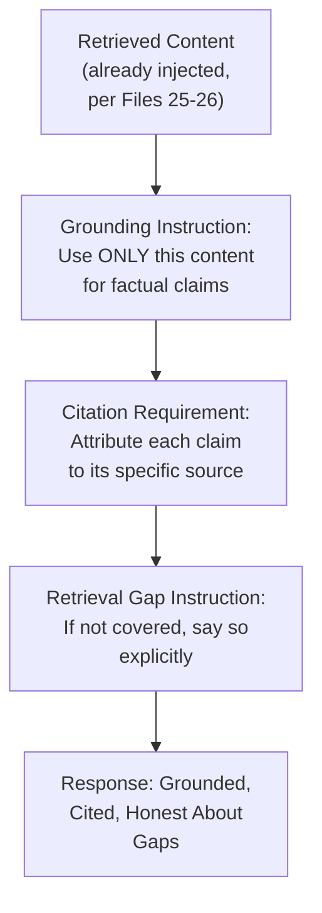
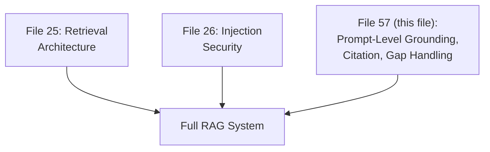
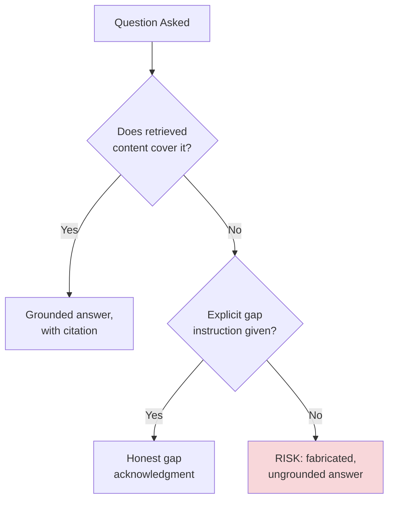

# 57 — RAG Prompting

> **Series:** Prompt Engineering Knowledge Library
> **File 57 of 60** | **Level:** Advanced
> **Prerequisites:** [`25_Context_Management.md`](./25_Context_Management.md), [`26_Context_Injection.md`](./26_Context_Injection.md), [`30_Response_Validation.md`](./30_Response_Validation.md)
> **Next:** [`58_Code_Generation_Prompts.md`](./58_Code_Generation_Prompts.md)

---

## Table of Contents

1. [Definition](#definition)
2. [Why It Matters](#why-it-matters)
3. [Core Concepts](#core-concepts)
4. [How It Works](#how-it-works)
5. [Internal Mechanism](#internal-mechanism)
6. [Types of RAG Prompting Techniques](#types-of-rag-prompting-techniques)
7. [Syntax / Structure](#syntax--structure)
8. [Examples (Simple → Advanced)](#examples-simple--advanced)
9. [Best Practices](#best-practices)
10. [Common Mistakes](#common-mistakes)
11. [Real-World Applications](#real-world-applications)
12. [Comparison with Related Concepts](#comparison-with-related-concepts)
13. [Advantages & Limitations](#advantages--limitations)
14. [FAQs](#faqs)
15. [Summary](#summary)
16. [Cheat Sheet](#cheat-sheet)
17. [Glossary](#glossary)
18. [References](#references)
19. [Visual Diagram Gallery](#visual-diagram-gallery)

---

## Definition

**RAG Prompting** covers the specific *prompt-level* techniques for writing effective prompts within a Retrieval-Augmented Generation system — citation instructions, grounding language, explicit handling for retrieval gaps, and source-attribution formatting. [File 25 — Context Management](./25_Context_Management.md) already covers RAG's general architectural role as a context management strategy, and [File 26 — Context Injection](./26_Context_Injection.md) already covers the security dimension of incorporating retrieved content — this file does *not* re-explain that architecture. Instead, it focuses narrowly on the actual prompt wording and structure that determines whether a RAG system's retrieved content is used well or poorly once it's already been retrieved and injected.

> The specific, narrow question this file answers: **given that relevant content has already been retrieved and placed in the prompt, what should the surrounding prompt text actually say to ensure the model uses that content accurately, cites it appropriately, and handles gaps honestly?**

---

## Why It Matters

- **Retrieval quality alone doesn't guarantee good output.** Even excellent retrieval can be undermined by poor prompt-level grounding instructions — a model with perfectly relevant retrieved content can still ignore it, misattribute claims, or blend it inappropriately with ungrounded prior knowledge without the right prompt guidance.
- **Citation and attribution quality is a genuine, distinct prompt engineering skill** — getting a model to reliably and accurately cite which specific retrieved passage supports which specific claim requires deliberate prompt design, not automatic behavior.
- **Handling retrieval gaps honestly is a common, high-stakes failure point** — a model asked a question the retrieved content doesn't actually cover needs explicit instruction to say so, rather than filling the gap with plausible-sounding but ungrounded content (a specific, well-documented hallucination risk pattern).
- **This is precisely the kind of technique-application-in-context this file's position late in the library reflects** — it draws directly on grounding principles from [File 25](./25_Context_Management.md)/[26](./26_Context_Injection.md), output formatting from [File 29](./29_Output_Formatting.md), and validation from [File 30](./30_Response_Validation.md), applied specifically to the RAG use case.

---

## Core Concepts

| Concept | Definition |
|---|---|
| **Grounding Instruction** | Explicit guidance to base claims only on retrieved content, not general knowledge |
| **Citation Requirement** | An instruction requiring the model to attribute specific claims to specific retrieved sources |
| **Retrieval Gap Handling** | Explicit instruction for what to do when retrieved content doesn't cover the question |
| **Source Attribution Format** | The specific structure used to indicate which source supports which claim |
| **Blended Knowledge Risk** | The risk of a model mixing retrieved content with its own general, ungrounded knowledge without distinguishing the two |
| **Retrieval Confidence Signaling** | Conveying how strongly retrieved content actually supports a given answer |

---

## How It Works



Each stage in this diagram is a specific, deliberate prompt-level instruction — none of this behavior happens automatically just because relevant content has been retrieved and placed in the prompt; each element requires explicit prompt design, which is precisely this file's focus.

---

## Internal Mechanism

### Why grounding instructions are necessary even with perfectly relevant retrieved content

Recall from [File 4 — How LLMs Interpret Prompts](./04_How_LLMs_Interpret_Prompts.md) that a model's response is shaped by everything in its context, including both the retrieved content *and* its own general knowledge from training — there's no automatic mechanism causing it to prioritize retrieved content over its own prior knowledge unless explicitly instructed to do so. Without an explicit grounding instruction, a model may blend retrieved content with its own general knowledge, potentially producing a response that's subtly inaccurate for the specific context (e.g., stating a general fact about a topic that happens to be superseded by the specific, more current retrieved content) — this is precisely the "blended knowledge risk" this file names explicitly. An explicit grounding instruction ("base your answer only on the provided content below, not your general knowledge") directly shifts the model's effective behavior toward prioritizing the retrieved content specifically, mirroring [File 21 — System Prompts](./21_System_Prompts.md)'s general finding that explicit instruction reliably shapes behavior more consistently than implicit expectation.

### Why explicit retrieval-gap handling is the single highest-leverage RAG-specific prompt instruction

A model asked a question where the retrieved content genuinely doesn't contain the answer faces a choice, shaped by learned patterns from training: attempt a plausible-sounding answer anyway (potentially hallucinating, since the underlying language-generation capability doesn't require grounded content to produce fluent-sounding text, per [File 10 — Prompt Engineering Basics](./10_Prompt_Engineering_Basics.md)'s fluency-versus-correctness discussion), or explicitly acknowledge the gap. Without explicit instruction establishing that acknowledging a gap is the *correct*, expected behavior — not a failure to be avoided — a model has no strong signal favoring honest gap acknowledgment over a plausible-sounding but ungrounded attempt. This is precisely why an explicit, clearly-stated retrieval-gap instruction ("if the provided content doesn't address the question, say so explicitly rather than guessing") is disproportionately high-leverage among RAG-specific prompt techniques — it directly targets one of RAG's most consequential and well-documented failure modes.

---

## Types of RAG Prompting Techniques

| Type | Description | Best Suited For |
|---|---|---|
| **Basic Grounding** | Simple instruction to use only retrieved content | General-purpose RAG applications |
| **Inline Citation** | Requiring specific claims to be attributed to specific source passages within the response text | Applications where source traceability matters to the end user |
| **Structured Citation** | Requiring citations in a separate, structured field (e.g., a JSON `sources` array) | Applications needing programmatic citation processing |
| **Confidence-Calibrated Grounding** | Instructing the model to signal how strongly retrieved content supports a given claim (strong/partial/none) | High-stakes applications needing nuanced reliability signaling |
| **Multi-Source Synthesis Grounding** | Explicit instruction for handling multiple retrieved passages that may partially overlap or conflict | Applications retrieving from multiple, potentially inconsistent sources |

---

## Syntax / Structure

```xml
<retrieved_content trust="untrusted_or_moderate" 
source="internal_kb_article_442">
"""
[retrieved passage text]
"""
</retrieved_content>

<instruction>
Answer the user's question using ONLY the content above. Do 
not use your general knowledge to fill in gaps.

For each claim in your answer, note which part of the 
retrieved content supports it.

If the retrieved content does NOT address the user's question, 
explicitly say: "The available information doesn't cover this 
— I'd recommend [appropriate next step]" rather than guessing.
</instruction>

<user_question>{{question}}</user_question>
```

```text
[Structured citation format for programmatic processing]
Respond in this format:
{
  "answer": "your grounded answer",
  "citations": [{"claim": "specific claim text", 
                  "source": "which retrieved passage supports it"}],
  "fully_grounded": true/false  // false if any part of the 
                                   answer isn't directly 
                                   supported by retrieved content
}
```

---

## Examples (Simple → Advanced)

**Level 1 — Basic grounding instruction:**
```text
Using only the policy text below, answer the customer's 
question. Don't use outside knowledge.

Policy: {{retrieved_policy_text}}
Question: {{customer_question}}
```

**Level 2 — Adding explicit gap handling:**
```text
Using only the policy text below, answer the customer's 
question. If the policy doesn't address this specific 
question, say so explicitly rather than guessing.

Policy: {{retrieved_policy_text}}
Question: {{customer_question}}
```

**Level 3 — Inline citation requirement:**
```text
Answer using only the retrieved articles below. For each 
factual claim, note in parentheses which article supports it, 
e.g., "(Article 2)".

Article 1: {{retrieved_1}}
Article 2: {{retrieved_2}}
Question: {{question}}
```

**Level 4 — Multi-source synthesis with conflict handling:**
```text
The retrieved sources below may partially overlap or, in some 
cases, conflict. Synthesize an answer using all relevant 
sources. If sources genuinely conflict on a specific point, 
note the conflict explicitly rather than silently picking one 
version.

Source A: {{retrieved_a}}
Source B: {{retrieved_b}}
Question: {{question}}
```

**Level 5 — Full structured RAG prompt with confidence calibration and validation-ready output:**
```text
<retrieved_content trust="moderate" source="kb_articles">
{{retrieved_passages}}
</retrieved_content>

<instruction>
Answer the question using only the content above.

Respond in this JSON structure:
{
  "answer": "your answer",
  "grounding_confidence": "strong" | "partial" | "none",
  "citations": [{"claim": "...", "source_excerpt": "..."}],
  "gap_note": "if grounding_confidence is 'partial' or 'none', 
               explain what specifically isn't covered"
}

If grounding_confidence would be "none" (the content doesn't 
address the question at all), set answer to a brief 
acknowledgment of the gap rather than a fabricated response.
</instruction>

<question>{{question}}</question>

[This structured output is designed for direct validation 
(File 30) — an application-layer check can flag any response 
with grounding_confidence "none" or "partial" for human review 
before delivery, rather than trusting the raw text alone.]
```

---

## Best Practices

1. **Always include an explicit grounding instruction**, even when it seems obvious from context — per the Internal Mechanism section, this behavior doesn't happen automatically just because relevant content was retrieved.
2. **Make retrieval-gap handling explicit and establish it as the correct, expected behavior**, not an implicit hope — this is the single highest-leverage RAG-specific prompt instruction per the Internal Mechanism section.
3. **Require citations for applications where source traceability genuinely matters**, choosing inline versus structured citation format based on whether the output needs human readability or programmatic processing.
4. **Design explicit conflict-handling guidance for multi-source retrieval** — silently picking one version when sources conflict is a specific, avoidable failure mode.
5. **Combine RAG-specific grounding instructions with downstream validation** ([File 30 — Response Validation](./30_Response_Validation.md)) for high-stakes applications — a structured, confidence-calibrated output format (Level 5) directly enables this validation.

---

## Common Mistakes

| Mistake | Consequence | Fix |
|---|---|---|
| Assuming grounding happens automatically once relevant content is retrieved | Blended knowledge risk — the model mixes retrieved content with ungrounded general knowledge | Always include an explicit grounding instruction |
| No explicit instruction for handling retrieval gaps | Model may fabricate a plausible-sounding but ungrounded answer rather than acknowledging the gap | Explicitly establish gap acknowledgment as correct, expected behavior |
| No citation requirement for applications needing source traceability | Users or downstream systems can't verify which claims are actually supported by which sources | Require inline or structured citations as appropriate |
| No explicit conflict-handling guidance for multi-source retrieval | Silent, potentially incorrect resolution when sources genuinely disagree | Design explicit conflict-acknowledgment instructions |
| Treating RAG prompt design as separate from validation | Missing the opportunity to design output specifically for downstream verification | Design structured, confidence-calibrated output enabling direct validation |

---

## Real-World Applications

- **Enterprise knowledge base Q&A systems** — grounding and citation instructions are foundational to producing trustworthy, verifiable answers from internal documentation.
- **Customer support systems grounded in policy documents** — explicit gap handling directly prevents the specific, costly failure mode of fabricated policy claims.
- **Legal and compliance-adjacent research tools** — citation requirements and confidence calibration are often essential, not optional, given the genuine stakes of unverified claims in these domains.
- **Academic and research assistance tools** — inline citation to specific retrieved sources supports the verifiability standards these applications typically require.

---

## Comparison with Related Concepts

| Concept | Difference from "RAG Prompting" |
|---|---|
| **Context Management (File 25)** | Context management covers the general architecture of retrieval and context budgeting; RAG prompting (this file) covers the specific prompt wording used once retrieved content is already in the prompt |
| **Context Injection (File 26)** | Context injection covers the security dimension of incorporating external, potentially untrusted retrieved content; RAG prompting covers the accuracy and grounding dimension — how to ensure retrieved content is used well, a related but distinct concern |
| **Response Validation (File 30)** | Validation is the general downstream verification practice; RAG-specific grounding confidence signaling (Level 5) is a technique specifically designed to make that validation more effective for retrieval-grounded responses |

---

## Advantages & Limitations

### ✅ Advantages of Deliberate RAG Prompting Technique

- **Directly addresses hallucination risk** through explicit grounding and gap-handling instructions.
- **Enables genuine source verifiability** through citation requirements, valuable for trust and compliance.
- **Provides structured output enabling effective downstream validation**, closing the loop with [File 30](./30_Response_Validation.md).

### ⚠️ Limitations

- **Grounding instruction adherence, like other prompt-level behaviors, is a strong but probabilistic tendency**, not an absolute guarantee — validation remains important even with well-designed grounding prompts.
- **Citation accuracy itself requires verification** — a model can, in principle, produce a citation that doesn't actually, precisely support the claim it's attached to, warranting its own validation layer for genuinely high-stakes applications.
- **These techniques don't compensate for poor retrieval quality** — even the best grounding and citation instructions can't produce a good answer if the underlying retrieved content itself isn't actually relevant or accurate.

---

## FAQs

**Q: Does a RAG system need explicit grounding instructions if the retrieved content is clearly relevant?**
A: Yes — per the Internal Mechanism section, grounding to retrieved content over general knowledge doesn't happen automatically regardless of how relevant the retrieved content is; explicit instruction is what actually shapes this behavior reliably.

**Q: What's the single most important RAG-specific prompt instruction?**
A: Explicit, clearly-established retrieval-gap handling — per the Internal Mechanism section, this directly targets one of RAG's most consequential, well-documented failure modes (fabricating an answer when retrieved content doesn't actually cover the question).

**Q: Should citations always be inline, or can they be structured separately?**
A: Depends on the application — inline citations suit human-readable output where source traceability should be immediately visible; structured citations (a separate field) suit applications needing to programmatically process or validate citation accuracy.

**Q: Can RAG prompting techniques fix poor retrieval quality?**
A: No — per Limitations, these techniques govern how well retrieved content is *used*, not whether the retrieval itself surfaced genuinely relevant, accurate content in the first place; retrieval quality is a separate, upstream concern covered by [File 25](./25_Context_Management.md)'s broader architecture.

---

## Summary

RAG Prompting covers the specific prompt-level techniques — explicit grounding instructions, citation requirements, retrieval-gap handling, and multi-source conflict acknowledgment — that determine whether a RAG system's already-retrieved content is used accurately, honestly, and verifiably, building directly on the retrieval architecture covered in [File 25](./25_Context_Management.md) and the security practices covered in [File 26](./26_Context_Injection.md) without re-explaining either. Because grounding to retrieved content over general knowledge and honest gap acknowledgment don't happen automatically, explicit instruction for both is essential, with gap handling specifically representing the single highest-leverage RAG-specific technique given how directly it targets a well-documented, consequential hallucination failure mode. Having covered this foundational retrieval-and-generation application pattern, the library turns to domain-specific applications of this entire library's general techniques, beginning with [File 58 — Code Generation Prompts](./58_Code_Generation_Prompts.md).

---

## Cheat Sheet

```text
RAG PROMPTING — QUICK REFERENCE

ESSENTIAL INSTRUCTIONS (don't assume these happen automatically)
[ ] Explicit GROUNDING instruction (use retrieved content, 
    not general knowledge)
[ ] Explicit GAP HANDLING (if not covered, say so — this is 
    the HIGHEST-LEVERAGE technique here)
[ ] CITATION requirement, if source traceability matters
[ ] CONFLICT handling, for multi-source retrieval

REMEMBER: This file is about PROMPT WORDING once content is 
already retrieved — NOT retrieval architecture (File 25) or 
injection security (File 26), which are separate concerns.

DESIGN FOR VALIDATION: Structured, confidence-calibrated 
output (Level 5) directly enables downstream verification (File 30).
```

---

## Glossary

| Term | Definition |
|---|---|
| **Grounding Instruction** | Guidance to base claims only on retrieved content |
| **Citation Requirement** | An instruction requiring source attribution for claims |
| **Retrieval Gap Handling** | Instruction for what to do when retrieved content doesn't cover the question |
| **Source Attribution Format** | The structure indicating which source supports which claim |
| **Blended Knowledge Risk** | The risk of mixing retrieved and ungrounded general knowledge |
| **Retrieval Confidence Signaling** | Conveying how strongly retrieved content supports an answer |

---

## References

- Lewis, P. et al. (2020) — *Retrieval-Augmented Generation for Knowledge-Intensive NLP Tasks*, arXiv:2005.11401
- Anthropic — [Reducing Hallucinations with Grounded Prompting](https://docs.claude.com/en/docs/build-with-claude/prompt-engineering/reduce-hallucinations)
- Gao, Y. et al. (2023) — *Retrieval-Augmented Generation for Large Language Models: A Survey*, arXiv:2312.10997
- Shuster, K. et al. (2021) — *Retrieval Augmentation Reduces Hallucination in Conversation*, arXiv:2104.07567

---

## Visual Diagram Gallery

**Diagram 1 — RAG Prompting's Narrow Scope Within the Broader RAG Stack**


**Diagram 2 — Blended Knowledge Risk (why grounding instructions are necessary)**
```text
WITHOUT explicit grounding:
Retrieved Content + Model's General Knowledge -> BLENDED, 
                                                   potentially 
                                                   inconsistent answer

WITH explicit grounding:
Retrieved Content ONLY (general knowledge deliberately 
excluded) -> Answer traceable specifically to retrieved content
```

**Diagram 3 — The Retrieval Gap Decision Point**


---

**⬅️ Previous:** [`56_Function_Calling.md`](./56_Function_Calling.md)
**➡️ Next:** [`58_Code_Generation_Prompts.md`](./58_Code_Generation_Prompts.md) — Applying this library's general techniques to code generation specifically.
