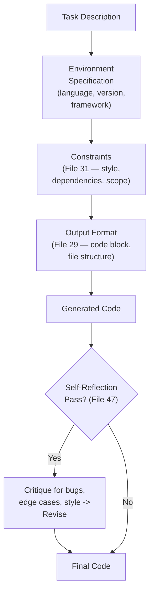
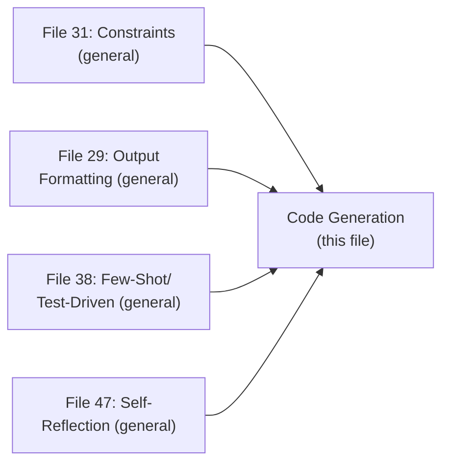

# 58 — Code Generation Prompts

> **Series:** Prompt Engineering Knowledge Library
> **File 58 of 60** | **Level:** Intermediate → Advanced
> **Prerequisites:** [`29_Output_Formatting.md`](./29_Output_Formatting.md), [`47_Self_Reflection.md`](./47_Self_Reflection.md), [`31_Constraints.md`](./31_Constraints.md)
> **Next:** [`59_Debugging_Prompts.md`](./59_Debugging_Prompts.md)

---

## Table of Contents

1. [Definition](#definition)
2. [Why It Matters](#why-it-matters)
3. [Core Concepts](#core-concepts)
4. [How It Works](#how-it-works)
5. [Internal Mechanism](#internal-mechanism)
6. [Types of Code Generation Prompting Needs](#types-of-code-generation-prompting-needs)
7. [Syntax / Structure](#syntax--structure)
8. [Examples (Simple → Advanced)](#examples-simple--advanced)
9. [Best Practices](#best-practices)
10. [Common Mistakes](#common-mistakes)
11. [Real-World Applications](#real-world-applications)
12. [Comparison with Related Concepts](#comparison-with-related-concepts)
13. [Advantages & Limitations](#advantages--limitations)
14. [FAQs](#faqs)
15. [Summary](#summary)
16. [Cheat Sheet](#cheat-sheet)
17. [Glossary](#glossary)
18. [References](#references)
19. [Visual Diagram Gallery](#visual-diagram-gallery)

---

## Definition

**Code Generation Prompts** apply this library's general prompting techniques specifically to the domain of producing source code — with the domain-specific concerns that make code generation distinct from other output types: exact syntactic correctness, language/framework/version specificity, and testable correctness criteria beyond mere plausibility. This file is deliberately narrower in scope than the general technique files it draws from — it does not re-derive output formatting, constraint-setting, or self-reflection from scratch, but shows how those already-covered general techniques apply with particular force and specific considerations in this one domain.

> The defining domain-specific challenge: code has an unusually unforgiving correctness bar compared to most other prompt outputs — a single misplaced character, an incompatible API version, or a subtly wrong logical condition can mean the difference between working and non-working code, in a way that a slightly awkward sentence in prose generally does not.

---

## Why It Matters

- **Code's binary correctness property changes which general techniques matter most.** Prose can be "mostly right" and still useful; code that's 95% correct syntactically is often 0% functional — this sharpens the value of techniques like explicit constraint-setting ([File 31](./31_Constraints.md)) and self-reflection ([File 47](./47_Self_Reflection.md)) specifically for this domain.
- **Version and environment specificity matters more here than in most other domains** — a model's frozen training knowledge ([File 4](./04_How_LLMs_Interpret_Prompts.md)) may not reflect the exact library version, API surface, or language feature set a specific project actually uses, making explicit environment specification a distinctly high-value practice for code.
- **Code generation is one of the most common, high-value practical applications** of the techniques covered throughout this entire library, making this domain-specific treatment directly useful for a very large share of real-world prompting work.
- **It sets up [File 59 — Debugging Prompts](./59_Debugging_Prompts.md)'s closely related but distinct focus** — this file covers generating new code well; the next covers diagnosing and fixing existing code that isn't working.

---

## Core Concepts

| Concept | Definition |
|---|---|
| **Environment Specification** | Explicitly stating the language, version, framework, and relevant constraints for generated code |
| **Syntactic Correctness** | Whether generated code is free of syntax errors and would actually parse/compile |
| **Functional Correctness** | Whether generated code actually behaves as intended when executed |
| **Style Convention** | The specific coding style, naming, and formatting conventions to follow |
| **Test-Driven Specification** | Providing expected input/output examples or test cases to precisely define correct behavior |
| **Dependency Constraint** | Explicit limits on what external libraries or APIs generated code may use |

---

## How It Works



This diagram shows code generation as a direct application of several already-established general techniques — environment specification and constraints are simply [File 31](./31_Constraints.md)'s general concept made concrete for this domain; the self-reflection pass directly applies [File 47](./47_Self_Reflection.md)'s critique-and-revise mechanism, particularly valuable here given code's unforgiving correctness bar.

---

## Internal Mechanism

### Why environment specification matters disproportionately for code, compared to most other domains

As established in [File 4 — How LLMs Interpret Prompts](./04_How_LLMs_Interpret_Prompts.md), a model's knowledge is frozen at its training cutoff, and its learned patterns reflect a mix of API versions, language features, and library conventions present across its training data — which may not precisely match a specific project's actual, current environment. For most prose-generation tasks, this mismatch risk is low (general writing conventions change slowly). For code, it's a genuine, common, and specifically consequential risk: a model might generate syntactically valid code using a deprecated API, an outdated language feature, or a library version incompatible with the actual target environment — code that looks entirely plausible but fails specifically because of this version mismatch. This is precisely why explicit environment specification (language version, framework version, relevant constraints) is a disproportionately high-value practice in this domain specifically, directly extending [File 9 — Prompt Design Principles](./09_Prompt_Design_Principles.md)'s context-sufficiency principle to code's unusually version-sensitive correctness bar.

### Why self-reflection is particularly valuable for code, given its binary correctness property

Recall [File 47 — Self-Reflection](./47_Self_Reflection.md)'s core mechanism: a complete artifact, evaluated holistically, can surface issues that weren't visible during its own incremental, token-by-token generation. This holistic-view advantage is particularly valuable for code specifically because of its unforgiving correctness property discussed above — a critique pass can check for a wide range of code-specific concerns (edge cases, off-by-one errors, unused variables, missing error handling) that are individually easy to introduce during generation but often become visible once the complete function or module is available for review as a whole. This is precisely why explicitly requesting a self-review pass ("review the code above for bugs, edge cases, and style issues, then provide a revised version") is a particularly high-value application of [File 47](./47_Self_Reflection.md)'s general technique specifically within this domain.

---

## Types of Code Generation Prompting Needs

| Type | Description | Relevant General Technique |
|---|---|---|
| **New Function/Module Generation** | Writing new code from a functional description | Constraints (File 31), Output Formatting (File 29) |
| **Test-Driven Generation** | Generating code to satisfy specific provided test cases | Few-Shot examples (File 38), as input/output pairs defining correctness |
| **Refactoring** | Rewriting existing code for clarity, performance, or style, preserving behavior | Constraints specifying what must NOT change |
| **Boilerplate/Scaffolding Generation** | Producing standard, conventional code structure (project setup, common patterns) | Templates (File 18), for genuinely repeated structural needs |
| **Code Explanation Alongside Generation** | Generating code with accompanying explanatory comments or documentation | Output Formatting (File 29), specifying both code and explanation sections |

---

## Syntax / Structure

```text
[Environment specification + constraints + output format, 
applying general techniques to this domain]

Write a Python function (Python 3.11+, using type hints) that 
validates an email address format.

Constraints:
- Use only the standard library (no external dependencies)
- Function signature: def validate_email(email: str) -> bool
- Handle None and empty string input gracefully (return False, 
  don't raise an exception)

Output format: Provide only the function code in a Python code 
block, followed by 2-3 example usages demonstrating edge cases.
```

```text
[Test-driven specification, applying File 38's few-shot 
principle to define correctness precisely]

Write a function matching this exact behavior:
validate_email("user@example.com") -> True
validate_email("not-an-email") -> False
validate_email("") -> False
validate_email(None) -> False
validate_email("user@sub.example.co.uk") -> True
```

---

## Examples (Simple → Advanced)

**Level 1 — Basic code generation with environment specification:**
```text
Write a JavaScript (ES2022+) function that debounces another 
function call.
```

**Level 2 — Adding explicit constraints:**
```text
Write a JavaScript function that debounces another function 
call. Constraints: no external libraries, must work in both 
browser and Node.js environments, use modern arrow function 
syntax.
```

**Level 3 — Test-driven specification:**
```text
Write a function matching this behavior exactly:
sum_positive([1, -2, 3, -4, 5]) -> 9  (only positive numbers summed)
sum_positive([]) -> 0
sum_positive([-1, -2]) -> 0
Language: Python 3.10+
```

**Level 4 — Full generation with self-reflection pass:**
```text
Write a Python function that parses a CSV string into a list 
of dictionaries, using the header row as keys.

[After initial generation:]
Review your code above for: edge cases (empty CSV, malformed 
rows, missing values), error handling, and whether it correctly 
handles quoted fields containing commas. Revise if needed.
```

**Level 5 — Full production-style code generation prompt combining multiple general techniques:**
```text
[Environment specification]
Language: TypeScript 5.0+, targeting Node.js 20+

[Task]
Write a function that fetches data from a REST API with retry 
logic (max 3 retries, exponential backoff).

[Constraints — File 31]
- Use native fetch (no axios or other HTTP libraries)
- Must be fully typed (no 'any' types)
- Should not retry on 4xx errors (client errors), only on 
  5xx or network failures

[Test-driven specification — File 38's principle applied]
Example expected behavior:
fetchWithRetry(url) succeeds on first try -> returns data 
  immediately, no retry
fetchWithRetry(url) fails with 500, then succeeds on 2nd try 
  -> returns data, 1 retry occurred
fetchWithRetry(url) fails with 404 -> throws immediately, 
  NO retry attempted

[Output format — File 29]
Provide the function code in a TypeScript code block, followed 
by a brief explanation of the backoff calculation.

[Self-reflection request — File 47]
After generating, review specifically: does the retry logic 
correctly distinguish 4xx from 5xx errors per the constraint 
above? Are there any TypeScript type-safety gaps? Revise if needed.
```

---

## Best Practices

1. **Always specify the language version and relevant framework/library versions explicitly** — per the Internal Mechanism section, this is disproportionately high-value for code given the version-mismatch risk from frozen training knowledge.
2. **Provide test cases or expected input/output examples when precise behavior matters** — this directly applies [File 38 — Few-Shot Prompting](./38_Few_Shot_Prompting.md)'s principle, and for code, precisely defines correctness in a way verbal description alone often cannot.
3. **Explicitly request a self-review pass for anything beyond trivial code** — per the Internal Mechanism section, this is a particularly high-value application of [File 47 — Self-Reflection](./47_Self_Reflection.md) given code's unforgiving correctness bar.
4. **State dependency constraints explicitly** ([File 31 — Constraints](./31_Constraints.md)) — whether external libraries are permitted, and if so, which ones, since generated code that assumes unavailable dependencies is a common, avoidable failure.
5. **Specify output format clearly** ([File 29 — Output Formatting](./29_Output_Formatting.md)) — code block only, code plus explanation, or code plus tests — rather than leaving this ambiguous.

---

## Common Mistakes

| Mistake | Consequence | Fix |
|---|---|---|
| No language version or environment specification | Risk of generated code using deprecated or incompatible APIs/features | Explicitly specify language, framework, and relevant versions |
| Relying purely on verbal description for precise behavioral requirements | Ambiguity in exactly what "correct" means, especially for edge cases | Provide test cases or input/output examples |
| Skipping a self-review pass for non-trivial code | Missing bugs, edge cases, or style issues a holistic review would catch | Explicitly request self-reflection for anything beyond trivial generation |
| No explicit dependency constraints | Generated code may assume libraries not actually available in the target environment | State dependency constraints explicitly |
| Ambiguous output format expectations | Inconsistent delivery — sometimes just code, sometimes with unwanted extra explanation, or vice versa | Specify output format clearly |

---

## Real-World Applications

- **AI-assisted software development tools** — code generation is one of the most widely adopted, high-value applications of LLM prompting across the software industry.
- **Automated boilerplate and scaffolding generation** — using templates ([File 18](./18_Prompt_Templates.md)) for genuinely repeated structural code patterns across projects.
- **Test-driven development workflows** — providing test cases as the specification, directly applying few-shot principles ([File 38](./38_Few_Shot_Prompting.md)) to precisely define required behavior.
- **Code review and quality improvement tools** — self-reflection-based generation ([File 47](./47_Self_Reflection.md)) directly supports producing higher-quality first-draft code before human review.

---

## Comparison with Related Concepts

| Concept | Difference from "Code Generation Prompts" |
|---|---|
| **Debugging Prompts (File 59)** | This file covers generating new, working code; File 59 covers diagnosing and fixing existing code that isn't working — related but distinct domain applications |
| **Self-Reflection (File 47)** | Self-reflection is the general technique; this file shows its particularly high-value, specific application to code given code's unforgiving correctness property |
| **Constraints (File 31)** | Constraints are the general concept; this file shows environment specification and dependency limits as specific, code-domain applications of that general concept |

---

## Advantages & Limitations

### ✅ Advantages of Applying These Techniques to Code Generation

- **Directly addresses code's unusually unforgiving correctness bar** through environment specification, testing, and self-reflection.
- **Leverages already-established general techniques** rather than requiring code-specific prompting knowledge learned from scratch.
- **Test-driven specification provides genuinely precise correctness definition**, often more reliable than verbal description alone for this domain.

### ⚠️ Limitations

- **Even well-prompted code generation doesn't guarantee correctness** — like all prompt-level techniques, this remains a strong but probabilistic influence; actual testing and execution of generated code remains essential, not optional.
- **Environment specification can't fully compensate for a model's training-time knowledge gaps** regarding genuinely very recent language features or library versions released after training.
- **Self-reflection carries the same self-critique blind spot risk** discussed in [File 47](./47_Self_Reflection.md) — it improves but doesn't guarantee catching every possible bug, particularly ones rooted in genuine knowledge gaps.

---

## FAQs

**Q: Is environment specification really necessary if I'm just asking for a "simple" function?**
A: Yes, generally — even simple code can use version-specific syntax or deprecated patterns without explicit version guidance; the disproportionate value of this practice (per the Internal Mechanism section) applies regardless of task simplicity.

**Q: Should I always ask for a self-review pass?**
A: For anything beyond genuinely trivial code, yes — the cost is modest and the value, given code's binary correctness property, is typically well justified; for very simple, easily-verified snippets, it may be less necessary.

**Q: How is test-driven specification different from just describing what the function should do?**
A: Test cases (specific input/output pairs) precisely and unambiguously define correct behavior, including edge cases, in a way that verbal description alone often leaves ambiguous — directly applying [File 38](./38_Few_Shot_Prompting.md)'s principle that demonstration often outperforms description for precisely specifying a pattern.

**Q: Does good prompting eliminate the need to actually test generated code?**
A: No — per Limitations, prompt-level techniques improve the likelihood of correct code but don't guarantee it; actually running and testing generated code remains an essential, separate verification step, not something prompting alone can replace.

---

## Summary

Code Generation Prompts apply this library's general techniques — constraints, output formatting, few-shot/test-driven specification, and self-reflection — to the specific domain of producing source code, sharpened by code's unusually unforgiving correctness bar and its distinct sensitivity to environment and version specificity given a model's frozen training knowledge. Explicit environment specification and self-reflection passes are disproportionately high-value practices in this specific domain, directly extending general principles from [File 9](./09_Prompt_Design_Principles.md) and [File 47](./47_Self_Reflection.md) to code's particular correctness demands, while test-driven specification (providing input/output examples) often defines required behavior more precisely than verbal description alone can achieve. Having covered generating new code well, the library turns to the closely related but distinct concern of diagnosing and fixing existing code that isn't working: [File 59 — Debugging Prompts](./59_Debugging_Prompts.md).

---

## Cheat Sheet

```text
CODE GENERATION PROMPTS — QUICK REFERENCE

DISPROPORTIONATELY HIGH-VALUE FOR THIS DOMAIN
[ ] Explicit language/framework VERSION specification
[ ] Test cases / input-output examples for precise behavior
[ ] Self-reflection pass (bugs, edge cases, style)
[ ] Explicit dependency constraints (what libraries ARE/
    AREN'T allowed)
[ ] Clear output format (code only? code + explanation?)

WHY: Code's BINARY correctness property (mostly-right code is 
often 0% functional) sharpens the value of these general 
techniques compared to most prose-generation tasks.

REMEMBER: Good prompting improves likelihood of correct code — 
it does NOT replace actually testing/running the result.
```

---

## Glossary

| Term | Definition |
|---|---|
| **Environment Specification** | Explicitly stating language, version, and framework for generated code |
| **Syntactic Correctness** | Whether code is free of syntax errors |
| **Functional Correctness** | Whether code actually behaves as intended when executed |
| **Style Convention** | Specific coding style and formatting conventions to follow |
| **Test-Driven Specification** | Defining correctness via input/output examples |
| **Dependency Constraint** | Explicit limits on external libraries/APIs used |

---

## References

- Chen, M. et al. (2021) — *Evaluating Large Language Models Trained on Code*, arXiv:2107.03374
- Anthropic — [Claude for Coding](https://docs.claude.com/en/docs/build-with-claude/prompt-engineering/overview)
- Austin, J. et al. (2021) — *Program Synthesis with Large Language Models*, arXiv:2108.07732
- Madaan, A. et al. (2023) — *Self-Refine: Iterative Refinement with Self-Feedback*, arXiv:2303.17651 (self-review applied to code)

---

## Visual Diagram Gallery

**Diagram 1 — General Techniques Applied to the Code Domain**


**Diagram 2 — Why Code's Correctness Bar Is Unusually Binary**
```text
PROSE:  "Mostly right" sentence -> still USEFUL, readable
CODE:   "Mostly right" function -> often 0% FUNCTIONAL
        (one wrong character, wrong API version, off-by-one 
         error = broken, not "mostly working")
```

**Diagram 3 — Test-Driven Specification vs. Verbal Description**
```text
VERBAL: "sum only the positive numbers"
        -> ambiguous on: empty list? all-negative list? 
           what about zero?

TEST-DRIVEN: sum_positive([1,-2,3]) -> 4
             sum_positive([]) -> 0
             sum_positive([-1,-2]) -> 0
             -> PRECISELY defines behavior, including edge cases
```

---

**⬅️ Previous:** [`57_RAG_Prompting.md`](./57_RAG_Prompting.md)
**➡️ Next:** [`59_Debugging_Prompts.md`](./59_Debugging_Prompts.md) — Diagnosing and fixing existing code that isn't working.
