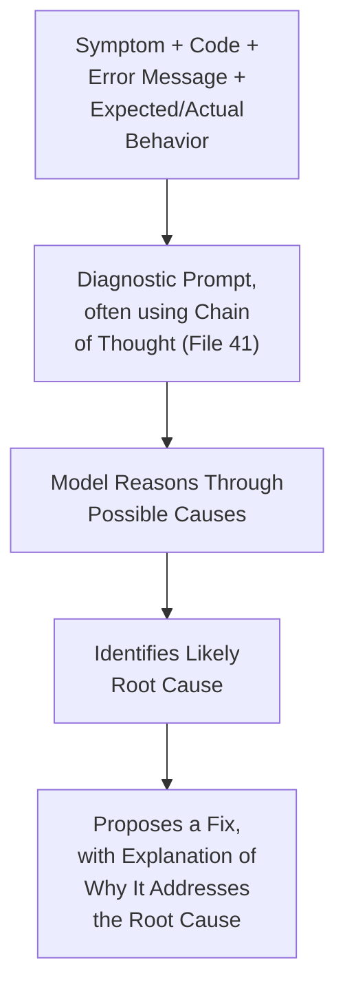
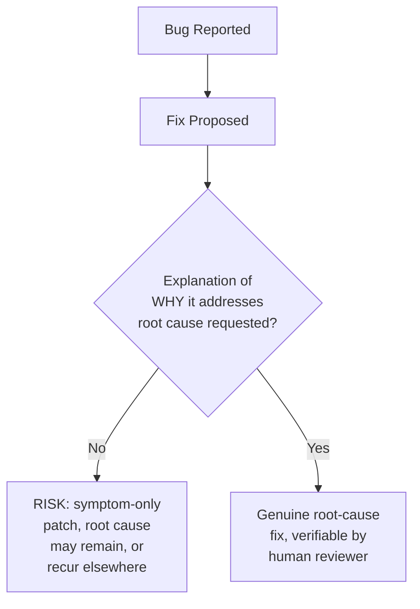

# 59 — Debugging Prompts

> **Series:** Prompt Engineering Knowledge Library
> **File 59 of 60** | **Level:** Intermediate → Advanced
> **Prerequisites:** [`58_Code_Generation_Prompts.md`](./58_Code_Generation_Prompts.md), [`13_Prompt_Debugging.md`](./13_Prompt_Debugging.md)
> **Next:** [`60_SQL_Prompts.md`](./60_SQL_Prompts.md)

---

## Table of Contents

1. [Definition](#definition)
2. [Why It Matters](#why-it-matters)
3. [Core Concepts](#core-concepts)
4. [How It Works](#how-it-works)
5. [Internal Mechanism](#internal-mechanism)
6. [Types of Debugging Prompts](#types-of-debugging-prompts)
7. [Syntax / Structure](#syntax--structure)
8. [Examples (Simple → Advanced)](#examples-simple--advanced)
9. [Best Practices](#best-practices)
10. [Common Mistakes](#common-mistakes)
11. [Real-World Applications](#real-world-applications)
12. [Comparison with Related Concepts](#comparison-with-related-concepts)
13. [Advantages & Limitations](#advantages--limitations)
14. [FAQs](#faqs)
15. [Summary](#summary)
16. [Cheat Sheet](#cheat-sheet)
17. [Glossary](#glossary)
18. [References](#references)
19. [Visual Diagram Gallery](#visual-diagram-gallery)

---

## Definition

**Debugging Prompts** are prompts specifically designed to help diagnose and fix broken or misbehaving *code*, applying this library's general reasoning and reliability techniques to that specific diagnostic task. This must be carefully distinguished from [File 13 — Prompt Debugging](./13_Prompt_Debugging.md), which covers the methodology for debugging *prompts themselves* when a prompt is misbehaving — a genuinely different subject undergoing debugging. This file is the domain-specific application: using a model, via prompts, as a diagnostic aid for someone else's (or the model's own previously-generated) broken code.

> Critical disambiguation: **[File 13](./13_Prompt_Debugging.md)'s subject being debugged is a *prompt*. This file's subject being debugged is *code*.** The two share methodological similarities (reproduce, isolate, hypothesize, fix, verify) precisely because both apply general debugging discipline to their respective subjects — but they are debugging genuinely different things.

---

## Why It Matters

- **Debugging is one of the most common, practical applications of LLM assistance in software development**, alongside code generation ([File 58](./58_Code_Generation_Prompts.md)) — understanding how to prompt effectively for this specific task has broad practical value.
- **Effective debugging prompts benefit substantially from providing complete, specific context** — error messages, relevant code, and expected versus actual behavior — directly connecting to [File 9 — Prompt Design Principles](./09_Prompt_Design_Principles.md)'s context-sufficiency principle, applied with particular force to this diagnostic task.
- **[File 41 — Chain of Thought](./41_Chain_of_Thought.md)'s reasoning-elicitation benefit applies with particular strength to debugging** — diagnosing a bug is inherently a multi-step reasoning process (understand the symptom, form hypotheses, trace through logic, identify the root cause), making this domain a natural fit for the reasoning techniques covered earlier in this library.
- **It sets up an important contrast with [File 13](./13_Prompt_Debugging.md)** — understanding both together clarifies that "debugging" as a general discipline applies at multiple levels: debugging the tool you're using (prompts) versus using that tool to debug something else (code).

---

## Core Concepts

| Concept | Definition |
|---|---|
| **Symptom Description** | The observed, incorrect behavior being reported for diagnosis |
| **Minimal Reproducible Context** | The smallest amount of code and context needed to demonstrate the bug |
| **Expected vs. Actual Behavior** | The explicit statement of what should happen versus what actually happens |
| **Error Message Inclusion** | Providing the exact error output, not a paraphrase of it |
| **Hypothesis-Driven Diagnosis** | Structuring the diagnostic prompt to elicit explicit reasoning about possible causes |
| **Fix Verification Request** | Asking the model to explain why a proposed fix addresses the actual root cause |

---

## How It Works



This diagram directly mirrors the general debugging methodology from [File 13](./13_Prompt_Debugging.md) — reproduce (provide the symptom and context), hypothesize (reasoning about causes), fix, and — critically — explain why the fix addresses the actual root cause rather than merely making the specific symptom disappear.

---

## Internal Mechanism

### Why complete, specific diagnostic context dramatically outperforms a vague bug description

As established in [File 9 — Prompt Design Principles](./09_Prompt_Design_Principles.md), context-sufficiency directly determines whether a model has what it genuinely needs to perform a task well — and debugging is a task where this principle applies with particular, sharp force. A vague description ("my code isn't working") provides almost no information for the model to reason from; it must essentially guess at what "not working" means, what the code likely looks like, and what environment it's running in. Providing the actual code, the exact error message (not a paraphrase, since paraphrasing risks losing precisely the specific detail that would reveal the actual cause), and an explicit statement of expected versus actual behavior gives the model genuine, specific evidence to reason from — directly mirroring [File 13](./13_Prompt_Debugging.md)'s emphasis on reliably reproducing a symptom before attempting to diagnose it, applied here to what information the diagnostic prompt itself should contain.

### Why explicitly requesting root-cause explanation, not just a fix, guards against symptom-only patches

A model asked simply "fix this bug" may, in some cases, propose a change that happens to make the specific reported symptom disappear without actually addressing the underlying, genuine root cause — analogous to [File 13](./13_Prompt_Debugging.md)'s caution against declaring a bug "fixed" based on one successful re-run without understanding *why* it was actually broken. Explicitly requesting an explanation of *why* a proposed fix addresses the root cause — not just presenting the fix itself — surfaces the model's actual diagnostic reasoning, which serves two practical purposes: it helps a human reviewer verify the fix is genuinely well-founded rather than a coincidental patch, and it directly applies the same "understand the actual cause, don't just make the symptom go away" discipline [File 13](./13_Prompt_Debugging.md) establishes for debugging prompts, now applied to debugging code.

---

## Types of Debugging Prompts

| Type | Description | Best Suited For |
|---|---|---|
| **Error-Message-Driven Debugging** | Providing a specific error/exception message alongside the relevant code | Crashes, exceptions, and clear error conditions |
| **Behavioral Mismatch Debugging** | Describing expected versus actual output for code that runs without crashing but produces wrong results | Logic errors, incorrect calculations |
| **Explain-Then-Fix Debugging** | Asking the model to first explain what the code currently does, before diagnosing why it's wrong | Complex code where understanding current behavior itself needs verification |
| **Regression Debugging** | Providing both working (prior) and broken (current) code versions, asking what changed | Cases where something recently broke after a prior change |

---

## Syntax / Structure

```text
[Complete diagnostic context, per Internal Mechanism]

Language/Environment: Python 3.11

Code:
{{relevant_code_snippet}}

Error message (exact):
{{exact_error_text}}

Expected behavior: {{what_should_happen}}
Actual behavior: {{what_actually_happens}}

Please diagnose the root cause, thinking through the logic 
step by step, then propose a fix and explain why it addresses 
the actual cause (not just the symptom).
```

```text
[Explain-then-fix variant, for complex code]
Here's a function that's producing incorrect results: 
{{code}}

First, explain what this code currently does, step by step. 
Then identify where that logic diverges from the intended 
behavior: {{expected_behavior_description}}. Finally, propose 
a fix.
```

---

## Examples (Simple → Advanced)

**Level 1 — Basic error-message-driven debugging:**
```text
This Python code throws an error:
{{code}}

Error: "TypeError: unsupported operand type(s) for +: 'int' 
and 'str'"

What's causing this and how do I fix it?
```

**Level 2 — Behavioral mismatch with explicit expected/actual:**
```text
This function should return the average of a list, but it's 
returning wrong results:
{{code}}

Expected: average([2, 4, 6]) should return 4
Actual: it returns 12

Diagnose the issue.
```

**Level 3 — Chain-of-thought-structured diagnostic request:**
```text
{{code}}
Error: {{error_message}}

Think through this step by step: (1) what is this code trying 
to do at the point where the error occurs, (2) what does the 
error message indicate about the actual state at that point, 
(3) what's the mismatch between intent and actual state, (4) 
what's the fix.
```

**Level 4 — Explicit root-cause verification request:**
```text
{{code}}
Bug: {{description}}

Propose a fix. Then explicitly explain: why does this fix 
address the ACTUAL root cause, not just make this specific 
symptom go away? Would this fix also handle related edge 
cases, or might the same underlying issue manifest differently 
elsewhere in the code?
```

**Level 5 — Full regression debugging with complete context:**
```text
This code worked correctly last week. After a recent change, 
it's now producing incorrect results.

Previous (working) version:
{{old_code}}

Current (broken) version:
{{new_code}}

Expected behavior: {{expected}}
Actual behavior now: {{actual}}

Diagnose specifically: what changed between these two 
versions, and how does that specific change explain the new, 
incorrect behavior? Propose a fix that preserves the intent 
of the recent change while correcting the introduced bug — 
don't simply revert to the old version if the new version's 
intent was valid.
```

---

## Best Practices

1. **Provide the exact error message, not a paraphrase** — per the Internal Mechanism section, paraphrasing risks losing precisely the specific detail that would reveal the actual cause.
2. **Explicitly state expected versus actual behavior**, not just "it's not working" — this directly applies [File 9](./09_Prompt_Design_Principles.md)'s context-sufficiency principle with particular force to this diagnostic task.
3. **Request explicit reasoning through the diagnostic process** ([File 41 — Chain of Thought](./41_Chain_of_Thought.md)), since debugging is inherently a multi-step reasoning task well suited to this technique.
4. **Ask for explanation of why a fix addresses the root cause**, not just the fix itself — this guards against symptom-only patches and supports human verification of the proposed fix's soundness.
5. **Include relevant surrounding context** (recent changes, environment details, related code) without including irrelevant excess — balancing [File 9](./09_Prompt_Design_Principles.md)'s conciseness/context-sufficiency tension specifically for this task.

---

## Common Mistakes

| Mistake | Consequence | Fix |
|---|---|---|
| Vague bug descriptions ("it's not working") | Model has almost no specific information to reason from | Provide complete, specific diagnostic context |
| Paraphrasing rather than quoting the exact error message | Risk of losing the specific detail that would reveal the actual cause | Always include the exact, verbatim error text |
| Asking only for a fix, not an explanation of the root cause | Risk of accepting a symptom-only patch rather than a genuine fix | Explicitly request root-cause explanation alongside any proposed fix |
| No expected-versus-actual behavior statement for non-crashing bugs | Ambiguity about what "wrong" actually means for logic errors | Explicitly state both expected and actual behavior |
| Omitting relevant recent changes for regression bugs | Missing the specific context that would most directly explain a recent break | Provide before/after code versions explicitly for regression debugging |

---

## Real-World Applications

- **AI-assisted software development and debugging tools** — one of the most common, high-value practical applications across the software industry, alongside code generation.
- **Automated error-triage and diagnosis systems** — using error-message-driven debugging prompts as a first-pass diagnostic step before human developer review.
- **Code review assistance** — behavioral mismatch and explain-then-fix debugging prompts support catching logic errors during review, not just crash-level bugs.
- **Incident response and regression analysis** — regression debugging prompts directly support the common, practical need to diagnose what a recent change broke.

---

## Comparison with Related Concepts

| Concept | Difference from "Debugging Prompts" |
|---|---|
| **Prompt Debugging (File 13)** | The critical distinction this file establishes: File 13 debugs *prompts themselves*; this file uses prompts to debug *code* — genuinely different subjects, sharing methodological similarity (reproduce, hypothesize, fix, verify) because both apply general debugging discipline to their respective subjects |
| **Code Generation Prompts (File 58)** | Code generation produces new, working code from a specification; debugging prompts diagnose and fix existing code that isn't working — related but distinct domain applications |
| **Chain of Thought (File 41)** | CoT is the general reasoning-elicitation technique; this file shows its particularly strong, natural fit for the inherently multi-step reasoning process debugging requires |

---

## Advantages & Limitations

### ✅ Advantages of Well-Designed Debugging Prompts

- **Directly leverages complete, specific context to produce dramatically better diagnostic reasoning** than vague bug descriptions.
- **Chain-of-thought structuring is a particularly natural, strong fit** for this domain's inherently multi-step reasoning nature.
- **Root-cause explanation requests guard against symptom-only patches**, supporting genuinely sound fixes rather than coincidental ones.

### ⚠️ Limitations

- **Diagnostic accuracy remains bounded by the completeness of provided context** — even excellent prompting technique can't compensate for missing, critical diagnostic information the model was never given.
- **Like all prompt-level techniques, a proposed diagnosis and fix are strong but probabilistic suggestions**, not guaranteed correct — actually testing a proposed fix remains an essential, separate verification step.
- **Complex, deeply architectural bugs may exceed what even well-structured single-prompt diagnosis can reliably identify**, potentially requiring the more extended, tool-augmented investigation covered in [File 48 — ReAct Prompting](./48_ReAct_Prompting.md) or [File 53 — Agentic Prompting](./53_Agentic_Prompting.md) for genuinely complex cases.

---

## FAQs

**Q: Is "debugging prompts" the same thing as "prompt debugging" (File 13)?**
A: No — this is precisely the critical distinction this file establishes: File 13 is about debugging prompts *themselves* when a prompt is misbehaving; this file is about using prompts to help debug *code*, a genuinely different subject undergoing the debugging process.

**Q: Why does providing the exact error message matter so much?**
A: Per the Internal Mechanism section, error messages often contain precise, specific details (exact line numbers, specific type names, specific values) that a paraphrase would lose — and that specific detail is frequently exactly what reveals the actual root cause.

**Q: Should I always ask for an explanation of why a fix works, not just the fix itself?**
A: For anything beyond a trivial, obviously-correct fix, yes — per Best Practices, this guards against accepting a fix that happens to resolve the specific symptom without addressing the genuine underlying cause.

**Q: What if a single debugging prompt doesn't successfully diagnose the issue?**
A: For genuinely complex or architectural bugs, consider a more extended, multi-step investigative approach — [ReAct Prompting](./48_ReAct_Prompting.md)'s reasoning-and-acting cycle (e.g., actually running diagnostic code, checking intermediate values) can provide a more thorough investigation than a single, static diagnostic prompt.

---

## Summary

Debugging Prompts apply this library's general reasoning and diagnostic techniques specifically to diagnosing and fixing broken code, carefully distinguished from [File 13 — Prompt Debugging](./13_Prompt_Debugging.md)'s focus on debugging prompts themselves — the two share methodological similarity precisely because both apply general debugging discipline to their respective, genuinely different subjects. Complete, specific diagnostic context — exact error messages, explicit expected-versus-actual behavior statements, and relevant surrounding code — dramatically outperforms vague bug descriptions, and Chain of Thought's reasoning-elicitation benefit applies with particular natural strength given debugging's inherently multi-step reasoning nature, while explicitly requesting root-cause explanation alongside any proposed fix guards against accepting symptom-only patches. Having covered both generating and debugging code, the library concludes its domain-specific application coverage with a narrower, structured-query-language-specific case: [File 60 — SQL Prompts](./60_SQL_Prompts.md).

---

## Cheat Sheet

```text
DEBUGGING PROMPTS — QUICK REFERENCE

CRITICAL DISAMBIGUATION
File 13 (Prompt Debugging)  = debugging PROMPTS themselves
File 59 (this file)         = using prompts to debug CODE

ESSENTIAL DIAGNOSTIC CONTEXT
[ ] EXACT error message (never paraphrased)
[ ] Explicit expected VS actual behavior
[ ] Relevant code (complete enough to reason from)
[ ] Recent changes, for regression bugs specifically

BEST PRACTICE: Request explicit reasoning (Chain of Thought, 
File 41) AND explicit root-cause explanation for any proposed 
fix — not just the fix alone.
```

---

## Glossary

| Term | Definition |
|---|---|
| **Symptom Description** | The observed, incorrect behavior being reported |
| **Minimal Reproducible Context** | The smallest code/context needed to demonstrate a bug |
| **Expected vs. Actual Behavior** | Explicit statement of what should versus does happen |
| **Error Message Inclusion** | Providing the exact, verbatim error output |
| **Hypothesis-Driven Diagnosis** | Structuring a prompt to elicit explicit reasoning about causes |
| **Fix Verification Request** | Asking why a proposed fix addresses the actual root cause |

---

## References

- Zeller, A. (2009) — *Why Programs Fail: A Guide to Systematic Debugging* (general methodology background)
- Wei, J. et al. (2022) — *Chain-of-Thought Prompting Elicits Reasoning in Large Language Models*, arXiv:2201.11903
- Anthropic — [Claude for Coding and Debugging](https://docs.claude.com/en/docs/build-with-claude/prompt-engineering/overview)
- Chen, M. et al. (2021) — *Evaluating Large Language Models Trained on Code*, arXiv:2107.03374

---

## Visual Diagram Gallery

**Diagram 1 — The Critical Disambiguation**
```text
FILE 13: Prompt Debugging          FILE 59: Debugging Prompts
Subject being debugged: A PROMPT    Subject being debugged: CODE
                                    (using a prompt AS THE TOOL)
Both share method: reproduce -> hypothesize -> fix -> verify
(applied to genuinely DIFFERENT subjects)
```

**Diagram 2 — Diagnostic Context Completeness**
```text
VAGUE ("it's not working"):
-> Model has almost NOTHING specific to reason from

COMPLETE (exact error + expected/actual + relevant code):
-> Model has genuine, specific EVIDENCE to reason from
   -> dramatically better diagnostic accuracy
```

**Diagram 3 — Why Root-Cause Explanation Requests Matter**


---

**⬅️ Previous:** [`58_Code_Generation_Prompts.md`](./58_Code_Generation_Prompts.md)
**➡️ Next:** [`60_SQL_Prompts.md`](./60_SQL_Prompts.md) — The final domain-specific application: structured query language generation.
