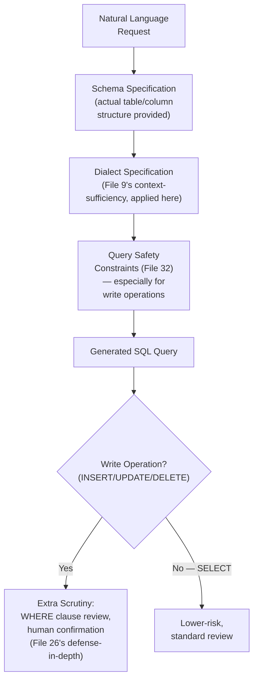
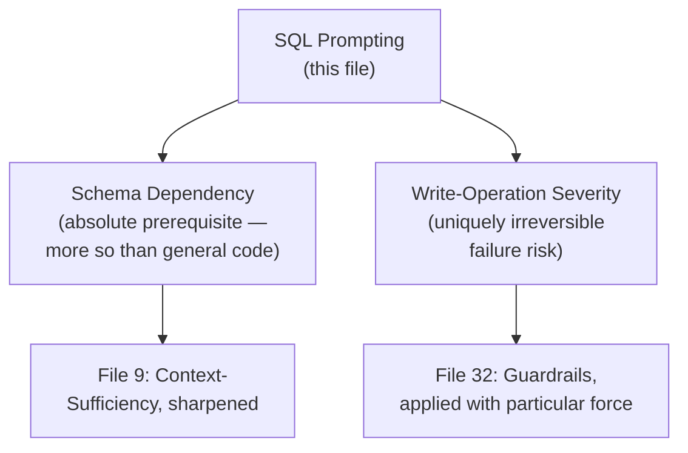
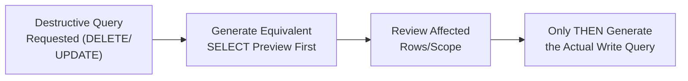

# 60 — SQL Prompts

> **Series:** Prompt Engineering Knowledge Library
> **File 60 of 60 (Final File)** | **Level:** Intermediate → Advanced
> **Prerequisites:** [`59_Debugging_Prompts.md`](./59_Debugging_Prompts.md), [`29_Output_Formatting.md`](./29_Output_Formatting.md), [`32_Guardrails.md`](./32_Guardrails.md)
> **Next:** None — this is the final file in the series. See the [Series Conclusion](#series-conclusion) below.

---

## Table of Contents

1. [Definition](#definition)
2. [Why It Matters](#why-it-matters)
3. [Core Concepts](#core-concepts)
4. [How It Works](#how-it-works)
5. [Internal Mechanism](#internal-mechanism)
6. [Types of SQL Prompting Needs](#types-of-sql-prompting-needs)
7. [Syntax / Structure](#syntax--structure)
8. [Examples (Simple → Advanced)](#examples-simple--advanced)
9. [Best Practices](#best-practices)
10. [Common Mistakes](#common-mistakes)
11. [Real-World Applications](#real-world-applications)
12. [Comparison with Related Concepts](#comparison-with-related-concepts)
13. [Advantages & Limitations](#advantages--limitations)
14. [FAQs](#faqs)
15. [Summary](#summary)
16. [Cheat Sheet](#cheat-sheet)
17. [Glossary](#glossary)
18. [References](#references)
19. [Visual Diagram Gallery](#visual-diagram-gallery)
20. [Series Conclusion](#series-conclusion)

---

## Definition

**SQL Prompts** apply this library's general prompting techniques to the specific task of generating, explaining, or debugging SQL queries — a domain narrower than general code generation ([File 58](./58_Code_Generation_Prompts.md)) but with its own genuinely distinct concerns: exact schema dependency (a query is only correct relative to a *specific* database structure), a uniquely severe safety dimension (a wrong SQL query can delete or corrupt real data, not merely fail to run), and natural-language-to-structured-query translation as a core, recurring use case in its own right.

> The defining domain-specific tension SQL prompting must navigate: SQL queries are simultaneously **schema-dependent** (meaningless without knowing the actual table structure) and **consequential** (a `DELETE` or `UPDATE` without a proper `WHERE` clause can cause real, sometimes irreversible damage) — a combination of precision-dependency and destructive potential that few other code-generation domains share to the same degree.

---

## Why It Matters

- **Schema dependency makes context provision even more critical here than in general code generation** — a syntactically perfect SQL query is still completely useless, or actively wrong, if it references table or column names that don't match the actual database.
- **The consequences of a wrong query can be uniquely severe and sometimes irreversible** — unlike most generated code, which typically just fails to run when wrong, a wrong SQL `UPDATE` or `DELETE` statement can silently corrupt or destroy real production data, directly connecting this domain to [File 32 — Guardrails](./32_Guardrails.md)'s safety-specific constraint category with particular force.
- **Natural-language-to-SQL translation is one of the most common, high-value practical applications of prompting overall** — enabling non-SQL-expert users to query databases directly, a widely deployed real-world use case.
- **As this library's final file, SQL prompting serves as a fitting capstone**: it draws together output formatting ([File 29](./29_Output_Formatting.md)), context-sufficiency ([File 9](./09_Prompt_Design_Principles.md)), guardrails ([File 32](./32_Guardrails.md)), and code-domain debugging ([File 59](./59_Debugging_Prompts.md)) into one final, concrete, widely-applicable domain — demonstrating how the library's general techniques compose in practice.

---

## Core Concepts

| Concept | Definition |
|---|---|
| **Schema Specification** | Explicitly providing the actual table structure, column names, and types a query must be correct against |
| **Read vs. Write Query Distinction** | Distinguishing safe, non-destructive `SELECT` queries from potentially destructive `INSERT`/`UPDATE`/`DELETE` operations |
| **Query Safety Constraint** | Explicit guardrails specifically preventing or requiring extra caution around destructive operations |
| **Natural-Language-to-SQL Translation** | Converting a plain-language question into a correct, executable SQL query |
| **Dialect Specification** | Identifying which specific SQL dialect (PostgreSQL, MySQL, SQLite, etc.) the query must be compatible with |
| **Query Explanation** | Describing what an existing SQL query actually does, in plain language |

---

## How It Works



This pipeline directly demonstrates the library's general techniques applied in composition — schema provision is context-sufficiency ([File 9](./09_Prompt_Design_Principles.md)) made concrete; safety constraints for destructive operations are guardrails ([File 32](./32_Guardrails.md)) made concrete; and the write-operation confirmation step directly applies [File 26](./26_Context_Injection.md)'s defense-in-depth principle to this domain's specific, real risk.

---

## Internal Mechanism

### Why schema specification is even more critical here than in general code generation

As established in [File 58 — Code Generation Prompts](./58_Code_Generation_Prompts.md), environment specification matters disproportionately for code generally, but SQL sharpens this further: a general-purpose function can often be written correctly based on a description of its intended *behavior* alone, with the specific data types being relatively flexible. A SQL query, by contrast, is meaningless without knowing the *exact* actual table and column names it must reference — there's no equivalent of "reasonable default" table structure a model can assume, since the correct query depends entirely on a specific, particular database's actual schema, which the model cannot know from its frozen training knowledge ([File 4](./04_How_LLMs_Interpret_Prompts.md)) unless explicitly provided. This makes schema specification not merely a best practice but a strict, non-negotiable prerequisite for correct SQL generation in a way that's genuinely more absolute than most other code-generation contexts.

### Why write operations warrant categorically more caution than read operations, mechanistically and practically

A `SELECT` query, even if subtly wrong, typically fails safely — it returns incorrect or empty results, which a human can notice and correct without permanent consequence. A `DELETE` or `UPDATE` query without a properly scoped `WHERE` clause, by contrast, can execute against far more rows than intended, and — critically — this kind of error often cannot be undone once executed against a real production database, unlike most other code-generation mistakes which simply fail to run or produce an obviously wrong, easily-corrected result. This categorical difference in failure consequence is precisely why [File 32 — Guardrails](./32_Guardrails.md)'s elevated-stakes constraint treatment applies with particular, sharp force to SQL write operations specifically — the "does failure risk genuine harm" test that defines a guardrail is very clearly met by an unconstrained, unreviewed destructive SQL operation in a way it usually is not for a typical function-generation mistake.

---

## Types of SQL Prompting Needs

| Type | Description | Best Suited For |
|---|---|---|
| **Natural-Language-to-SQL Translation** | Converting a plain-language question into a correct query | Enabling non-SQL-expert users to query data directly |
| **Query Explanation** | Describing what an existing, possibly unfamiliar query does | Code review, onboarding, understanding legacy queries |
| **Query Optimization** | Improving an existing, working query's performance | Addressing slow-running queries against large datasets |
| **Query Debugging** | Diagnosing why a query produces incorrect or unexpected results | Applying [File 59 — Debugging Prompts](./59_Debugging_Prompts.md)'s general approach to this specific domain |
| **Schema-Aware Multi-Table Query Generation** | Generating queries involving joins across multiple related tables | Complex reporting or analysis needs spanning several tables |

---

## Syntax / Structure

```text
[Full schema specification + dialect + safety framing]

Database: PostgreSQL 15

Schema:
customers (id INT PRIMARY KEY, name TEXT, email TEXT, 
           signup_date DATE)
orders (id INT PRIMARY KEY, customer_id INT REFERENCES 
        customers(id), total DECIMAL, order_date DATE)

Write a query that finds all customers who signed up in the 
last 30 days and have placed at least one order.

[Safety framing, applied by default per File 32's principle]
This is a read-only SELECT request. If you interpret this 
request as requiring any data modification (INSERT/UPDATE/
DELETE), stop and flag this explicitly rather than generating 
a write query.
```

```text
[Explicit write-operation caution, per Internal Mechanism]

Schema: {{schema}}

Write a query to remove all orders older than 2 years.

CAUTION: This is a DELETE operation. Include a precise WHERE 
clause. Before finalizing, explicitly state: how many rows do 
you estimate this would affect, and is there a way to preview 
the affected rows (e.g., via a SELECT with the same WHERE 
clause) before actually running the DELETE?
```

---

## Examples (Simple → Advanced)

**Level 1 — Basic natural-language-to-SQL with schema:**
```text
Schema: employees (id, name, department, salary)

Find all employees in the "Engineering" department earning 
more than $100,000.
```

**Level 2 — Adding dialect specification:**
```text
Database: MySQL 8.0
Schema: {{schema}}

Find the average salary per department, rounded to 2 decimal 
places.
```

**Level 3 — Multi-table join query:**
```text
Schema:
students (id, name, major)
enrollments (student_id, course_id, grade)
courses (id, course_name)

Find the names of all students enrolled in "Introduction to 
Statistics" along with their grade.
```

**Level 4 — Query explanation (reverse direction):**
```text
Explain what this query does, in plain language, for someone 
unfamiliar with SQL:

SELECT department, COUNT(*) as employee_count
FROM employees
WHERE salary > 80000
GROUP BY department
HAVING COUNT(*) > 5
```

**Level 5 — Full production-style prompt with schema, dialect, safety constraint, and write-operation caution:**
```text
Database: PostgreSQL 15
Schema:
inventory (id INT PRIMARY KEY, product_name TEXT, 
           quantity INT, last_updated DATE)

Task: Update the quantity for all products that haven't been 
updated in over 180 days, setting them to 0 (marking as 
out-of-stock, per our quarterly inventory reconciliation process).

[Write-operation safety framing]
This is an UPDATE operation affecting potentially many rows. 
Before providing the final UPDATE statement:
1. First provide the equivalent SELECT statement using the 
   same WHERE clause, so the affected rows can be previewed.
2. State explicitly: what is the precise condition determining 
   which rows are affected?
3. Only after this preview step, provide the actual UPDATE 
   statement.

[Output format — File 29]
Provide both the SELECT preview query and the UPDATE query in 
separate labeled SQL code blocks.

-> This demonstrates the full composition of general 
   techniques this library has covered: schema specification 
   (context-sufficiency, File 9), dialect specification, 
   explicit write-operation guardrails (File 32), a preview-
   before-destructive-action pattern (directly mirroring File 
   26's defense-in-depth confirmation principle), and explicit 
   output formatting (File 29).
```

---

## Best Practices

1. **Always provide the actual schema explicitly** — per the Internal Mechanism section, this is a strict, non-negotiable prerequisite for correct SQL generation, more absolute than in most other code-generation contexts.
2. **Specify the SQL dialect** (PostgreSQL, MySQL, SQLite, etc.) — different dialects have genuine syntactic differences that affect correctness.
3. **Apply elevated caution and explicit guardrails for write operations specifically** ([File 32 — Guardrails](./32_Guardrails.md)) — the categorical difference in failure consequence between `SELECT` and `DELETE`/`UPDATE` warrants correspondingly different treatment.
4. **Request a preview (equivalent SELECT) before any destructive operation** for genuinely consequential write queries — directly applying [File 26](./26_Context_Injection.md)'s defense-in-depth confirmation principle to this domain's real risk.
5. **Use explicit output formatting** ([File 29 — Output Formatting](./29_Output_Formatting.md)) when generating multiple related queries (e.g., preview plus actual operation) to keep them clearly, separately identifiable.

---

## Common Mistakes

| Mistake | Consequence | Fix |
|---|---|---|
| Requesting SQL generation without providing the actual schema | Generated query references non-existent or incorrectly-named tables/columns | Always provide explicit, actual schema |
| No dialect specification | Risk of dialect-specific syntax incompatibilities | Explicitly specify the target SQL dialect |
| Treating write and read operations with the same level of scrutiny | Under-protecting against the categorically more severe consequences of a wrong destructive query | Apply elevated caution and explicit guardrails specifically for write operations |
| No preview step before destructive operations | Risk of executing an unreviewed DELETE/UPDATE against more rows than intended | Request a preview (equivalent SELECT) before finalizing a destructive query |
| Assuming a syntactically correct query is automatically the intended, correct query | Query may be syntactically valid but logically wrong for the actual intended request | Review query logic against intent, not just syntactic correctness, especially for consequential operations |

---

## Real-World Applications

- **Natural-language database query interfaces** — enabling business users without SQL expertise to query data directly, one of the most widely deployed practical LLM applications.
- **Data analysis and business intelligence tooling** — generating complex analytical queries from plain-language questions about business data.
- **Database administration and maintenance assistance** — query explanation and optimization support for understanding and improving existing database interactions.
- **Onboarding and documentation** — query explanation capabilities help new team members understand existing, possibly complex or legacy SQL codebases.

---

## Comparison with Related Concepts

| Concept | Difference from "SQL Prompts" |
|---|---|
| **Code Generation Prompts (File 58)** | SQL prompting is a specific, narrower domain within general code generation, with genuinely distinct concerns — stricter schema dependency and a uniquely severe, sometimes-irreversible write-operation safety dimension that most general code generation doesn't share to the same degree |
| **Debugging Prompts (File 59)** | Query debugging is a specific application of File 59's general code-debugging approach to the SQL domain specifically, inheriting that file's principles (exact error messages, expected-vs-actual behavior) while adding schema-awareness |
| **Guardrails (File 32)** | SQL write-operation caution is a specific, concrete domain application of the general guardrail concept — the "genuine harm" test that defines a guardrail is clearly met by unconstrained destructive database operations |

---

## Advantages & Limitations

### ✅ Advantages of Well-Designed SQL Prompting

- **Enables natural-language database access** for users without SQL expertise, a genuinely high-value, widely-deployed capability.
- **Explicit schema and dialect specification directly and substantially improves generation correctness**, addressing this domain's sharpest correctness dependency.
- **Write-operation safety patterns (preview-before-destructive-action) provide genuine, meaningful risk mitigation** for this domain's uniquely severe failure consequences.

### ⚠️ Limitations

- **Even with excellent prompting technique, generated SQL — like all prompt-level output — is a strong but probabilistic suggestion**, not a guarantee; review before execution, especially for write operations, remains essential.
- **Complex, multi-table analytical queries may require iterative refinement** rather than reliable one-shot generation, particularly for genuinely intricate schema relationships.
- **Natural language questions themselves can be genuinely ambiguous** about intended scope (e.g., "recent customers" — how recent, exactly?), requiring either clarification or explicit, stated assumptions.

---

## FAQs

**Q: Is providing the schema always necessary, even for simple queries?**
A: Yes, essentially always — per the Internal Mechanism section, this is one of the most absolute, non-negotiable prerequisites in this entire library's domain-specific coverage, since a SQL query's correctness is fundamentally, inescapably tied to a specific, actual schema.

**Q: Why does this file treat write operations so much more cautiously than read operations?**
A: Because the actual, real-world failure consequences are categorically different — a wrong `SELECT` typically fails safely and visibly; a wrong `DELETE` or `UPDATE` can silently affect far more data than intended and often cannot be undone, directly meeting [File 32](./32_Guardrails.md)'s test for what warrants guardrail-level treatment.

**Q: Should I always request a preview before a destructive query?**
A: For anything beyond a trivial, extremely well-understood operation, yes — this pattern directly applies [File 26](./26_Context_Injection.md)'s defense-in-depth confirmation principle, providing a genuine safety checkpoint before an irreversible action.

**Q: How is SQL query debugging different from general code debugging (File 59)?**
A: It follows the same general principles (exact error messages, expected-vs-actual results) but adds the domain-specific requirement of schema-awareness — understanding why a query produces wrong results often requires knowing the actual data and table relationships, not just the query syntax.

---

## Summary

SQL Prompts apply this library's general techniques to a domain defined by two genuinely distinctive characteristics: an unusually absolute dependency on explicit, accurate schema provision (a query is meaningless without knowing the actual table structure) and a uniquely severe safety dimension for write operations (a wrong `DELETE` or `UPDATE` can cause real, sometimes-irreversible data loss in a way most code-generation mistakes cannot). This makes schema specification a non-negotiable prerequisite rather than merely a best practice, and makes elevated guardrail treatment — including preview-before-destructive-action patterns directly applying defense-in-depth principles — a genuinely warranted, not excessive, response to this domain's real, categorically different risk profile for write operations.

---

## Cheat Sheet

```text
SQL PROMPTS — QUICK REFERENCE

NON-NEGOTIABLE PREREQUISITE: Always provide the ACTUAL schema 
— more absolute here than almost any other domain in this library.

READ vs. WRITE — DIFFERENT TREATMENT REQUIRED
SELECT (read)         -> fails safely, standard review
INSERT/UPDATE/DELETE   -> CAN cause real, irreversible harm -> 
(write)                  elevated guardrails (File 32), 
                          preview-before-execute pattern (File 26)

ESSENTIAL PRACTICES
[ ] Explicit, actual schema (table/column names, types)
[ ] Explicit SQL dialect specification
[ ] Preview (equivalent SELECT) before destructive operations
[ ] Explicit output formatting for multi-query responses
```

---

## Glossary

| Term | Definition |
|---|---|
| **Schema Specification** | Explicitly providing actual table structure and column names |
| **Read vs. Write Query Distinction** | Distinguishing safe SELECT from potentially destructive operations |
| **Query Safety Constraint** | Explicit guardrails around destructive database operations |
| **Natural-Language-to-SQL Translation** | Converting plain language into executable SQL |
| **Dialect Specification** | Identifying the specific SQL dialect required |
| **Query Explanation** | Describing what an existing query does in plain language |

---

## References

- Anthropic — [Claude for Data and SQL Tasks](https://docs.claude.com/en/docs/build-with-claude/prompt-engineering/overview)
- Yu, T. et al. (2018) — *Spider: A Large-Scale Human-Labeled Dataset for Complex and Cross-Domain Semantic Parsing and Text-to-SQL*, arXiv:1809.08887
- Rajkumar, N. et al. (2022) — *Evaluating the Text-to-SQL Capabilities of Large Language Models*, arXiv:2204.00498
- OWASP — [SQL Injection Prevention](https://owasp.org/www-community/attacks/SQL_Injection) (destructive-operation risk background)

---

## Visual Diagram Gallery

**Diagram 1 — SQL's Two Defining Domain-Specific Characteristics**


**Diagram 2 — Read vs. Write Risk Profile**
```text
SELECT (read):           DELETE/UPDATE (write):
Wrong result -> visible,  Wrong scope -> can affect FAR more 
easily corrected           rows than intended, OFTEN CANNOT 
                            BE UNDONE
      |                            |
      v                            v
Standard review           ELEVATED guardrails + preview-
                           before-execute pattern REQUIRED
```

**Diagram 3 — The Preview-Before-Destructive-Action Pattern**


---

**⬅️ Previous:** [`59_Debugging_Prompts.md`](./59_Debugging_Prompts.md)
**➡️ Next:** None — this is the final file in the 60-file series.

---

## Series Conclusion

This concludes the complete 60-file Prompt Engineering Knowledge Library — a substantial expansion beyond the original 30-file arc, adding a comprehensive catalog of named, concrete techniques (constraints through automatic prompt engineering, Files 31–50), multi-prompt composition and agentic systems (Files 51–56), and domain-specific applications (Files 57–60).

**How the two halves of this library relate:**

- **Files 1–30** established the *meta-layer* of prompt engineering as a discipline: what a prompt fundamentally is, its historical evolution, the mechanical basis for why prompting works, design principles, the full lifecycle and quality-assurance triad (debugging/testing/evaluation), the landscape of prompt roles and sources, and the foundational concerns of context management, instruction hierarchy, and output control.
- **Files 31–60** built the *technique and application layer* on top of that foundation: named, concrete prompting patterns (few-shot through step-back prompting), the full reasoning-elicitation family (chain-of-thought through least-to-most), reliability mechanisms (self-consistency, self-reflection), the complete agentic and multi-agent taxonomy, and finally domain-specific applications (RAG, code generation, debugging, SQL) showing how everything composes in practice.

**A few closing threads worth holding onto, now with the full 60-file picture in view:**

- **The scoping distinctions matter as much as the techniques themselves.** Few-shot versus one-shot versus zero-shot; chain-of-thought versus tree-of-thought versus skeleton-of-thought versus step-back; tool use versus function calling; prompt debugging versus debugging prompts — each pair shares surface similarity but differs in genuine, load-bearing ways. Confusing these pairs is a common, avoidable source of applying the wrong technique to a given problem.
- **The domain-application files (57–60) are demonstrations, not new theory.** RAG prompting, code generation, debugging prompts, and SQL prompts don't introduce fundamentally new concepts — they show, concretely, how the general techniques from throughout this entire 60-file library compose together in real, practical use cases. This is deliberate: the payoff of the first 56 files is precisely this kind of fluent, confident application.
- **Safety and stakes-calibration considerations compound across the library's later files.** Guardrails (File 32), context injection defense (File 26), instruction hierarchy (File 27), and agentic agency scope (File 53) all connect and reinforce each other, and SQL's write-operation caution (File 60) shows these principles applied with concrete, unmistakable force in a domain where the stakes are genuinely, sometimes irreversibly, real.

Thank you for working through this complete, 60-file library.
